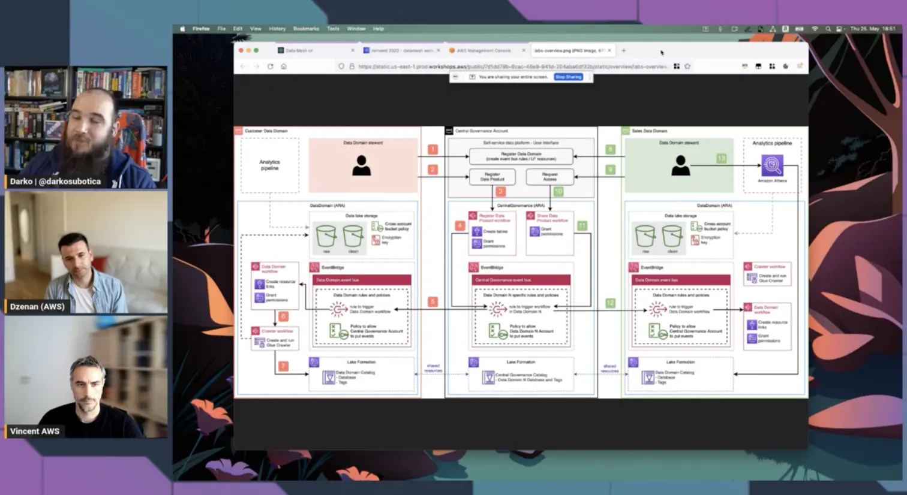

Today, Dzenan, Vincent and Darko look at the Analytics and Data Mesh reference architectures, and how you can create them in your AWS Account with [AWS CDK](https://aws.amazon.com/cdk/) and the [level 3 construct](https://constructs.dev/packages/aws-analytics-reference-architecture/) they have created. By just importing this construct and using it in your CDK code, you are able easily deploy different elements to your analytics infrastructure that are implemented with the best practices.

To easily get started, just install the necessary L3 construct in your TypeScript CDK repository by adding the following to your **requirements.txt** file:
```json
aws-cdk-lib==2.51.0
constructs>=10.0.0,<11.0.0
aws_analytics_reference_architecture>=2.0.0
```

Do **NOTE** the version of CDK, as this reference architecture requires a specific version of CDK to work.

Also, if you are interested in getting hands on with this, make sure to check out the [Data Mesh workshop](https://catalog.us-east-1.prod.workshops.aws/workshops/23e6326b-58ee-4ab0-9bc7-3c8d730eb851/en-US). And give Vincent and Dzenan a shoutout for any feedback. 👏

Check out the recording here:

https://www.twitch.tv/videos/1846587978

## Links from today's episode

- [Analytics Reference Architecture github page](https://github.com/aws-samples/aws-analytics-reference-architecture)
- [L3 Construct over at the Constructs hub](https://constructs.dev/packages/aws-analytics-reference-architecture)
- [ARA Blog post](https://aws.amazon.com/blogs/opensource/adding-cdk-constructs-to-the-aws-analytics-reference-architecture/)
- [Data Mesh Blog post](https://aws.amazon.com/blogs/big-data/use-an-event-driven-architecture-to-build-a-data-mesh-on-aws/)
- [Data Mesh workshop](https://catalog.us-east-1.prod.workshops.aws/workshops/23e6326b-58ee-4ab0-9bc7-3c8d730eb851/en-US)

**🐦 Reach out to the hosts and guests:**

Dzenan: [https://www.linkedin.com/in/dzenansoftic/](https://www.linkedin.com/in/dzenansoftic/)

Vincent: [https://www.linkedin.com/in/vincent-gromakowski/](https://www.linkedin.com/in/vincent-gromakowski/)

Darko: [https://twitter.com/darkosubotica](https://twitter.com/darkosubotica)
