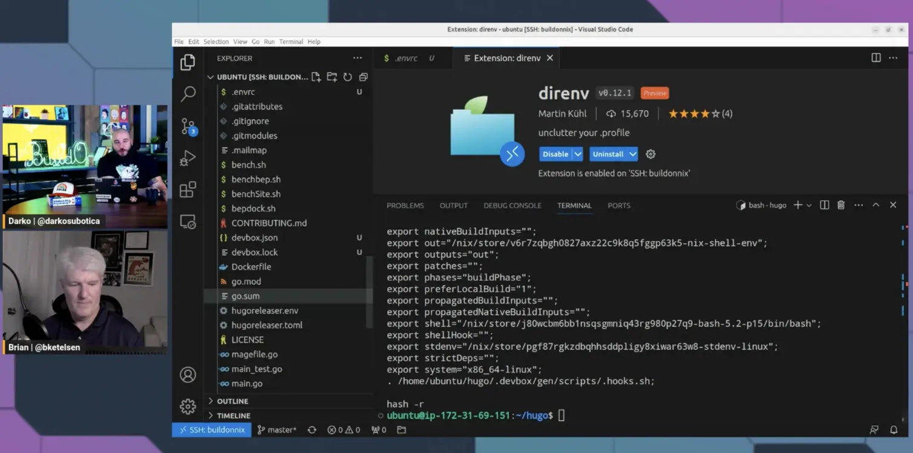

What if we told you with just three Open Source tools, you can make and take your development environment wherever you want. Imagine a world, where just changing into a different directory gives you a different, predefined version of Python! One can only dream ... Until now 🚀 🔥Check out the video of today's stream were Brian and Darko go into explaining how you can manage and make portable your development environments, with Nix Package Manager, Devbox, and direnv. 

The code in the 4 scripts that was used by Brian:

*1-nix.sh*
```bash
#!/bin/bash

curl --proto '=https' --tlsv1.2 -sSf -L https://install.determinate.systems/nix | sh -s -- install
```

*2-devbox.sh*
```bash
#!/bin/bash

curl -fsSL https://get.jetpack.io/devbox | bash
```

*3-direnv.sh*
```bash
#!/bin/bash

sudo apt update && sudo apt install -y direnv
```

*4-bashrc.sh*
```bash
#!/bin/bash

echo 'eval "$(direnv hook bash)"' >> .bashrc
```

Check out the recording here:

https://www.twitch.tv/videos/1835498649

## Links from today's episode

- [DevBox](https://www.jetpack.io/devbox/)
- [Amazon Cloud9](https://aws.amazon.com/cloud9/)
- [Nix Installer](https://github.com/DeterminateSystems/nix-installer)
- [Direnv](https://direnv.net/)
- [Code used by Brian in a nice gist](https://gist.github.com/bketelsen/e1646d2a4551217b4f0531fb9f0f3c9a)


**🐦 Reach out to the hosts and guests:**

Brian: [https://twitter.com/bketelsen](https://twitter.com/bketelesen)
Darko: [https://twitter.com/darkosubotica](https://twitter.com/darkosubotica)
