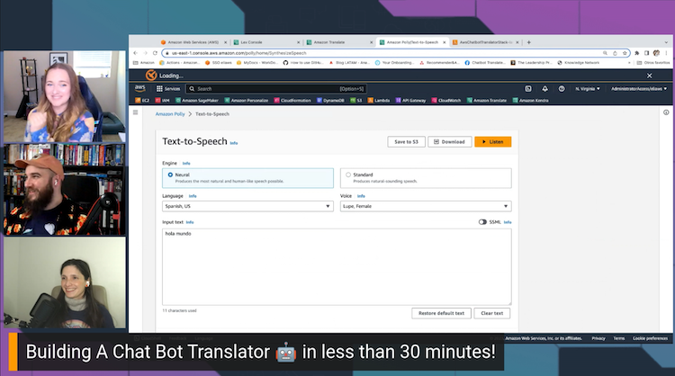

Wouldn't it be easier to learn a new language with your own personal chatbot to help you translate and pronounce the words? On this week's episode of Build on Weekly, hosts Jacquie & Darko welcome AWS Developer Advocate Elizabeth Fuentes to build a language translator bot in under 30 minutes!

Leveraging a number of Amazon services including Lex for our conversational chatbot and Translate to provide us with already trained machine learning language models, we dove right in with Elizabeth to live code Lambda functions in Python! ✨

Try it out at home using the demo code here: [AWS Chatbot Translator](https://github.com/elizabethfuentes12/aws-chatbot-translator).

Check out the recording here:

[Building a Translator Chatbot in <30m!](https://www.twitch.tv/videos/1860069336)

## Links from today's episode

- [Code for today's AWS Chatbot Translator](https://github.com/elizabethfuentes12/aws-chatbot-translator)
- [Amazon Lex](https://aws.amazon.com/lex/)
- [Amazon Translate](https://aws.amazon.com/translate/)
- [Amazon Lex: Lambda Function Input Event and Response docs](https://docs.aws.amazon.com/lex/latest/dg/lambda-input-response-format.html)
- [AWS Code Samples: Amazon Rekognition](https://github.com/aws-samples/amazon-rekognition-code-samples)
- [AWS Code Samples: Amazon Transcribe Comprehend Podcast](https://github.com/aws-samples/amazon-transcribe-comprehend-podcast)
- [AWS Code Samples: Document Translation](https://github.com/aws-samples/document-translation)
- [Workshop: Amazon Connect and Amazon Lex Integration](https://catalog.us-east-1.prod.workshops.aws/workshops/638d00f5-2248-488f-b7ca-903e8b966bf8/en-US)

**🐦 Reach out to the hosts and guests:**

- Jacquie: [https://twitter.com/devopsjacquie](https://twitter.com/devopsjacquie)
- Darko: [https://twitter.com/darkosubotica](https://twitter.com/darkosubotica)
- Elizabeth: [https://twitter.com/ElizabethFue12](https://twitter.com/ElizabethFue12)
