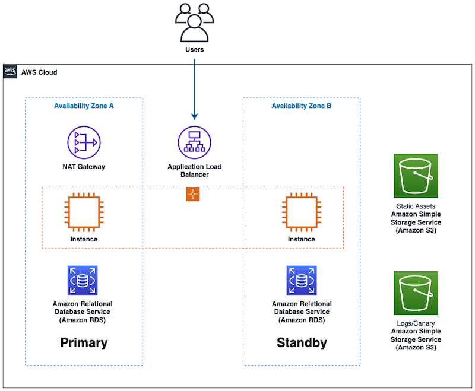

Hello friends and welcome to this week's Build On Weekly episode show notes! Jacquie and guest co-host Todd Sharp are joined by resident resilience expert Seth Eliot to take on a workshop where we use AWS Resilience Hub to find out if our architecture as resilient as we think it is! At first glance, our architecture appears to look pretty good but trouble surfaces when we dig a little deeper. 

Together, we explore the architecture and what it means to build it with resilience as we learn about reslience policies and resolve the faults we discovered. During this stream we work with a multitude of services including load balancers, RDS databases, CodePipeline and more!

Follow the workshop yourself at home: [Using AWS Resilience Hub to monitor resilient architectures!](https://catalog.workshops.aws/aws-resilience-hub-lab/en-US/prepare-and-protect/account-setup).

Check out the recording here:

https://www.twitch.tv/videos/1870896895

## Links from today's episode

- [Today's Workshop: Using AWS Resilience Hub to monitor resilient architectures!](https://catalog.workshops.aws/aws-resilience-hub-lab/en-US/prepare-and-protect/account-setup)
- [AWS re:Inforce 2023 - Engineer application resilience with compliance in mind (GRC304)](https://bit.ly/arh-reinforce2023)
- [Resilience Wave content](https://community.aws/tags/resilience)
- [Blog: Building Resilient Well-Architected Workloads Using AWS Resilience Hub](https://aws.amazon.com/blogs/architecture/building-resilient-well-architected-workloads-using-aws-resilience-hub/)
- [Blog: Continually assessing application resilience with AWS Resilience Hub and AWS CodePipelin](https://aws.amazon.com/blogs/architecture/continually-assessing-application-resilience-with-aws-resilience-hub-and-aws-codepipeline/)

**🐦 Reach out to the hosts and guests:**

- Jacquie: [https://twitter.com/devopsjacquie](https://twitter.com/devopsjacquie)
- Todd: [https://twitter.com/recursivecodes](https://twitter.com/recursivecodes/)
- Seth: [https://twitter.com/setheliot](https://twitter.com/setheliot/)
