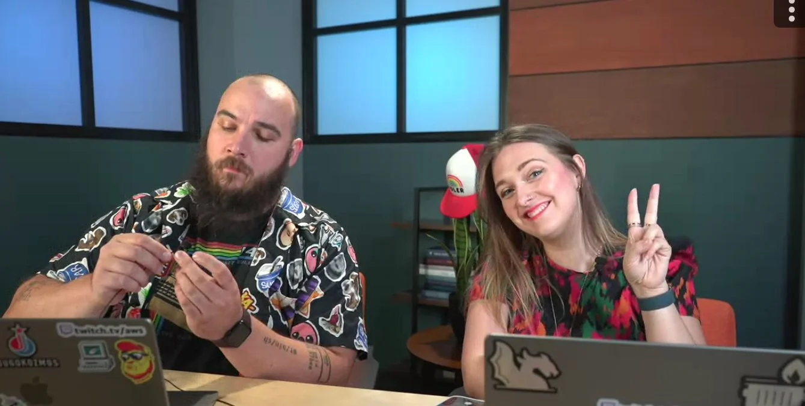
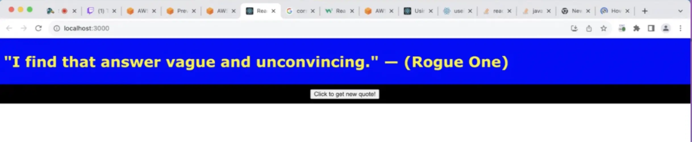

Hello friends and welcome to this week's Build On Weekly episode show notes! Today is **PART 3**, yes you heard that right, Part 3 of our Star Wars Quote Generator adventure. Last time we looked at this, we managed to add an API to *PUT* new Quotes into the Database. And this time we are doing something scary (at least for us back end folks), we are adding a **REACT** front end to our quotes API.😭

Check out the recording below for some fiddling around with CORS, Darko's stunning web design, and all around tomfoolery! 💜



And if you want to try and improve the code of the entire thing we built. Check it out right here on [github](https://github.com/darko-mesaros/starwars-quote-api)

Oh, and if you are here just to learn how to **enable CORS on Lambda and API Gateway**, here is what you need to do:

Ensure that your Lambda `response` function contains the following code:
```javascript
const response = {
        statusCode: 200,
        headers: {
                "Content-Type" : "application/json",
                "Access-Control-Allow-Headers" : "Content-Type,X-Amz-Date,Authorization,X-Api-Key,X-Amz-Security-Token",
                "Access-Control-Allow-Methods" : "OPTIONS,POST",
                "Access-Control-Allow-Credentials" : true,
                "Access-Control-Allow-Origin" : "*",
                "X-Requested-With" : "*"
            },
    /* rest of code goes here */
    };
```

And when creating up the API Gateway with CDK do it like so:
```typescript
// API Gateway
const api = new apigateway.RestApi(this, "Api",{
  defaultCorsPreflightOptions: {
    allowOrigins: apigateway.Cors.ALL_ORIGINS,
    allowMethods: apigateway.Cors.ALL_METHODS // this is also the default
  }
});

const quotes = api.root.addResource('quotes')

quotes.addMethod("GET", new apigateway.LambdaIntegration(quoteLambda));
quotes.addMethod("POST", new apigateway.LambdaIntegration(putLambda));
```

*You're welcome* 😅

Check out the recording here:

https://www.twitch.tv/videos/1889416352

## Links from today's episode

- [Github repo with code](https://github.com/darko-mesaros/starwars-quote-api)
- [REACT code in codesandbox](https://codesandbox.io/s/optimistic-sutherland-hno5c8?file=/src/App.js:0-439)
- [API Gateway CORS with CDK](https://docs.aws.amazon.com/cdk/api/v2/docs/aws-cdk-lib.aws_apigateway-readme.html#cross-origin-resource-sharing-cors)
- [REACT StrictMode](https://react.dev/reference/react/StrictMode)  

**🐦 Reach out to the hosts and guests:**

- Jacquie: [https://twitter.com/devopsjacquie](https://twitter.com/devopsjacquie)
- Darko: [https://twitter.com/darkosubotica](https://twitter.com/darkosubotica)
