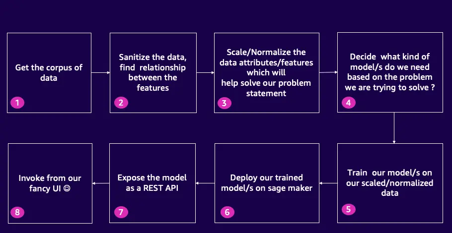

"Did you ever want to build your own recommendation engine powered by machine learning? A way to properly create recommendations for your customers? Well you came to the right show 🥳 In this PART 1 episode, Piyali and Darko look at the first steps it takes to do this.

Today we manage to discuss the reasoning *why* would you need a recommendation engine. We ingest and clean up some data. We get to learn about **pandas** (no, not those 🐼), and converting your data into numeric values so it can be trained. Make sure to follow us for future PART 2 and PART 3 of this adventure, where we will actually train the Machine Learning Model, and deploy it as an API Endpoint, and yes have a front end for it as well. Make sure to show up **every Thursday at 9AM Pacific** as we **Build** (more) **On** AWS 😅

Oh yeah, and if you wish to follow along at home, Piyali was amazing and she wrote a whole blog post on this same topic. You can check it out [here](https://community.aws/tutorials/recommendation-engine-full-stack).

Check out the recording here:

https://www.twitch.tv/videos/1889439197

## Links from today's episode

- [Piyali's blog post](https://community.aws/tutorials/recommendation-engine-full-stack)
- [Code for this project](https://github.com/build-on-aws/recommendation-engine-full-stack)
- [Pandas 🐼](https://pypi.org/project/pandas/)
- [What is Feature Engineering](https://towardsdatascience.com/what-is-feature-engineering-importance-tools-and-techniques-for-machine-learning-2080b0269f10)
- [Parquet Data format](https://parquet.apache.org/)

- [Today's Workshop: Using AWS Resilience Hub to monitor resilient architectures!](https://catalog.workshops.aws/aws-resilience-hub-lab/en-US/prepare-and-protect/account-setup)

**Reach out to the hosts and guests:**

- Piyali: [https://www.linkedin.com/in/piyali-kamra/](https://www.linkedin.com/in/piyali-kamra/)
- Darko: [https://www.linkedin.com/in/darko-mesaros/](https://www.linkedin.com/in/darko-mesaros/)
