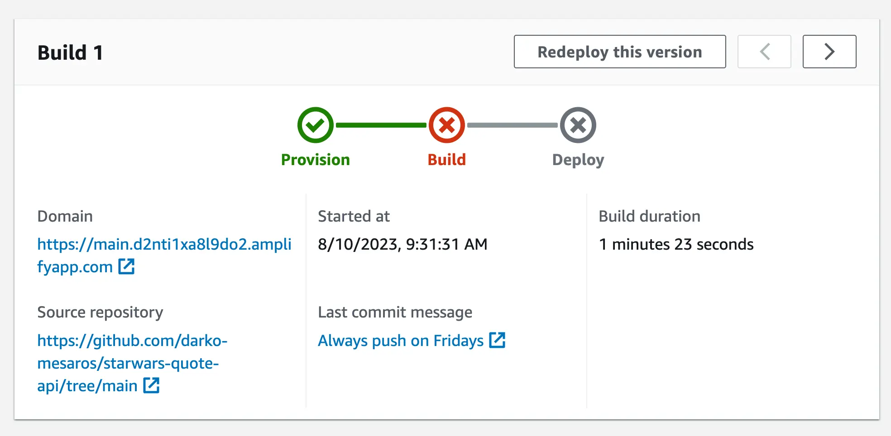

Today, Darko welcomes Michael to help him out and fix the front-end mistake he made in the [previous part](). Yes, and well, we actually get to deploy our REACT application to The Cloud with [AWS Amplify Hosting](https://go.aws/3KCOdVE). Say good bye to `localhost:3000` and hello to the internet. We created the AWS Amplify Hosting app, connected it to Darko's GitHub account and configured the build steps needed (thank you [Roberttables](https://twitter.com/drpoindexter) ❤️). And the best quote of the day was: *"Keep in mind, I am expecting this to fail." - Michael L.*

Michael created  AWS Amplify hosting an [AWS CDK L2 Construct](https://docs.aws.amazon.com/cdk/api/v2/docs/aws-amplify-alpha-readme.html) that is currently in *Alpha*, so please make sure to take care when using that in production.

Oh yeah, and if you wish to follow along at home, we have a GitHub repository with the code used today. You can check it out [here](https://bit.ly/3qiKc1L). And make sure to let us know what other features you would like us to build into this application.

Check out the recording here:

https://www.twitch.tv/videos/1895323486

## Links from today's episode

- [Code Used today](https://bit.ly/3qiKc1L)
- [AWS Amplify Hosting](https://go.aws/3KCOdVE)
- [Build file from Roberttables](https://github.com/mtheoryx/drpoindexter/blob/main/amplify.yml)

**Reach out to the hosts and guests:**

- Michael: [https://twitter.com/focusotter](https://twitter.com/focusotter) 
- Darko: [https://twitter.com/darkosubotica](https://twitter.com/darkosubotica)
