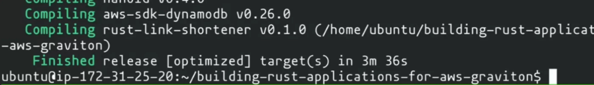

You may have heard that Rust is one of the most Admired and Desired languages out [there](https://survey.stackoverflow.co/2023/#technology-admired-and-desired). So lets talk about it. No, lets build it and run in in the cloud. In today's episode of Build On Weekly, Cobus and Darko compile a Link shortener application written in rust and deploy it to the Cloud. Not just anywhere, but rather on an [ARM based EC2 instance](https://go.aws/3KLVZN3) on AWS - Graviton.

Today's episode is inspired by [this](https://bit.ly/3QRg3RE) amazing blog post by Tyler Jones (and he was in chat helping us out). And the goal was to deploy the same application to both an x86 Instance and an ARM instance and see the results of a load test. After a bit back and forth we managed to get it running (we found some issues with the blog post along the way - which Tyler fixed on the spot 👏) and we managed to run a load test on the x86 version of this application. Sort of. 

Sort of? Yes, turns out that if you keep sending huge amounts of traffic to a DynamoDB table that is using provisioned instead of On Demand capacity, your application is no longer able to write to it anymore. Ooops 😇

A few things we learned today:

1. It's always the **security group**
2. Either properly **provision your DynamoDB** tables, or use On-Demand
3. Port `80` on Ubuntu is a **protected port** and anything that uses it needs `sudo` permissions
4. Oh yeah, Rust 🦀 applications **run like a charm on Graviton**, go try it out 😎

Oh yeah, and if you wish to follow along at home, as mentioned this is all based off of [this](https://bit.ly/3QRg3RE) article written by Tyler. So go and have some fun compiling (and testing) Rust applications on Graviton processors 😎

Check out the recording here:

https://www.twitch.tv/videos/1901212120

## Links from today's episode

- [Blog post on compiling Rust applications on Graviton](https://bit.ly/3QRg3RE)
- [AWS Graviton processor](https://go.aws/3KLVZN3)
- [WRK2 - HTTP benchmarking tool we used today](https://github.com/giltene/wrk2)

**Reach out to the hosts and guests:**

- Cobus: [https://twitter.com/cobusbernard](https://twitter.com/cobusbernard) 
- Darko: [https://twitter.com/darkosubotica](https://twitter.com/darkosubotica)
