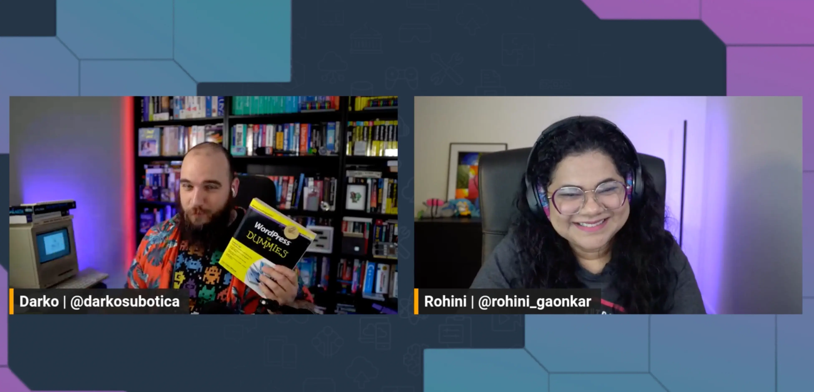
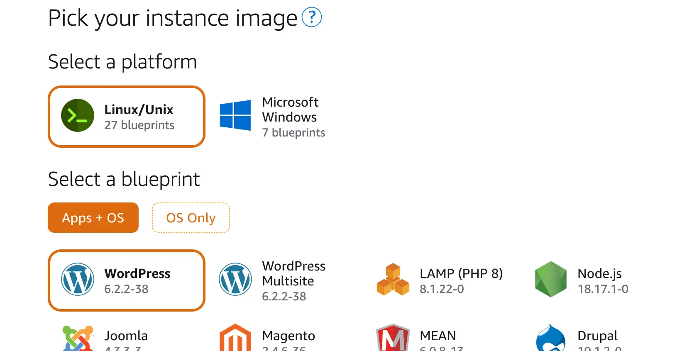

How do you get that WordPress website up and running in the cloud? Do you use an EC2 instance? Do you use containers? Or maybe something completely different. In today's episode, Rohini and Darko are joined by Sophia as we try to achieve this goal in a couple of ways.

### WordPress hosted on EC2

First we take a simple approach and set up WordPress on an [AWS EC2](https://go.aws/3YX93ou) instance. This gives a flexibility to approach this problem from many directions, as we have the entire virtual server to ourselves. Today we have decided to host our WordPress website using [Docker](https://docs.docker.com/engine/install/ubuntu/), specifically [Docker Compose](https://docs.docker.com/compose/). As that allows us to host multiple different WordPress websites (maybe even different versions) on the same server.

Here is the `docker-compose.yml` file we used for today's deployment:
```yaml
services:
  db:
    # We use a mariadb image which supports both amd64 & arm64 architecture
    image: mariadb:10.6.4-focal
    # If you really want to use MySQL, uncomment the following line
    #image: mysql:8.0.27
    command: '--default-authentication-plugin=mysql_native_password'
    volumes:
      - db_data:/var/lib/mysql
    restart: always
    environment:
      - MYSQL_ROOT_PASSWORD=somewordpress
      - MYSQL_DATABASE=wordpress
      - MYSQL_USER=hunter2
      - MYSQL_PASSWORD=wordpress
    expose:
      - 3306
      - 33060
  wordpress:
    image: wordpress:latest
    volumes:
      - wp_data:/var/www/html
    ports:
      - 80:80
    restart: always
    environment:
      - WORDPRESS_DB_HOST=db
      - WORDPRESS_DB_USER=wordpress
      - WORDPRESS_DB_PASSWORD=hunter2
      - WORDPRESS_DB_NAME=wordpress
volumes:
  db_data:
  wp_data:
```
But make sure to check out the full guide Darko has followed [here](https://github.com/docker/awesome-compose/tree/master/official-documentation-samples/wordpress/).

### Using Amazon Lightsail

Now, if you really do not wish to bother with an EC2 instance, and just want a WordPress website (but still have all the benefits of running it in the AWS Cloud), look no further than [Amazon Lightsail](https://go.aws/44sVChe). The place to run your WordPress workloads 👏 And Sophia, not only showed us how to [get a WordPress instance running](https://go.aws/3PuISCJ) but also how to secure it, and set up automatic updates! Wonderful.



Check out the recording here:

https://www.twitch.tv/videos/1913458536

## Links from today's episode

- [Cost Optimization space](https://community.aws/cost-optimization)
- [Amazon Ligthsail](https://go.aws/44sVChe)
- [Running WordPress on Lightsail](https://go.aws/3PuISCJ)
- [Sophia's guides on moving to the cloud 🌤️](https://bit.ly/45MCOex)

**Reach out to the hosts and guests:**

- Rohini: [https://www.linkedin.com/in/rohinigaonkar/](https://www.linkedin.com/in/rohinigaonkar/) 
- Sophia: [https://www.linkedin.com/in/sophiaparafina/](https://www.linkedin.com/in/sophiaparafina/) 
- Darko: [https://twitter.com/darkosubotica](https://twitter.com/darkosubotica)
