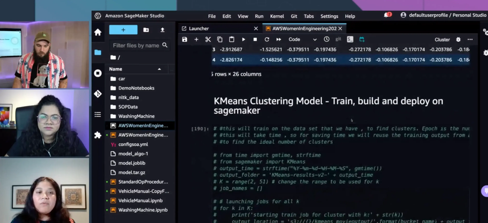

You may recall [last time]() Piyali was on Build On Weekly, we talked about why and how do you build recommendation engines. On top of that we cleaned up a lot of data, this time it's time to build this ML model and host it somewhere. In this epsiode we do just that - deploy this Machine Learning model to an endpoint and start serving recommendations back to a front end. Well, we do not have the front end yet - but do join us in the future for PART 3, where we build that front end and make it available to you! 👏

Oh yeah, and if you wish to follow along at home, Piyali was amazing and she wrote a whole blog post on this same topic. You can check it out [here](/tutorials/recommendation-engine-full-stack).

Check out the recording here:

https://www.twitch.tv/videos/1931622267

## Links from today's episode

- [Piyali's blog post](/tutorials/recommendation-engine-full-stack)
- [Code for this project](https://github.com/build-on-aws/recommendation-engine-full-stack)
- [K-Means clustering](https://en.wikipedia.org/wiki/K-means_clustering)
- [AWS Chalice](https://github.com/aws/chalice)

**Reach out to the hosts and guests:**

- Piyali: [https://www.linkedin.com/in/piyali-kamra/](https://www.linkedin.com/in/piyali-kamra/)
- Rohini: [https://www.linkedin.com/in/rohinigaonkar/](https://www.linkedin.com/in/rohinigaonkar/)
- Darko: [https://www.linkedin.com/in/darko-mesaros/](https://www.linkedin.com/in/darko-mesaros/)
