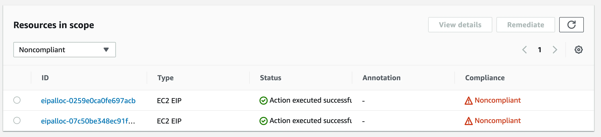

It is very important to be aware of your costs when running workloads in the cloud. Do you know if you have any lingering resources (unused Elastic IPs, detached EBS volumes) that are causing you unwanted cots? 🤔 Well, today we have Steph joining us and demonstrating how we can fix all this using [AWS Config](https://aws.amazon.com/config/?sc_channel=el&sc_campaign=livestreams&sc_content=build_on_weekly&sc_geo=mult&sc_country=mult&sc_outcome=acq) and [AWS Systems Manager Automation](https://docs.aws.amazon.com/systems-manager/latest/userguide/systems-manager-automation.html?sc_channel=el&sc_campaign=livestreams&sc_content=build_on_weekly&sc_geo=mult&sc_country=mult&sc_outcome=acq).

We ended up not being able to fix it on stream, BUT, Darko did spend some time and made it work at the end. And here is how it works now:

### The fix

Alright, the issue we had is that we were not able to pass the SSM Automation document the correct parameters and execute the automation. After some time spent searching online and looking at other options in the [SSM Automation documentation](https://docs.aws.amazon.com/systems-manager/latest/userguide/documents.html?sc_channel=el&sc_campaign=livestreams&sc_content=build_on_weekly&sc_geo=mult&sc_country=mult&sc_outcome=acq), we've realized that the solution is to use a different action type.

Instead of using `aws:executeAwsApi`, the better option was just to use `aws:createTags`, as that is what we actually wanted! 🥳 This simple change has made it possible to create a new automation document that has the following contents:
```yaml
description: |-
  This automation document tags Unused Elastic IPs so we can track them.  
schemaVersion: '0.3'
assumeRole: '{{AutomationAssumeRole}}'
parameters:
  Resources:
    type: StringList
    description: (Required) The allocation IDs of the Elastic IP Addresses to be tagged.
  AutomationAssumeRole:
    type: String
    description: The role that allows Automation to execute the actions on your behalf.
  Tags:
    type: MapList
    description: 'Tags to apply to the elastic IP addresses. Enter in teh following format: {"Key":"COST_ALERT","Value":"UnusedEip"}'
mainSteps:
  - name: 'TagElasticIP'
    action: 'aws:createTags'
    inputs:
      ResourceType: EC2
      Tags: '{{Tags}}'
      ResourceIds: '{{Resources}}'
```

Then - to pass it the `Tags` parameter we use the following format: `{"Key":"COST_ALERT","Value":"UnusedEip"}`. Huzzah!

If you wish to see this in action, check out the addendum video here:

https://www.youtube.com/watch?v=PC3pPeChdDg

Check out the full stream recording here:

https://www.twitch.tv/videos/1931622267

## Links from today's episode

- [AWS Config](https://aws.amazon.com/config/?sc_channel=el&sc_campaign=livestreams&sc_content=build_on_weekly&sc_geo=mult&sc_country=mult&sc_outcome=acq)
- [AWS SSM Automation](https://docs.aws.amazon.com/systems-manager/latest/userguide/systems-manager-automation.html?sc_channel=el&sc_campaign=livestreams&sc_content=build_on_weekly&sc_geo=mult&sc_country=mult&sc_outcome=acq)
- [AWS SSM Documents](https://docs.aws.amazon.com/systems-manager/latest/userguide/documents.html?sc_channel=el&sc_campaign=livestreams&sc_content=build_on_weekly&sc_geo=mult&sc_country=mult&sc_outcome=acq)

**Reach out to the hosts and guests:**

- Steph: [https://www.linkedin.com/in/awssteph/](https://www.linkedin.com/in/awssteph/)
- Rohini: [https://www.linkedin.com/in/rohinigaonkar/](https://www.linkedin.com/in/rohinigaonkar/)
- Darko: [https://www.linkedin.com/in/darko-mesaros/](https://www.linkedin.com/in/darko-mesaros/)
