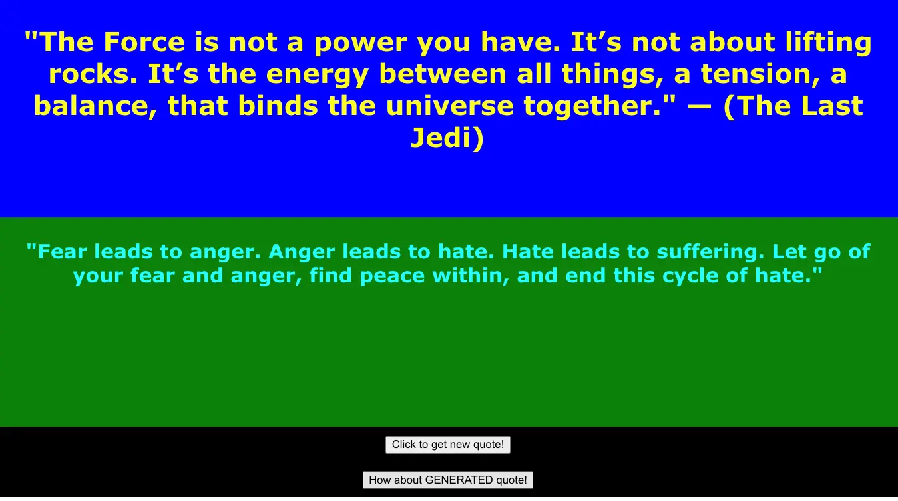

In today's live stream, Darko is joined by Banjo, as we discuss and implement some Generative AI into the all mighty Star Wars quote generator app. This time, we are actually adding the **generator** into this app. We had fun, we troubleshooted Lambda functions, Generated some fake Star Wars quotes, and fixed CORS. All in a days work! 👏

We have the [code](https://github.com/darko-mesaros/starwars-quote-api) available for you if you wish to deploy it for yourself or follow along. But if you are very curious to see how did a **Lambda Function invoke Amazon Bedrock** here it is:

```python
import boto3
import json

def handler(event, context):

    bedrock = boto3.client("bedrock-runtime", region_name="us-west-2")

    prompt = """Generate me a made up quote from the films - Star Wars. Keep it to under 50 words. Just return the quote and nothing else.
    """.encode('unicode-escape').decode('utf-8')

    modelId= "anthropic.claude-v2"
    contentType= "application/json"
    accept= "*/*"

    body = json.dumps({
        "prompt": "Human: "+prompt+"\n Assistant:",
        "max_tokens_to_sample": 300,
        "temperature": 1,
        "top_k": 250,
        "top_p": 0.999,
        "stop_sequences": ["\n\nHuman:"],
        "anthropic_version":"bedrock-2023-05-31"
        })

    response = bedrock.invoke_model(accept=accept, body=body, contentType=contentType,modelId=modelId)
    response_body = json.loads(response.get("body").read())
    completion = response_body.get("completion")


    return {
        'statusCode': 200,
        'headers': {
                'Content-Type': 'application/json',
                'Access-Control-Allow-Origin': '*',
                'Access-Control-Allow-Methods': 'OPTIONS,POST,GET,PUT,DELETE',
                'Access-Control-Allow-Headers': 'Content-Type,X-Amz-Date,Authorization,X-Api-Key,X-Amz-Security-Token',
            },
        'body': json.dumps({
            'message': completion
            })
    }
```

But if you are looking to learn a bit about:

- How to start your Adventure with Amazon Bedrock
- How to invoke a model on Amazon Bedrock with a Lambda function
- How to (not) make good React code
- How to fix CORS on API Gateway and Lambda

Make sure to check out the full stream recording here:

https://www.twitch.tv/videos/1949626001

## Links from today's episode

- [Amazon Bedrock](https://aws.amazon.com/bedrock/?sc_channel=el&sc_campaign=livestreams&sc_content=build_on_weekly&sc_geo=mult&sc_country=mult&sc_outcome=acq)
- [Github Repo of the code we used](https://github.com/darko-mesaros/starwars-quote-api)

**Reach out to the hosts and guests:**

- Banjo: [https://www.linkedin.com/in/banjo-obayomi-a22520a4/](https://www.linkedin.com/in/banjo-obayomi-a22520a4/)
- Darko: [https://www.linkedin.com/in/darko-mesaros/](https://www.linkedin.com/in/darko-mesaros/)
