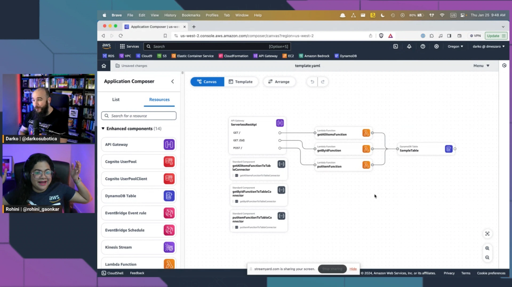

This was launch episode for Season 3 of Build On Weekly show! The show hosts Rohini and Darko introduced themselves, their journey at AWS from Premium Support to Solutions Architect and now Developer Advocates. 👏

Darko and Rohini also had demo AWS Application Composer and Amazon CodeWhisperer. If you are interested to use Application Composer and also want to check other 3rd party tools to create architecutre diagrams, then checkout the [blog (and video)](https://community.aws/tutorials/deploy-sam-application-composer?sc_channel=el&sc_campaign=livestreams&sc_content=build_on_weekly&sc_geo=mult&sc_country=mult&sc_outcome=acq) by Rohini.

Darko also showed us how to use Visual Studio Live Share and code online together with Rohini.

But if you are looking to learn a bit about:

- How to use Application Composer and AWS SAM
- How to use CodeWhisperer to generates code suggestions
- How to use CodeWhisperer for command line (mac OS only)

Make sure to check out the full stream recording here:

https://www.twitch.tv/videos/2043337929

## Links from today's episode

- [Amazon CodeWhisperer for command line](https://docs.aws.amazon.com/codewhisperer/latest/userguide/command-line.html?sc_channel=el&sc_campaign=livestreams&sc_content=build_on_weekly&sc_geo=mult&sc_country=mult&sc_outcome=acq)
- [Blog for Drag-and-Drop Development on Serverless Applications: Using AWS Application Composer and AWS Serverless Application Model](https://community.aws/tutorials/deploy-sam-application-composer?sc_channel=el&sc_campaign=livestreams&sc_content=build_on_weekly&sc_geo=mult&sc_country=mult&sc_outcome=acq)
- Visualise and Generate diagrams from CloudFormation/SAM templates:
  - [LucidChart](https://www.lucidchart.com) and [Cloudcraft](https://www.cloudcraft.co/) [find demo in Rohini's video in the blog above]
  - [NPM Package cfn-diagram](https://www.npmjs.com/package/@mhlabs/cfn-diagram)
- [Former 2](https://former2.com/) to generate Infrastructure-as-Code outputs from your existing resources within your AWS account

**Reach out to the hosts:**

- Darko: [https://www.linkedin.com/in/darko-mesaros/](https://www.linkedin.com/in/darko-mesaros/)
- Rohini: [https://www.linkedin.com/in/rohinigaonkar/](https://www.linkedin.com/in/rohinigaonkar/)