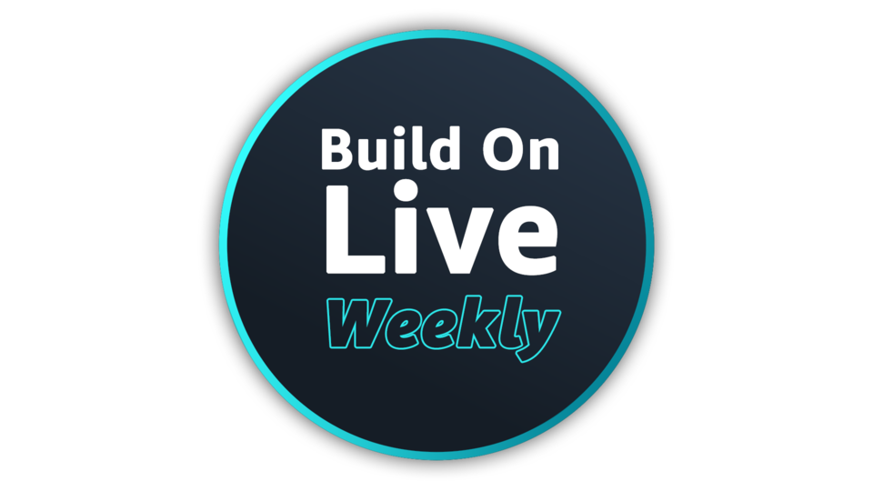

👋 Hello friends and welcome to Build On Weekly, a [Twitch show](https://www.twitch.tv/aws) where we build something together every week while answering questions from our favourite people - you! We'll build anything that helps you solve problems: whether it's Open Source or AWS, from operators, developers, data or security specialists to anyone in between. Join us every Thursday at 9am PT to learn live with us through hands on keyboard coding and stay for the lively conversations with expert guests.

## Hosts of the show
Everyone is friends, so join in the conversation both on or off the air with your hosts!
- Dark Mesaroš (Дарко Месарош), Senior Developer Advocate: Seattle, WA based resident retro hardware aficionado who loves yelling into the camera about the cloud while he learns, breaks and builds it. If you could summon him with one word it would be: Commodore 64. Talk with him on [Twitter](https://twitter.com/darkosubotica) or [LinkedIn](https://www.linkedin.com/in/darko-mesaros/).
- Jacquie Grindrod, Senior Developer Advocate: Located in Vancouver, BC she's an avid gamer who applies her passion for problem solving to challenges based in systems, people and anything inbetween. If you could summon her with one word it would be: DevOps. Talk with her on [Twitter](https://twitter.com/devopsjacquie) or [LinkedIn](https://www.linkedin.com/in/jacquelyne-grindrod/).

## Schedule
Come learn live with us! We stream every Thursday at 9am PT/Noon ET.

