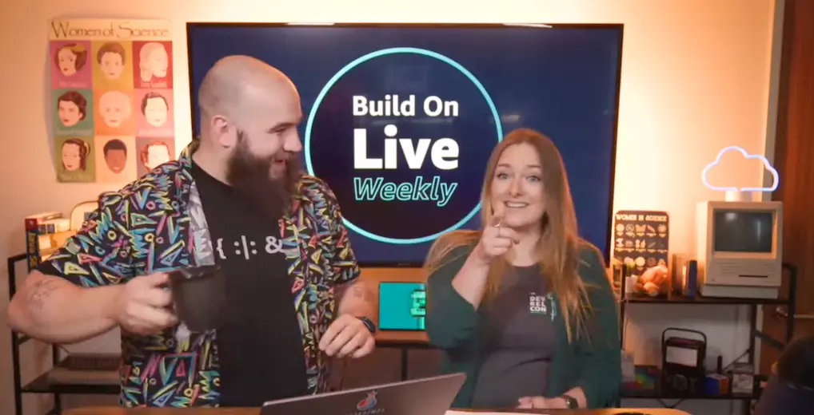

👋 Hello friends and welcome to Build On Weekly, a [Twitch show](https://www.twitch.tv/aws) where we build something together every week while answering questions from our favourite people - you! We'll build anything that helps you solve problems: whether it's Open Source or AWS, from operators, developers, data or security specialists to anyone in between. Join us every Thursday at 9am PT to learn live with us through hands on keyboard coding and stay for the lively conversations with expert guests.

## Hosts of the show 🎤

Everyone is friends, so join in the conversation both on or off the air with your hosts!

- Dark Mesaroš (Дарко Месарош), Senior Developer Advocate: Seattle, WA based resident retro hardware aficionado who loves yelling into the camera about the cloud while he learns, breaks and builds it. If you could summon him with one word it would be: Commodore 64. Talk with him on [Twitter](https://twitter.com/darkosubotica) or [LinkedIn](https://www.linkedin.com/in/darko-mesaros/).
- Jacquie Grindrod, Senior Developer Advocate: Located in Vancouver, BC she's an avid gamer who applies her passion for problem solving to challenges based in systems, people and anything in-between. If you could summon her with one word it would be: DevOps. Talk with her on [Twitter](https://twitter.com/devopsjacquie) or [LinkedIn](https://www.linkedin.com/in/jacquelyne-grindrod/).

## Contact 📬

If you have any ideas, suggestions, comments. Feel free to email us at [build-on-weekly@amazon.com](mailto:build-on-weekly@amazon.com)

## Schedule 📆

Come learn live with us! We stream **every Thursday at 9am PT/Noon ET**. Check us out on [twitch.tv/aws](https://twitch.tv/aws) 👇

---

## Show notes

### SEASON 02:

| Episode | Name | Date | Link to Show Notes
|--|--|--|--|
| S02E25 | Hosting a REACT app on AWS, Star Wars quotes generator - PART 4 | 2023-08-10  | [Show Notes](/livestreams/build-on-weekly/2023-08-10) |
| S02E24 | Build Your Own Recommendation Engine on AWS - PART 1 | 2023-08-03  | [Show Notes](/livestreams/build-on-weekly/2023-08-03) |
| S02E23 | Adding some REACT to our Star Wars quotes API | 2023-07-27  | [Show Notes](/livestreams/build-on-weekly/2023-07-27) |
| S02E22 | Building Resilient Architecture | 2023-07-13  | [Show Notes](/livestreams/build-on-weekly/2023-07-13) |
| S02E21 | Building a Translator Chatbot in <30m!| 2023-06-29  | [Show Notes](/livestreams/build-on-weekly/2023-06-29) |
| S02E20 | Managing Development Environments| 2023-06-01  | [Show Notes](/livestreams/build-on-weekly/2023-06-01) |
| S02E19 | Data Mesh Reference Architecture| 2023-05-25  | [Show Notes](/livestreams/build-on-weekly/2023-05-25) |
| S02E18 | Extract, Transform, Lock and Load| 2023-05-18  | [Show Notes](/livestreams/build-on-weekly/2023-05-18) |
| S02E15 | Generative AI Applications | 2023-04-27  | [Show Notes](/livestreams/build-on-weekly/2023-04-27) |
| S02E14 | Stable Diffusion with Viktoria | 2023-04-20  | [Show Notes](/livestreams/build-on-weekly/2023-04-20) |
| S02E13 | Hot Dog or Not Hot Dog | 2023-04-13  | [Show Notes](/livestreams/build-on-weekly/2023-04-13) |

### SEASON 01:

| Episode | Name | Date | Link to Show Notes
|--|--|--|--|
| S01E06 | Local Development | 2022-08-18  | [Show Notes](/livestreams/build-on-weekly/2022-08-18) |
| S01E05 | Containers, Containers Everywhere | 2022-08-11  | [Show Notes](/livestreams/build-on-weekly/2022-08-11) |
| S01E04 | Static S3 Website | 2022-08-04  | [Show Notes](/livestreams/build-on-weekly/2022-08-04) |
| S01E03 | Command Line Magic | 2022-07-28  | [Show Notes](/livestreams/build-on-weekly/2022-07-28) |
| S01E02 | Breaking blocks with Terraform | 2022-07-21  | [Show Notes](/livestreams/build-on-weekly/2022-07-21) |
| S01E01 | Open With Open Source | 2022-07-14  | [Show Notes](/livestreams/build-on-weekly/2022-07-14) |
