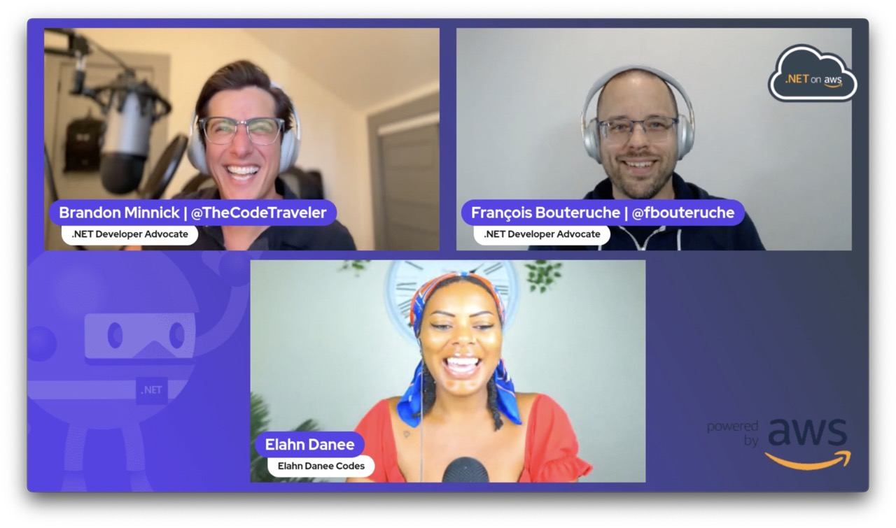
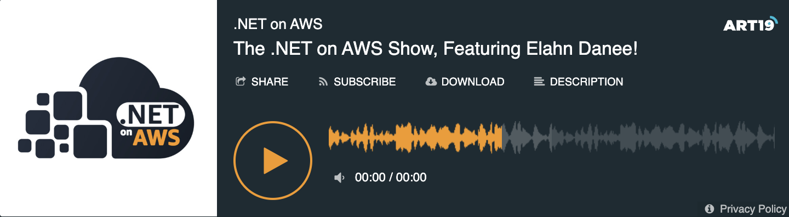

The .NET on AWS Show interviews people in the .NET community to learn more about their journey into .NET and to highlight the cool projects they are working on!

Hosted by [Brandon Minnick](https://twitter.com/TheCodeTraveler) + [Francois Bouteruche](https://twitter.com/fbouteruche)

## Listen to the Podcast

## Watch the Live Stream

https://www.twitch.tv/videos/1820628311

## Transcript

Brandon Minnick  1:15  
Hello, and welcome back, everybody to another episode of the dotnet on AWS Show. I'm your host, Brandon Minnick, and with me as always is the amazing Francoise. Francoise, how are you doing? How's your week?

Francois Bouteruche  1:30  
Fine, fine. I'm doing great. Good morning, everyone. Good afternoon for people in Europe and good evening. Good night for foreseeing the Azure. Because we, we are from everywhere.

Brandon Minnick  1:45  
That's right. That's right. So if you have watched the data on an AWS show, you might notice somebody's missing. We love Isaac, but we are taking over the show. If you hadn't heard there were some layoffs recently that unfortunately, Isaac got caught up in. But we still want to push forward with the show because we have so much to share with you the dominant in the AWS community, and great transition. We have a couple of announcements to make. There is a conference next week that both Francoise and I will be at called NDC. Oslo. This is one of the biggest conferences in Europe. Certainly the biggest dotnet conference in Europe. And so if you're in the area, NDC Oslo is happening next week. There's two days of workshops Monday, Tuesday, Wednesday, Thursday, Friday, are amazing conference talks all week. So come join us. We'll be at the dotnet and AWS booth is where you can find us. And we'll also be giving a couple of talks ourself, I'm actually kicking off the week in Stavanger. So Stavanger, Norway. If you're there. Come check me out at the AWS user group. I'll be talking about done at Maui and how we can connect our mobile apps to the cloud on AWS. And then Francoise, I believe you have a talk queued up on Yes, Tuesday.

Francois Bouteruche  3:13  
I have. Yes. On Tuesday, I have a community talk. I will be speaking about rest Graph QL, G, RPC and signaler. All these backend API technology and how we can decide which one to use for a use case. Because it's, it's always something out to meet Okay, or do I choose? There are so many ways to build an API today. So how can I choose?

Brandon Minnick  3:41  
That's a good question. That's actually there's a there's a new commerce doc I've been working on myself that's similar and just with which, which service do we choose? Anything from? Like, when because when you show up to AWS, you see options like AWS, lamda, Elastic Beanstalk? Graph QL options, like, but it's like, okay, well, I just want an API, what do I do? Or I just want a website. What do I do? But yeah, very familiar friends off that that situation and you know, having to even just figure out what, what framework what tool to use?

Francois Bouteruche  4:21  
It's exactly goodness. We have today. It's like a candy store. You have so many different choice. It's like, Oh, my God, it's awesome. But which one? Should I pick?

Brandon Minnick  4:36  
Right? I love I love that meme thing is XKCD. Or it's like, there's there's too many choices. There's too many frameworks out there today. We need to build one to to win them all. And then the next frame is there's now 13 frameworks to choose from. Now, we do have such an amazing guest today and I'm super excited to Bring her in. But Francoise, you have a couple of announcements to make before we get going. Yeah.

Francois Bouteruche  5:06  
Last week, we have released a new dotnet sample application called Bob's Bob's use book. It's, it's really, to me, the best way I learn to build something to build an application is looking at the code of already existing application. And here, Brad vivre and Steve Roberts. Steve Roberts was proud of the company and has been also been hit by in the labor but still contributed a lot to this sample, the overall ecommerce application using federal AWS services, but why I like a sample is that it's a full blown application that you can run locally, debug locally, as you would expect, okay, I can really just get clone the repository, and it f5 and run the application and it will works on your local machine with local SQL, for example. And then you will have the third step where you can use what we call an AWS cloud development kit. So it's infrastructure as code technologies that will allow you to deploy all the required resources to read the sense of birds in the cloud, on AWS. So it deployed all the required resources for you, you don't have to care, you just trust what they've built. And you can run the exact same application in the cloud. So it's really helpful, in my opinion, just to get started to with dotnet, on AWS, to understand how it works, and it use many services. And we, I have a third link, it's a link from someone from the community, Jack Scott. It will create posts that are great examples of how to deploy a serverless API on AWS lambda, but using that, that you've arrived at. So it's a step by step conference where he explained how to build this, how to compile with dotnet, data, IoT, and leverage the amazing performance improvement of using data availability. So grit community called

Brandon Minnick  7:46  
Love that. And yeah, Francoise and I were chatting before the show about a OT and dotnet. If you've never heard about this, it's really, really cool. EO t just stands for ahead of time compiled. And what that means is, well, if we back up nowadays, everything, most everything dotnet is just in time compiled. So JIT compiler is what it runs on. And what really happens when you publish your ASP. NET Core website, for example, is, every time your code runs, the JIT compiler optimizes it. So your code should get a little bit faster every time thanks to the JIT compiler. But that means your codes can be a little slow to start. Because at first run through, everything's got to load, you know, the all the dotnet runtime stuff has got to load. So the first time you deploy your website, your server, for example, that first load is going to be a little longer than the rest. And that it gets faster and faster until it gets super optimized. IoT basically does all of that ahead of time. So it compiles all that code ahead of time. So your apps launch really, really quickly. And this is something that I've been doing for a long time. I'm actually a mobile app developer. By trade, I make iOS and Android apps and C Sharp using Xamarin. And now down in Maui, and in the Xamarin. World, we've been doing IoT forever, because iOS, Apple doesn't allow you to basically execute code at runtime. So it forces us developers to pre compile all of our apps. And there's something called the Moto runtime, which included in a Iot compiler for dotnet decades ago, well, definitely over a decade ago. And so I love it, because that allows my apps to launch super fast, because you know, you don't want to be staring at a splash screen on your mobile on your mobile phone. Nobody enjoys that. So super excited to see this coming to the greater dotnet world. We can use our websites we can use on things like publish your website to say AWS lambda, where it can reload every time and reload quickly. That's got me excited. So thanks so much for our swag. Appreciate that. but it is time to bring in our amazing guests. You've probably seen her around. She's huge in the community. But without further ado, Lon, Donnie, welcome to the show.

Elahn Danee  10:14  
Hi, Brandon. It's actually Ilan Janae. I'm sorry. Not to put you on blast or anything.

Brandon Minnick  10:25  
The two weeks gap.

Elahn Danee  10:29  
But thank you so much for having me. I'm so excited to be on the show. I'm so excited to be your first guest. Yeah, maybe we're gonna have such an amazing time and have an amazing conversation. So yeah.

Brandon Minnick  10:44  
Can't wait. So. So for folks who don't know you. Who are you in? What do you do?

Elahn Danee  10:50  
Oh, my gosh, there's so many things I do. There's so many aspects of myself. That's why I just called myself, the tech goddess. So I am involved in tech and mindset. I started learning how to code mid pandemic back in August of 2020. And since then, like I've done amazing, incredible things I won, I created created a dotnet book study web series called dotnet book study with my co host, Gabrielle Emanuel, we are working on some new episodes coming to you guys soon. And basically, it's we're going through different concepts of dotnet, and C sharp and coding, doing live coding and like helping one I don't know everything about code. So I'm learning in that process. But we're also kind of teaching it to the community to people who don't really know much about dotnet, or C sharp, and making them more accessible to those who are code newbies. And they that want to learn how to code. And we have a corresponding discord group called dotnet book study on Discord. And then I also have a podcast called a conversation with where I am speaking with awesome dotnet developers learning about their stories, learning about their journeys, and you know what makes them them because I feel like sometimes we can get a little too lost in the code. And at the end of the day, tech is about human connection, and bringing human imagination to life. So that is the purpose of that just learning about people's stories, the storytelling, and what makes them them and unique. Another thing that I am doing is I am I'm the co host of insight dotnet we've had Brandon on. And that's kind of how we met. It was really awesome episode I learned so much from you, Brandon. We have it's a basically it's a panel of dotnet community members, awesome people, obviously. And we're interviewing different people in the community and, you know, going through their code samples, everything that all of their fun dotnet adventures, I think that's a good way to explain it. Yeah, there's just so much. To me. That's why it's like, for me, I've never even had a job in the tech industry. I've kind of just created my own space. And so it can be tough and describing myself. So that's why I just say, you know, I'm the tech God is

Brandon Minnick  13:47  
so good. And you mentioned. And you're certainly very passionate about helping out new developers code newbies. And I'm curious, how how did you get started in your dotnet journey? Let's go way back. What, what year is it? And how did you get going?

Elahn Danee  14:10  
It's so funny, even like going way back. It's like, my mind was in such a different place, then than it was than it is now. And which is why I am involved with I specialize in tech and mindset, like mindset is so important. When learning how to code when doing anything, honestly, because our thoughts create our reality. If we're thinking negative thoughts, we're only going to focus on negativity in our lives. So for me, during the pandemic, I felt like Okay, shoot, like people are losing their jobs at the time. I was a payroll and retirement specialists for charter school. And you know, when you're hearing about tech and you're not familiar with it, you hear a lot about how people can lose their jobs that you're getting An automated out of a job. And for me, I wanted to anticipate that move. So I was like, shoot, I need to learn how to code, I need to be a part of the tech industry, it seems like the job security isn't the tech industry. And so that's when I decided to, like do some research on YouTube, like how to be a software developer how to get into tag. And there was I forget, I keep forgetting his name. His name is Andrew, his first name is Andrew. And he's a he's a very popular C sharp developer on YouTube. He has a whole community and everything. But like, because he was a C sharp developer, I was like, You know what, like, shoot, I'm not, I'm not gonna spend too much time going back and forth on like, which language to choose, like, I'm gonna pick C sharp, obviously, like you can do so much like with C sharp, you can make games you can make mobile apps, desktop apps, like websites. There's a lot of variety with C sharp. So that's what I chose. And it's just been such a long journey. Oh my gosh, there was a point in time, like when I first started, I because I found community on Twitter. And I felt like that was a very, like, big, like, a pivotal point for me is finding that community on Twitter. Cuz I started doing book studies with members of the dotnet community, learning how learning the history of the internet, like learning, like what makes us all tick. And that's, and it was the book study that helped me form communities. And that's why we ended up doing dotnet book study. Um, but like, even at the time, like, I had huge impostor syndrome, where, like, I was too afraid to even tweet about what I was learning, like, because I didn't want to seem dumb. I didn't want people to think of me as dumb or like, as a noob. Like, as, like, all these negative thoughts, like that kind of kept me like, isolated, and away from like, actually, like reaching out reaching out and having conversations like these. Um, I feel like I'm talking a lot. But

Brandon Minnick  17:17  
we just had somebody asking the comments about the the name of the YouTube channel.

Elahn Danee  17:23  
Right. I think it's Andrew, it starts with an

Brandon Minnick  17:28  
I just googled it real quick.

Elahn Danee  17:30  
I don't like it. That's how I felt like it was so long ago. It was so long ago. Like, even when you think about it's like, already 2023 Crazy, super crazy. But um, yeah, I think like, Andrew, I think that his last name starts with an S.

Unknown Speaker  17:55  
Yeah,

Elahn Danee  17:57  
are you guys but um, yeah, I feel like, even learning how to code it was like I was there's different storylines, like, within the storyline, because it's also like, it's where my mind was at. And this is why I feel like it's so important because having the right mindset before you get into anything like is very important, because it keeps you confident. For like, with any twists and turns that may come your way, like you develop Unshakable Confidence, where it's like, you know, I know who I am. And one big thing that I saw that kind of bugs me, and like when learning how to code, it was like, basically, is this method outdated? Should you even learn this anymore? Should you be a web developer in 2023? Should you become a software developer in 2023? This thing is outdated. Like, we're not doing that anymore. And it's like,

Brandon Minnick  18:52  
if you're the future,

Elahn Danee  18:55  
way to go, which direction to go? And it's like, No, everyone is the captain of their own ship. And that's like, once you realize that, that's when things become easier. And you have a sense of direction of where you want to go you personally, and not what somebody else is telling you. Because I felt like for me, I was kind of caught in that for a while. And it messed with my confidence and made me confused. It made me burnt out from coding, because I was like, there was a point in time where, and this is another thing. There's a point in time where, like, you go on Twitter, and it's like, Oh, if you want to be a software developer, you got to and you want to get hired, you got to code like three hours a day like all of these like requirements. And so for a long time of my like the beginning of my journey, I was like isolating myself for hours. Like I had like a full time job and everything like as my because I had I had a double life. I had a full time job.

Francois Bouteruche  19:59  
What Wait, you

Elahn Danee  20:02  
got it? Yeah, that's why, like, I had a double life. Like, it was just all of these things that like, I was, like hearing from people, it's like shoe like, I need to like step my game up, like, if I'm going to be taken serious, I need to do these things. And it's just listening to anybody, like, even if the advice is bad, but like, I had a full time job and like, I would even work overtime a lot. Because I was payroll, and retirement specialists, like you're, you're dealing with people's paychecks, you're dealing with the retirement, such sensitive information, you know, so I'm being held accountable for that, as well as like listening to people tell me like, I have to code this many hours a day. And that's what I was doing. And I ended up like, kind of burning myself out.

So, I guess that's like a whole another point is, like me looking at Tech from a more holistic approach more like, what like, taking it off the pedestal just a bit like, I love coding, I love tech. But like, I need to make sure my mind is okay. Like, if I'm too lost in the sauce, like I won't, my mind won't be clear enough to have amazing ideas, and to have amazing solutions. So that's one of the biggest things is like making sure your mindset is is is intact and positive. So that you have the confidence to approach any language, any framework, any person, any job with confidence and clarity of who you are. And, you know, to be to be able to lead yourself. Because if you're listening to too many different things at once you get lost in the sauce, and you get sad.

Brandon Minnick  22:07  
So, so, so true. I love that advice. Because I know that's something that I've been been in the game for, gosh, programming for almost 20 years now and doing it professionally for almost 15 years now. And you know that that imposter syndrome that you mentioned like that, that never goes away? That's something that you just kind of learn to live with. And you're like, you have to keep reminding yourself that No, I do know what I'm talking about. And I am good at my job. Because Because yeah, it's something that's super scary like set when you first get started. I don't want to say something wrong. I don't want people to make fun of me for doing something incorrectly. Yeah, yourself. Yeah, also that and yeah, there's a lot of vulnerability and putting yourself out there like well, most definitely. People who haven't liked me. I do. I do want to interject real quick, though. Was it into Stellman going back to our Andrew conversation?

Elahn Danee  23:16  
Kirby Andrew Stillman don't make me pull out my Andrew Stellman, it was like let me see Oh my god be on Facebook because he has a Facebook group late.

Brandon Minnick  23:34  
So inter Stellman for anybody who's maybe never heard the name before he made he actually he taught me C sharp injure we've never met and you don't know this. But he writes an amazing book called headfirst C sharp. So head first C sharp and that was the book I bought back in Gosh 2010 When I showed it for my first job and like we do C sharp here to go great What's that and he's still making new versions of it even to today so highly highly recommend headfirst C sharp by Andrew Stillman and would just be blown away if that's the same guy.

Elahn Danee  24:17  
Okay, so I love I love learning that about you. He sounds like an amazing man, but I've just realized that it is not that man. No, no

His name is Andy stricker Woods stuck awaits.

Brandon Minnick  24:35  
Let's see if I can find that.

Elahn Danee  24:40  
community on Facebook. Okay, now that was like where I got like my start because I was like, okay, like, I want to do it like I want to like what if I just didn't like you know, like, it was honestly it kind of like, honestly, I felt like what a cool storyline that would be it Hey, if I just, I just broke into tag and like, because it's something I never thought I would ever do, but I've always been a little like, that's it like, I've, I've always been a little nerdy I mean, I was like, I've always loved school. I always love learning new things. Like, I was like valedictorian. Not that that matters or anything like, no big deal. Not to say that people who code are nerdy, but but I'm just saying.

Brandon Minnick  25:36  
Not it's not wrong. Yeah, I consider myself a nerd. So. So yeah, we were talking about impostor syndrome. And you're mentioning that one of your biggest, biggest initiatives that you're working on nowadays is is fixing that mindset. So, I guess, first of all, what is this imposter syndrome mindset for anybody who's maybe never, fortunately, never had to experience it? And yeah, what are those steps we take to, to fix that or to learn to live with it? If maybe that's a better way to put it.

Elahn Danee  26:15  
For me, I am over living with it. I'm gonna be honest, like, if you really like if you look at that voice as separate from us, just like it say, if it was like, a rude friend, and I don't know if anybody has seen, okay, this is gonna be like, a one off. But like, I noticed it. Like, maybe two weeks ago, I was watching The Princess Diaries. And her friend was like, like, as she was going through these amazing changes, like, Oh, I'm a princess now. Like, I'm like holding myself like on a higher like pedestal like I can actually take things on and like, embrace challenges. Like during that transition, like her friend was like, What are you doing? Like, why do you look like that, like, you look horrible. And I was like, that is the voice in your head. Like, of imposter syndrome is like when you're trying to step up to the plate. You're trying to arise to the occasion, you're trying to allow new, wonderful, fun and ventures into your life. Sometimes you will hear that voice in your mind that says like, what do you think you're doing? No one will ever take you seriously, you've never done this before. You don't know what you're doing. Like. And you realize, oh, by like, like catching how you're feeling like, if you start to feel like defeated and deflated. It's like, oh, that's what's happening. It's not bliss, and I'm letting it run wild. The good thing in that I've learned and I make sure that I am doing this for myself, because I cannot teach anybody or like help anybody. If I don't even know what I'm doing myself. What I've learned is that through mental discipline, you have to get a handle on that voice. Because that voice will talk you out of a beautiful relationship, it will talk you out of a job, it will talk you out of doing a fun project, like it will talk you out of amazing, beautiful opportunities in your life, and you will be a slave to it. You'll be imprisoned to that voice. And when you think about it, that voice is like the voice of a coward. Like that voice is the voice of somebody who would never do what you are so courageous enough to even entertain the thought of Does that make sense? Like? It's if you look at somebody who is just talking down on you being mean to you. crapping all over your dreams. Like when you look at them, like you don't you're not good for me, like you would kind of like, have a boundary like, okay, Hey, guy, like, No, we don't do that. We don't do that. And you have to do that. For me, I've learned is having mental discipline. So for me, I make positive affirmations my lifestyle. It used to be a means to an end. But now I realize it has to be a lifestyle because your thoughts create your reality, the thoughts that you think, and this is what I've learned, and I'm not here to convince anybody, but the thoughts that you think are the lines of code in your mind. And just like how you see the lines of code, and the output is an app, the thoughts in your mind is the output is your reality. So if you're only thinking negative thoughts, like I said, You talk yourself out of amazing cities. Patience. But if you're thinking positive thoughts, and you're consistent, and this is a lifestyle, and this is who you become, then you're on top of your game. You're on the pedestal of your own life. And that's where everybody should be. Everyone should be on the pedestal of their own life. Everyone should be the main character have their own life. Everyone should feel competent enough to live the life of their dreams. And if it's between me and living the life of my dreams, and that voice, I'm going to wrestle that voice to the freakin ground. Not letting that voice stop me from everything I've ever wanted in my entire life. You know what I mean? So, that's what I've learned. Like, if all you're doing is thinking negative thoughts, like just how I was like with the imposter syndrome, if I, if I never felt developed the confidence enough to send out a tweet about what I'm learning or send out a tweet saying, hello, world, hello, C sharp world, this never would have happened. And I'm loving. I'm doing what I love. Like, I'm doing what I love. I'm so happy. I feel so at peace with myself. And it's like, I am seeing the benefits of wrestling that voice to the freakin ground.

Brandon Minnick  31:27  
Yeah, yeah,

that's exactly what is.

Elahn Danee  31:34  
How dare you?

So yeah, I think it's like, what helps is just making the distinction. It's like, you know, you know what's on your heart, you know, what you want to do you know what you want to achieve? You know, what you want to experience? If there's a voice that you're hearing or entertaining in your mind that contradicts that, then that's that other guy. That's that guy that has that has nothing to do with what you are trying to plan for your future and plan for your life. So that's what I've come to know. And I'm happy.

Brandon Minnick  32:09  
Yeah, yeah, it's very well said, I. Somebody once said to me, and I love this advice that your your thoughts are not you? Oh, random. Yeah, like random thoughts pop up into our minds all the time. And they can end up consuming us. But when you think about it, you know, I know you I know. Francoise based off of your actions, like, we've all had crazy thoughts. You know, I've been at the top of skyscrapers and gone Wow, that would be crazy. If I jumped off like we've all had that shot, but, but I don't do it. I'm not the guy who jumps from skyscrapers. We only get to do that once. But right. Yeah, your your thoughts are not. You, you, you are your actions. And so yeah, I love that advice of being able to dismiss that voice that tells you you can't do it. I mean, granted, when it tells you not to jump to the building, listen to it. That's a good.

Elahn Danee  33:18  
Like, okay, you got a point. Here one thing, okay, that's an interesting point. One thing that I've heard and that I've, for me, in my experience is like, even when it's like, you're not your thoughts, but you are the observer of your thoughts. And I feel like that gives you a lot more control, where it's just like, Okay, I just, I'm thinking this thought, and I get to decide, this is what I want to entertain. And this is what I want to keep. And this is what I want to experience. Because like when you become the observer of your thoughts, you allow yourself to have a little bit more space, a little more space from like, your, your any negativity, any negative thoughts or space from a situation where it's like, okay, is this what I want to experience in my life? Is this something I want to continue experiencing in my life? Is this something that I want to entertain? Is this fun for me? Is this is this fun for me? That's one that like, I think about a lot, especially when it's coding and, and having conversations like this, like, my biggest thing now is like, achievement is easy. Like it like achievement is easy. Like it's inevitable. My biggest thing now is like, am I having fun? I think we all want to have fun that's why we do what we do. We all want to have fun. So when you become the observer of your thoughts, like oh, is this is this a fun thought? Like, is this something that I want to experience? Is this something that I want to like dream about, you know, Hey, is this fun? And it's not fun, like, kicked to the curb? Yeah. You have that ability. And I think that's what's awesome is like, Oh, Ill No. Set that to the side over there, put it in the front is

Brandon Minnick  35:21  
a great Francoise, what do you think?

Francois Bouteruche  35:26  
I can relate to a lot of what I just said to be, for example, as a French person and has been around is to, to start speaking English. He in Brazil presentation or live here in this trip, it was kind of better for me just to Okay, let's do it. I want to do like exactly like you said, it was my goal at some point to to reach this level of confidence, okay, I want to do it, I want to be able to. Otherwise, it could have been a third barrier to be I could have, I've been a Microsoft, VP, I've worked on Microsoft before, though I work at areas. I'm very lucky of all of these, but not speaking English would have been a huge barrier for me as a French person. So. And yes, for a long time I was, though you won't be able to do it, though you won't be able to do it. And at some point, I said, Go, I want to do it. Otherwise. I couldn't, I couldn't achieve my dream and my dream or okay, I want to work in those kinds of companies, because that's where innovation happens. So yeah, I can I can totally relate to what Elon just said.

Elahn Danee  36:53  
That's amazing. That is amazing. Because like, even me, like I've been wanting to learn, like because I know Spanish, like I can, like read it, I still need to like get better at like, hearing it. So that's something that I've recently decided, like, you know, I'm going to commit to that I want to get better. I want to be fluent. And how cool would it be to even speak like, I haven't even thought about that part. Francoise like to even like speak in Spanish, like during a live to speak a different language on a live stream. That is amazing. Like you're killing it. That's awesome. Like, and like the type of confidence that it takes to even do that. Like, that's amazing. Amazing.

Francois Bouteruche  37:37  
But it wasn't it kind of Jonah. Like Hugh says, Julie, I started a few years ago, started with a few meetings with a few folks based in US and in Europe, I joined the European team. So with Forex dispatch or across Europe, so the language for communication with English. So, you know, it gets better on a daily basis that you reach a table of confidence where, okay, let's have a talk in English at a personal conference. And so yeah, it's a journey. Yeah, like

Elahn Danee  38:24  
I was just gonna say like, How fun is that? Like, even that like to like when you first got that idea? Was it like a fun idea to you?

Francois Bouteruche  38:34  
Oh, yes, yes. It was. It was a it was fun. Sometimes it was stressful. Because you like, like, when you could if you don't use the right keywords. The computer won't understand you. You don't choose the right world. You're always Oh, am I saying the right thing? Am I saying what I really mean?

Elahn Danee  39:07  
Am I insulting this person? Yeah,

Francois Bouteruche  39:12  
so as it happened some time it happened to be in some meetings or to have to project after a meeting because I've used an expression or word in the word situation that it was kind of different from the person but I didn't know. So that's something you have to deal with.

Elahn Danee  39:37  
That's awesome, though. That's super awesome. Yeah, I feel like it's it always for me, it always starts with just like, Wouldn't it be fun to do this? And then it's like, I think once you get that it's like that's when it's like there's like a certain fear. That's like, what if, what if what if you know or like, Am I really am I doing this right? Like all those questionings like, even today, I will say like even today, like, I was so excited to talk with you guys today to be the very first guest.

Brandon Minnick  40:11  
No pressure, my first guest.

Elahn Danee  40:12  
No pressure. And I had to like really like talk myself down. I was like, I got a little irritated. I was like, first of all, like, I do this all the time, like, this is like this. I'm doing what I love. This is fun. And I listened to my positive affirmations. And it's like, like, where I there's that voice where it's like the questioning, it's the questioning like, Okay, what am I going to tell you about? Like, do I know, like all? And it's like, I think rather than being like, sitting in the question is like becoming the answer. And I don't know if like, if you guys if that makes sense to you guys, but it's like becoming the answer. Like, no, boom, boom, boom, like, this is what it is. And we're gonna have a good time. We're gonna have fun. So it's like talk, talking yourself down, basically.

Brandon Minnick  41:02  
Yeah, yeah. Understanding that you can do it, you know how to do it? And then, yeah, sometimes, in this case, probably not so much. But in those scenarios, I've always found when you know how to do it, but you have that anxiety about like, how am I going to get there? Just kind of sitting down in kind of working backwards from that solution. So I know I'm capable of capable of this may be I've never done it before. So it's definitely scary. But what steps do I need to take to get there? And then now you have kind of a smaller goal or a more obtainable goal. And then you can break those down. So like, what steps do I need to get to there? And then the next thing, you know, it's like, oh, well, I just start by like, opening up my computer, I can do that. You kind of get these very bite sized chunks. And eventually, yeah, eventually you'll you'll reach that goal. And you'll turn around and go, Oh, my goodness, like, years ago. I could never do that. Right. Yeah.

Elahn Danee  42:13  
Exactly. Like, even like now, like, what I'm doing now is like, it's I'm having so much fun. I feel like it's, it's a dream come true. It's so awesome. And like the fact that it just stemmed from something like, Wouldn't it be fun if, you know, like, going back to what you were saying is like, because what it sounds like, to me, what you were saying is that you're just kind of visualizing the end, visualizing, like, what you're the outcome that you want. And that's kind of like what I I've been doing, it's just visualizing the outcome that I want, is to have a good time, like doing fun things, having a good time talking to amazing people and learning something new. And that's kind of like where my focus is, rather than being lost in the sauce about what if, and like, how do I do this and like, and getting anxious is just focusing on the outcome. And as you shift your focus, like, I don't know if you've heard of this, but where your attention goes, like, that's what grows like. So, like, whatever you place your attention on, that's what expands and I am placing my intention to on the outcome that I want. And I think that's what helps going back to the imposter syndrome. That's what helps silence that voice. I have learned that through like repetition and experience, like repetition and persisting, and letting it like becoming this new version of yourself through the repetition and the persisting of your positive thoughts and your positive affirmations. That's just who you become. So that's what I've experienced. I feel like I don't question myself as much anymore. I feel like if there is a fun opportunity that is presented to me, I'm going to take it because I know that I'm the best for that. I know that I am the best. Right? And I'm not afraid to say that anymore. Pretend to be humble, like when I want to be the best. So yeah, and I think everybody should feel that way. And it's possible it's possible

Brandon Minnick  44:23  
absolutely incredible. Now, there's I'm looking at your your website right now. Let me let's pull up the link. So Alonso de dot shop. And when I when I first saw the URL, I will say I was a little taken aback because you know in the developer world, usually were dot dev or dot.com if you can get a.com Nowadays Yeah. When I was like dot shop like what is this and and I'm glad I came on to explore it, man I recommend everybody does because yeah, you offer so many services. And so I'm seeing a one on one coaching mentoring. Tell us a little bit more about those. Because from what I've gathered in just these last 30 minutes, you have amazing advice and for for folks new to the community or new to a goal in general, I would say, but yeah, what are some of the services we can we can find on your website? And what could we expect for when we sign up?

Elahn Danee  45:30  
Of course, so I offer like you said, I offer one on one coaching. So if you guys, anybody wants to work with me one on one, any advice, any goals, you want to take on confidence you want to build, I am your girl. I also offer dotnet mastermind, which is basically a mastermind group for people who are interested in dotnet. In regards to careers or industry, navigation, you know, things can be uncertain at times. And it's like developing the confidence to navigate that uncertainty, but you becoming the certainty and not relying on the outside world to give you certainty. I've also have project pow, which is an all of this is like roundtable besides the one on one coaching. But project pow is for technical tutoring, if you guys need any technical tutoring, when it comes to C sharp or dotnet. Again, I'm your girl. And I, the thing about me for why I offer this in a round table style is because I'm going to be honest, I don't know everything. I don't care to know everything. And I noticed that we all learn much more quickly when it's in a conversation space. And around table space. I I've mentioned this a few times. But this since it's my first time being on here. I interviewed my friend Morton, Ron Yang, who's who's in Norway. He's an amazing dotnet developer. But he told me that his boss at the time told him that when you get the the right people in the room, and you get them talking to each other. That's when the magic happens. And for me that the term that I've learned in that come to know is the term synergy is the magic that happens through collaboration through conversation through cooperation. And I think when we allow synergy to take over, and we don't have to worry about knowing everything, knowing it all. But when, when we know what we want to know. And we know what is fun for us, as individuals, when we know what we want to know what have fun to know. And we're true to ourselves in an alignment with ourselves. That's when the synergy takes over. And we're all talking and having a conversation together. That is when the synergy takes over. That's when we become the answer. That's when we get the answers that we want. And that we need. And we create the solutions that we want and that we need. So that is what I offer. And then I also have some some products too, like if you need to make a decision, I have a decision worksheet I I've turned my talks into interactive ebooks, just because I feel like that's fun. And it helps me like because I ever since I started, I've talked about my journey, and where my mind has gone. So if you guys need some to gain any type of clarity in your journey, I have the interactive ebook where you can, you know, take it a step at a time, challenge yourself push yourselves to, to New Horizons and to new opportunities and to challenge yourself each and every day. So

Brandon Minnick  48:54  
incredible. I'm curious. I know, this, obviously, we're talking about dotnet on here, and we all love to code here on the show. But it sounds like a lot of these skills can be used outside of software, do you see a lot of folks leveraging similar skills or non technical to come to you to learn this.

Elahn Danee  49:16  
My thing with that is that this is when you learn these types of skills. Sometimes the code becomes irrelevant. Going back like code becomes legacy code. Code becomes outdated at times and it's not that the code is bad. You know, just like how I believe we're gonna have dotnet eight is being released. Like we had dotnet seven, we have dotnet six, and you know, and then before, it's like we, at the end of the day, tech is for us tech is not above us. Tech came from the human imagination. That's how powerful the human imagination is that It's how powerful we are. So it's not being afraid of tech anymore. It's putting yourself back on the pedestal is not being afraid of tech, especially like, you know, those fears and conspiracies of like, I'm gonna lose my job because of tech, like, I'm gonna be automated out of a job. They're taking our jobs, you don't trust it tick tock is like, I mean, like, like fearful conversations, it's like, you don't even have to be afraid of tech anymore. It came from the human imagination. So it's taking control of the human imagination to prepare for the outcome that you want. Like I said, during the positive affirmations, having the positive thoughts, have visualizing your own success, it's like, once you learn these skills, you've become a master of yourself, you don't have to be afraid of the code you don't like. So it's like it code, it can be interchanged with anything. It really can. Like when it's dieting or weight loss or riding on a bike, I don't know. It's anything that you want to take on in your life, and you want to entertain the thought that you could be successful at it. So honestly, it's like, this is just who I am. And I enjoy coding I enjoy like talking to amazing people such as yourself, and having like awesome conversations about like the leading edge, you know, that's what I like, I like being on the leading edge. And, and it's also, but just being the master of yourself. So you're in a situation like the pandemic, you don't lose your mind.

Speaker 4  51:41  
So far, we've come look, maybe a little bit, right.

Elahn Danee  51:49  
But it's like now that I found I found it, it's like, Okay, let's go like being the certainty in times of uncertainty. I love that this

Brandon Minnick  52:00  
is such great advice. And we only have a couple minutes left. But do you want to touch on something you mentioned earlier, that folks watching listening to the show today can maybe get a takeaway, because we've we've touched on the subject of interviewing a couple times, you know, Francoise mentioned, leveraging English skills to kind of get ahead and move up, improve his interviewing skills, getting better job and, and Alon, you mentioned that some of the first advice that was told you is you need to study three hours a day, so you can prep for these interviews. But I'm curious what, what is your advice to folks seeking to get that new job so you can do get ahead or even to break into tech? Because I'm gonna guess it's not to study three hours a day and burn yourself out.

Elahn Danee  52:54  
I was burnt out for a very long time. I was like, I was burnt out. And I was like, pissed off. Because I felt like I was like, I was just listening to anybody with any advice. But like, for me, I had to realize, and I even like, okay, that's another thing that I have is the learning with intention study workbook. I feel like in order to learn something new, you have to come at it with like, why am I learning this? What do I want to get out of it? What is the intention, you have to set the intention first? Because if you don't, you get lost in the sauce, and you just go off of anybody's advice, even if it's bad and not good for you. So it's like, I feel like First you come at it from like, Okay, what do I want to get out of this? Well, if this is what I want to get out of this, well, I am going to set the intention of studying but it doesn't have to be like crazy hours. Because when I was doing that, I was so lonely. I was isolating myself, because I felt like I had to do this to get a good job. But first of all, setting the intention. I will say Repetition is key. But also what what what is the fun? What is your source of fun? For me, I had to come to the conclusion and get over the guilt that, you know, I am not like the average developer. I think that I'm not like the average developer. Like I like I said, I never had a job in the tech industry. Like I created my job in the tech industry. And it was based off of my own personal like guiding system like listening to myself, listening to what's in my heart. And so I'm not coding every single day. For me, I like to go out in the sun and meditate and make sure my mind is clear. So that when I do come up with like good ideas like I'm able to come up with good ideas because my mind is clear. So it's also about going for my fun. I love having wonderful conversations. I love them. You Meeting new people. I love learning. So it's going with what is your personal fun. So going back to what I said, intention, setting the intention, what do you want to get out of it, having working it into your routine, and allowing that to be your repetition. Three, I didn't mention this part, but having the positive self talk and being kind to yourself throughout this entire journey, because it is a journey. And it's always it's always moving. It's always shifting, it's tech. And four is finding your fun and making that a priority. Your fun needs to be a priority. This is your life, and you only you live your life. So fun should be a part of your life. It should be the main focus of your life. So that's what I have.

Francois Bouteruche  55:48  
I love the your advice about the routine. I think it's it is very bothered regarded by God, about English, it was very bottled into by God to set a routine. A daily routine, okay, every day you have to speak English at least one hour. You have to set up meetings with with folks abroad. Just to make it digital, it will happen. If you don't do something,

Elahn Danee  56:21  
yes, yes. Like going back to what I said, even when it comes to like mastering your mind. It comes through repetition, and allowing it to like allowing yourself to go through that process of repetition, and not beating yourself up. Like and being kind to yourself through the process because it is a process. But Repetition is key. That's what I've learned. Repetition is key.

Brandon Minnick  56:47  
That's such good advice. Yeah, cuz, you know, it's, it's one of those things, it's like, if it was easy, everybody would do it. But at the same time, when it comes to breaking into tech learning, programming, learning C sharp, or just learning new skills in general, like anybody can do it. And, and keeping in mind, the fun.

Unknown Speaker  57:14  
I love that. I love that aspect.

Brandon Minnick  57:16  
Because if if you set a goal for yourself, and you start learning a new language, or whether it's a programming language or

a language language,

I don't even know what the right

Elahn Danee  57:31  
language. Yes speaking language. Yeah.

Brandon Minnick  57:34  
But yeah, as you're going through this process, if if you're not having fun, maybe it's not worth it, maybe, maybe you learn something new about yourself. And that's, and that's the takeaway that you know, it, I don't really enjoy learning this or I've actually found a niche over here in this part, where I like this specific part about what I'm learning. And I think that holds true for so many things in life because, yeah, it's it's your life, like, like you said, and if you're not having fun, what's the point? So let's, let's prioritize that. And we can still follow the processes, we can still be successful. But finding the fun finding the good things I think is what will both keeps me going at least

Elahn Danee  58:26  
the positive outcome.

Brandon Minnick  58:28  
That's right. So a lot it's been so awesome. having you on the show. I can't believe we only have two minutes left.

Elahn Danee  58:38  
had so much fun.

Brandon Minnick  58:39  
Before we sign off. Where can folks find you?

Elahn Danee  58:43  
Yeah, okay, so you guys, you can find me on my I'm on Instagram, Elon, Denae Coates. And then I'm also on Twitter. I'm code the lightning. It's a Metallica reference. Right? The lightning but it called the lightning. I never wanted to change it. Because I was like, That's brilliant. I never changed it to you. But yeah, code, the lightning on Twitter. And I'm on YouTube. A lot and a coach on YouTube.

Brandon Minnick  59:19  
Love it. Well, a lot. And thank you so much for joining us today. And thank you for for watching the show and sticking with us as we transition into the new series hosted by Brandon and Francoise will be live every two weeks. So we'll see you in a couple of weeks. Same time Mondays at 8am Pacific. Thanks, everybody. We'll see you then. See you

