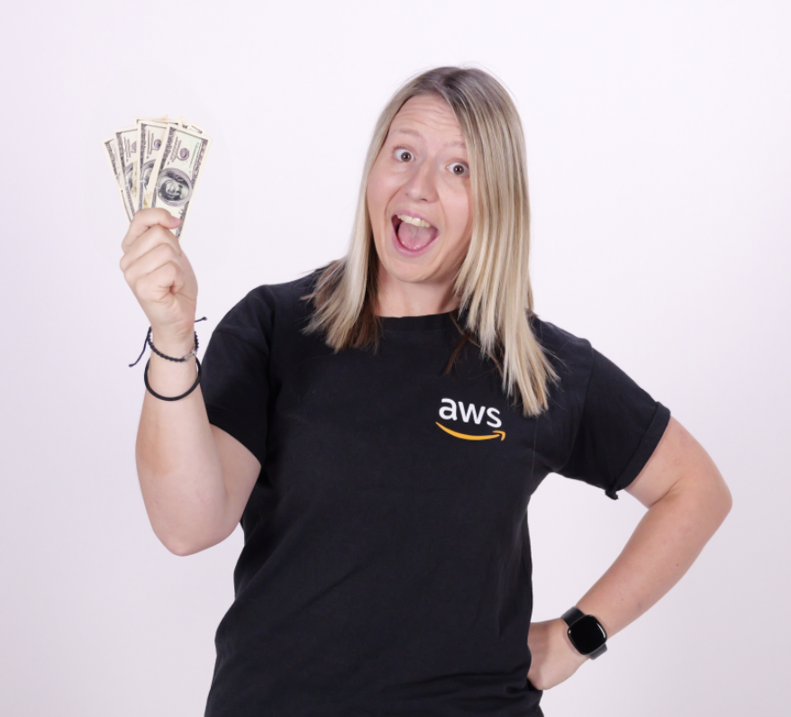

The Keys to AWS Optimization is a weekly Twitch show where we share stories, concepts and solutions to help you unlock your cost optimization. Hosted by three SME’s in the field; Steph, Savanna and John, they will interview guests from a range of subject matters to share information that could help you optimize your spend at AWS. With both technical and non technical guest, the show aims to take you from level 100 to 300 on every subject. The show will provide you with cost optimization resources for you to utilize in your own environment as well as answer any questions you have along the way.

You can watch all past episodes on [YouTube](https://www.youtube.com/@TheKeystoAWSOptimization) or on [Spotify](https://podcasters.spotify.com/pod/show/keys-to-aws-optimization)

## Hosts the show

- **Steph Gooch** is a Sr. Optimization Solution Architect Advocate in the AWS OPTICS team, where she acts as a Subject Matter Expert, guiding customers through ways to optimize their AWS spend. Alongside this, she works to educate AWS customer through external content such as videos, blogs and solutions. 

- **Savanna Jensen** is a Senior FinOps Success Manager on the AWS OPTICS team. She has worked within the Cloud Financial Management space at AWS for six years supporting various customers and industries on their CFM journeys. Her team enables customers to organize and interpret billing and usage data, identify actionable insights from that data, and develop sustainable strategies to embed cost into their culture. Prior to AWS, she worked in Healthcare Software.

If you have any questions, comments, or ideas, **reach out** to us. Feel free to send us an email at: [costoptimization@amazon.com](mailto:costoptimization@amazon.com)

## Schedule

Come learn live with us! We stream every Thursday at 7:30am Pacific/ 10:30 ET

### Current - SEASON 09

| Episode | Name | Date  | Link to Video
|--|--|--|--|
| S09E01 | Microsoft on AWS Cost Optimization | 45309 | [Link to live show](https://twitch.tv/aws) 
| S09E02 | 5 Steps to setting FinOps goals | 45316 | [Link to live show](https://twitch.tv/aws) 
| S09E03 | CFM Tips Launch | 45323 | [Link to live show](https://twitch.tv/aws) 
| S09E04 | Cost Allocation and how AWS can help | 45330 | [Link to live show](https://twitch.tv/aws) 
| S09E05 | Cost Optimizse Sheild | 45337 | [Link to live show](https://twitch.tv/aws) 
| S09E06 | Deep dive on AWS pricing | 45344 | [Link to live show](https://twitch.tv/aws) 
| S09E07 | AWS Joins the FinOps Foundation | 45351 | [Link to live show](https://twitch.tv/aws) 
| S09E08 | How executive sponsorship drives FinOps success | 45358 | [Link to live show](https://twitch.tv/aws) 
| S09E09 | New CloudWatch Logs Pattern Analysis | 45365 | [Link to live show](https://twitch.tv/aws) 
| S09E10 | Amazon Billing Conductor: Back and better than ever | 45372 | [Link to live show](https://twitch.tv/aws) 
| S09E11 | FinOps journey of customer Sky | 45379 | [Link to live show](https://twitch.tv/aws) 
| S09E12 | The Science of Instance Schedular | 45386 | [Link to live show](https://twitch.tv/aws) 
| S09E13 | What is CUR 2.0? | 45393 | [Link to live show](https://twitch.tv/aws) 
| S09E14 | Customer TBC | 45400 | [Link to live show](https://twitch.tv/aws) 

### Past - SEASON 08

| Episode | Name | Date  | Link to Video
|--|--|--|--|
| S08E01 | Demo EC2 how to find savings | 05/10/2023 | [Link to show recording](https://www.youtube.com/watch?v=LxNNsjvi3Z8&list=PLvf9vfTyZTQKOd3vAK3uuTKaPajqn5ceX) 
| S08E02 | How to view Azure costs using Amazon QuickSight | 12/10/2023 | [Link to show recording](https://www.youtube.com/watch?v=yzbn0EBMEEM&list=PLvf9vfTyZTQKOd3vAK3uuTKaPajqn5ceX&index=2) 
| S08E03 | How Haven shifted left | 19/10/2023 | [Link to show recording](https://www.youtube.com/watch?v=OYE0IhRE58g&list=PLvf9vfTyZTQKOd3vAK3uuTKaPajqn5ceX&index=3) 
| S08E04 | Halloween Horror Account | 26/10/2023 | [Link to show recording](https://www.youtube.com/watch?v=v8N44utcGIA&list=PLvf9vfTyZTQKOd3vAK3uuTKaPajqn5ceX&index=4) 
| S08E05 | The Power of Evangelising FinOps | 02/11/2023 | [Link to show recording](https://www.youtube.com/watch?v=GVxUpMIapbQ&list=PLvf9vfTyZTQKOd3vAK3uuTKaPajqn5ceX&index=5) 
| S08E06 | Saving Millions Through Small Changes  | 09/11/2023 | [Link to show recording](https://www.youtube.com/watch?v=cBmvRrz1p6U&list=PLvf9vfTyZTQKOd3vAK3uuTKaPajqn5ceX&index=6) 
| S08E07 | Power Tune Tool Demo  | 16/11/2023 | [Link to show recording](https://www.youtube.com/watch?v=-jiR1RxNQ9M&list=PLvf9vfTyZTQKOd3vAK3uuTKaPajqn5ceX&index=7) 
| S08E08 | CloudWatch Optimization Demo | 23/11/2023 | [Link to show recording](https://www.youtube.com/watch?v=LfR6e1xGSs0&list=PLvf9vfTyZTQKOd3vAK3uuTKaPajqn5ceX&index=8) 
| S08E09 | re:Invent reCap | 07/12/2023 | [Link to show recording](https://www.youtube.com/watch?v=DQm3JUJ3RZg&list=PLvf9vfTyZTQKOd3vAK3uuTKaPajqn5ceX&index=9) 
| S08E10 | A FinOps Christmas Carol | 14/12/2023 | [Link to show recording](https://www.youtube.com/watch?v=mFiqoRMMcC0&list=PLvf9vfTyZTQKOd3vAK3uuTKaPajqn5ceX&index=10) 