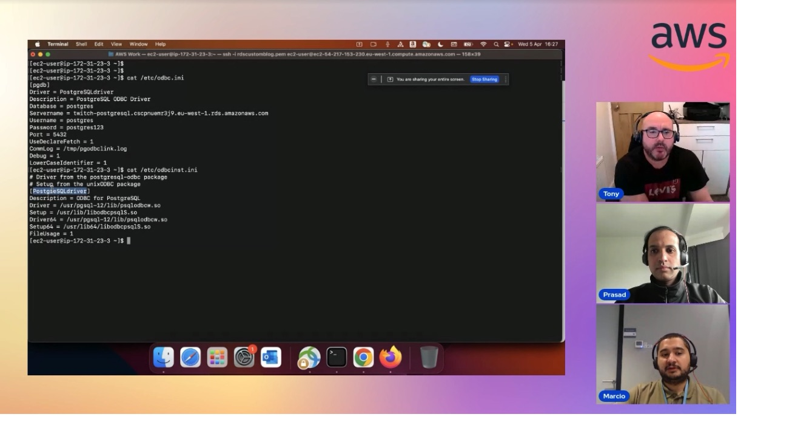

In this episode of Lets Talk About Data we discuss about the new GP3 storage class and how customers can benefit moving to it . In the second half of the show we discuss Oracle to PostgreSQL connectivity using the Oracle gateway and also have demo about how to configure the gateway.

Check out the recording here:

https://www.twitch.tv/videos/1841659475

## Hosts of the show 🎤

[**Tony Mullen**](https://www.linkedin.com/in/tony-mullen-8b05927), Senior RDS Specialist Solutions Architect @ AWS

## Guests

[**Marcio Fernando da Cruz**](https://www.linkedin.com/in/marcio-fernando-da-cruz/), Database Specialist

[**Prasad Matkar**](https://www.linkedin.com/in/prasad-matkar-37063715/), RDS Specialist Solutions Architect @ AWS

## Links from today's episode

- [Using an oracle database gateway blog](https://aws.amazon.com/blogs/database/using-an-oracle-database-gateway-to-connect-amazon-rds-custom-for-oracle-to-postgresql/)
- [GP3 volumes for RDS](https://aws.amazon.com/about-aws/whats-new/2022/11/amazon-rds-general-purpose-gp3-storage-volumes/)

## Reach out to the hosts and guests:

- Tony: (https://www.linkedin.com/in/tony-mullen-8b05927d)
- Marcio: (https://www.linkedin.com/in/marcio-fernando-da-cruz)
- Prasad: (https://www.linkedin.com/in/prasad-matkar-37063715)
