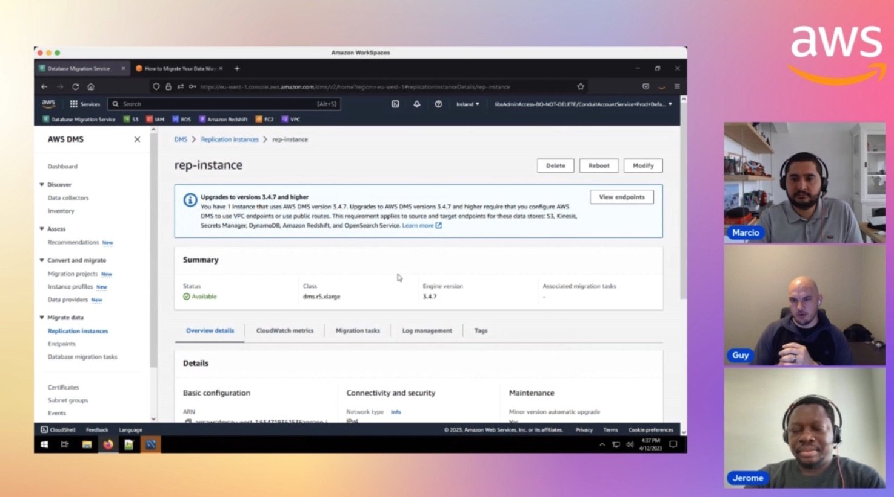

In this episode of Lets Talk About Data we discuss about the new GP3 storage class and how customers can benefit moving to it . In the second half of the show we discuss Oracle to PostgreSQL connectivity using the Oracle gateway and also have demo about how to configure the gateway.

Check out the recording here:

https://www.twitch.tv/videos/1841014442

## Hosts of the show 🎤

[**Marcio Fernando da Cruz**](https://www.linkedin.com/in/marcio-fernando-da-cruz/), Database Specialist

## Guests

[**Guy Baulch**](https://www.linkedin.com/in/guy-baulch-14b9b2a7/), Specialist Solutions Architect at AWS @ AWS

[**Jerome Darko**](https://www.linkedin.com/in/jerome-darko-3a436a39/), Specialist Solutions Architect at AWS @ AWS

## Links from today's episode

- [Troubleshooting DMS blog](https://aws.amazon.com/blogs/database/dws-dms-key-troubleshooting-metrics-and-performance-enhancers/)

## Reach out to the hosts and guests:

- Marcio: (https://www.linkedin.com/in/marcio-fernando-da-cruz/)
- Guy: (https://www.linkedin.com/in/guy-baulch-14b9b2a7)
- Jerome: (https://www.linkedin.com/in/jerome-darko-3a436a39/)
