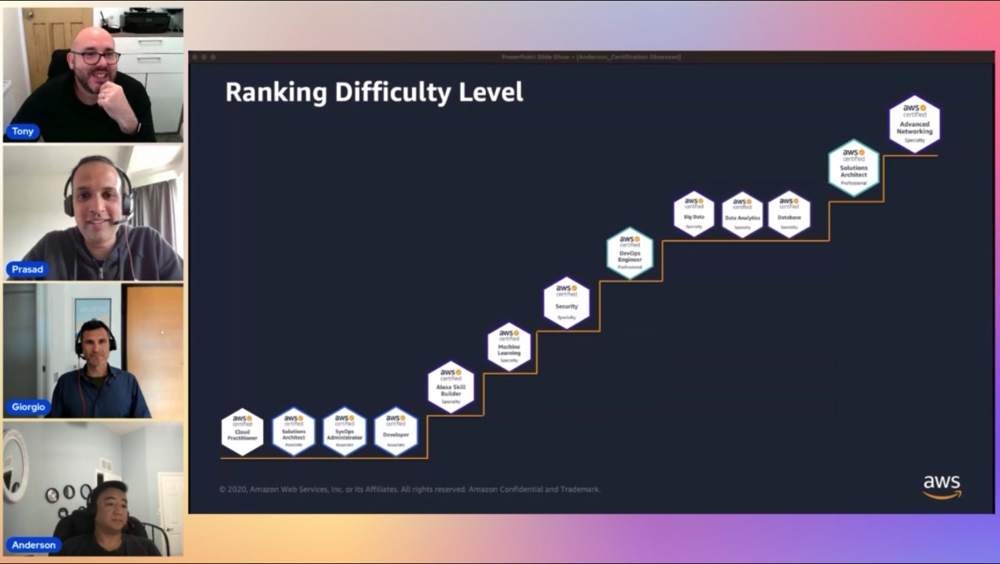

In this episode of Lets Talk About Data we discuss about importance of certifications and how certifications can help users in their cloud journey. We also discuss about sample questions that we come across in certification exams and tips/approach to solve them.

Check out the recording here:

https://www.twitch.tv/videos/1841017419

## Hosts of the show 🎤

[**Prasad Matkar**](https://www.linkedin.com/in/prasad-matkar-37063715/), RDS Specialist Solutions Architect @ AWS

## Guests

[**Tony Mullen**](https://www.linkedin.com/in/tony-mullen-8b05927), Senior RDS Specialist Solutions Architect @ AWS

[**Giorgio Bonzi**](https://www.linkedin.com/in/giorgio-bonzi-680a8a4b/), Senior RDS Specialist Solutions Architect @ AWS

[**Anderson Santos**](https://www.linkedin.com/in/anderson-santos-b9b1bb7/), Sr Solutions Architect at Amazon Web Services @ AWS

## Links from today's episode

- [Certfied solutions architect professional](https://aws.amazon.com/certification/certified-solutions-architect-professional/using-an-oracle-database-gateway-to-connect-amazon-rds-custom-for-oracle-to-postgresql/)
- [Database Speciality](https://aws.amazon.com/certification/certified-database-specialty/?ch=sec&sec=rmg&d=1)
- [Data Analytics Speciality](https://aws.amazon.com/certification/certified-data-analytics-specialty/?ch=sec&sec=rmg&d=1)

Free Training Plans & Badges

🔸 Architecting: https://bit.ly/architect23

🔸 AWS for Games: https://go.aws/3l6fYf7

🔸 Serverless: https://go.aws/3UZpFs0

🔸 Object Storage: https://go.aws/3JVneTS

🔸 Block Storage: https://go.aws/3JVneTS

🔸 File Storage: https://go.aws/3JVneTS

🔸 Storage Data Migration: https://go.aws/3JVneTS

🔸 Data Protection & Disaster Recovery: https://go.aws/3JVneTS

## Reach out to the hosts and guests:

- Tony: (https://www.linkedin.com/in/tony-mullen-8b05927d)
- Prasad: (https://www.linkedin.com/in/prasad-matkar-37063715/)
- Giorgio: (https://www.linkedin.com/in/giorgio-bonzi-680a8a4b/)
- Anderson: (https://www.linkedin.com/in/anderson-santos-b9b1bb7/)
