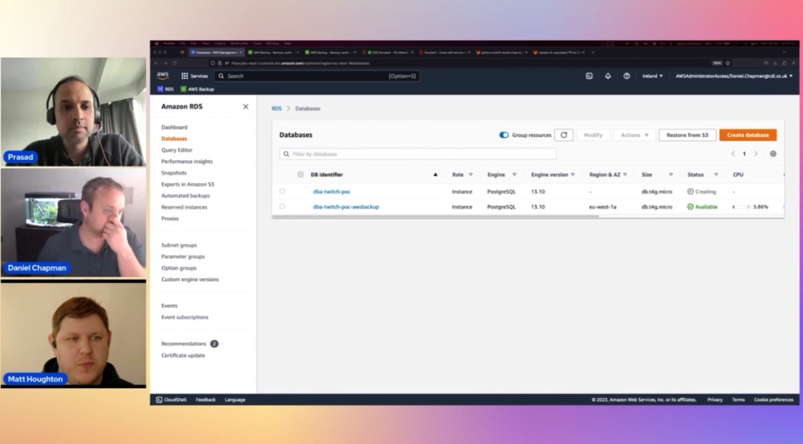

In this episode of Lets Talk About Data we discuss on how our customer CDL migrated 600 Oracle databases to the RDS PostgreSql ,best practises involved, challenges faced etc. In the second half of the show CDL walk us through the actual process  of how they achieved it , services they used for full load and change data capture , the monitoring and alerting during the migration process.

Check out the recording here:

https://www.twitch.tv/videos/1841658373

## Hosts of the show 🎤

[**Prasad Matkar**](https://www.linkedin.com/in/prasad-matkar-37063715/), RDS Specialist Solutions Architect @ AWS

## Guests

[**Daniel Chapman**](https://www.linkedin.com/in/daniel-chapman-a753b56b/), Lead Cloud Database Engineer @ CDL Software

[**Matthew Houghton**](https://www.linkedin.com/in/matt-houghton-06b59010a/), Data Architect @ CDL Software 

## Links from today's episode

- [Certfied solutions architect professional](https://aws.amazon.com/certification/certified-solutions-architect-professional/using-an-oracle-database-gateway-to-connect-amazon-rds-custom-for-oracle-to-postgresql/)
- [Database Speciality](https://aws.amazon.com/certification/certified-database-specialty/?ch=sec&sec=rmg&d=1)
- [Data Analytics Speciality](https://aws.amazon.com/certification/certified-data-analytics-specialty/?ch=sec&sec=rmg&d=1)

- [Fast Refresh Materialized Views in PostgreSQL re:Invent 2021 Talk: ](https://www.youtube.com/watch?v=DCLOiRMX3xE)
- [Fast Refresh Materialized Views in PostgreSQL open source code:](https://github.com/CDLSoftware/pg-mv-fast-refresh)
- [Database Migration re:Invent 2022 Talk: ](https://www.youtube.com/watch?v=0gpEbbx2Hy0)
- [RDS Ready APN Blog: ](https://aws.amazon.com/blogs/apn/amazon-rds-ready-program-expands-to-include-partner-business-application-product-category/)
- [CDL AWS Microsite: ](https://www.cdl.co.uk/aws/overview.html)

## Reach out to the hosts and guests:

- Prasad: (https://www.linkedin.com/in/prasad-matkar-37063715/)
- Dan: (https://www.linkedin.com/in/daniel-chapman-a753b56b/)
- Matt: (https://www.linkedin.com/in/matt-houghton-06b59010a/)
