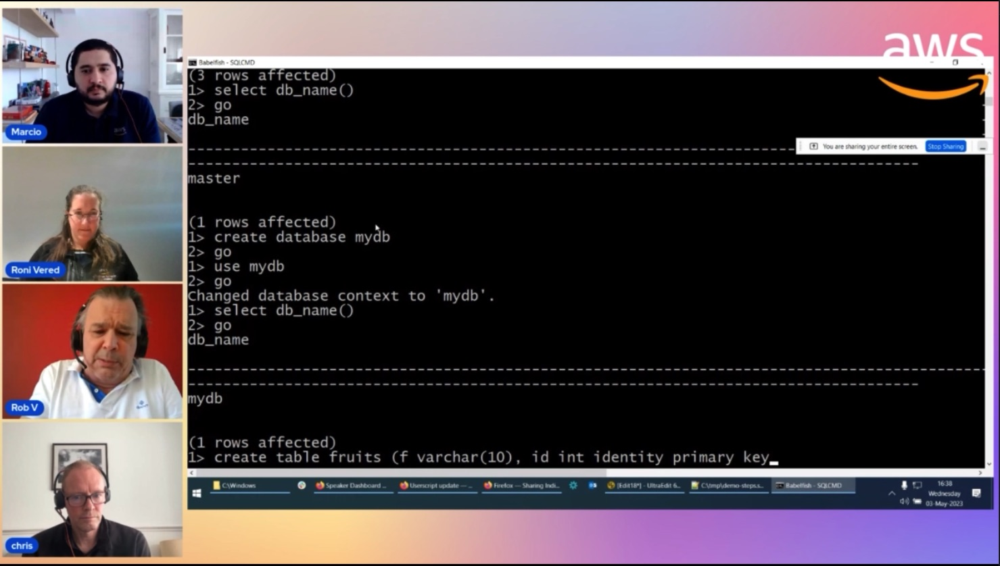

In this episode of Lets Talk About Data we discuss about the Bablefish for Aurora PostgreSQL and customer usecases for this option. In the second part of the show we build demo using the various features/functionality available to customers using Bablefish for PostgreSQL

Check out the recording here:

https://www.twitch.tv/videos/1841658652

## Hosts of the show 🎤

[**Marcio Fernando da Cruz**](https://www.linkedin.com/in/marcio-fernando-da-cruz/), Database Specialist

## Guests

[**Chris Hutchings**](https://www.linkedin.com/in/chris-hutchings-957214/), Database Specialist @ AWS

[**Roni Vered *](https://www.linkedin.com/in/ronivered/), Senior Database Solutions Architect @ AWS

[**Rob Verschoor *](https://www.linkedin.com/in/rob-verschoor-989520/), Principal Database Engineer, Aurora/PostgreSQL @ AWS

## Links from today's episode

* Get Up and Running with Babelfish for Aurora PostgreSQL - https://youtu.be/f9YC5NyNzAE
* Introduction to Babelfish for Aurora PostgreSQL - https://youtu.be/X_6--RJ_bdM    
* Introduction to Babelfish Compass - https://youtu.be/AXYJJYLmt1Q
* Babelfish Compass: reporting options - https://youtu.be/CReH49IPD4E
* Babelfish Compass: multiple input files - https://youtu.be/-Y-8gu1E8zI
* Babelfish Compass: advanced topics - https://youtu.be/rjNZL5wzfkc
* Modernizing MS SQL Server using Babelfish for Aurora PostgreSQL Case Study - https://youtu.be/HWljwZYsjvw

All Babelfish blogs:

* Intorduction to Babelfish:
    https://aws.amazon.com/blogs/aws/goodbye-microsoft-sql-server-hello-babelfish/
* All Babelfish posts:
    https://aws.amazon.com/blogs/database/category/database/amazon-aurora/babelfish-for-aurora-postgresql/

## Reach out to the hosts and guests:

- Marcio Fernando da Cruz (https://www.linkedin.com/in/marcio-fernando-da-cruz/)
- Chris Hutchings (https://www.linkedin.com/in/chris-hutchings-957214/)
- Roni Vered (https://www.linkedin.com/in/ronivered/)
- Rob Verschoor (https://www.linkedin.com/in/rob-verschoor-989520/)

