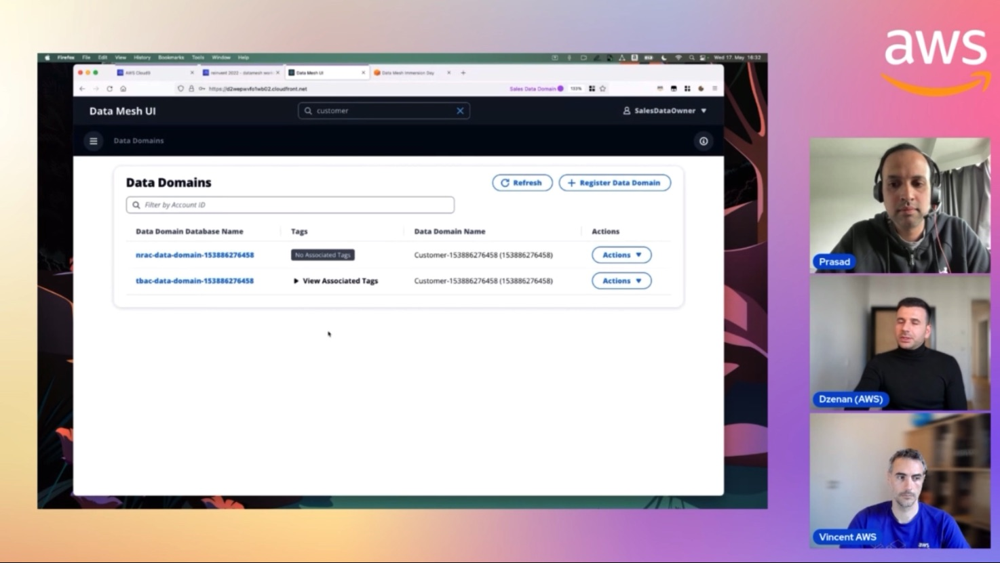

In this episode of Lets Talk About Data we discuss about the new services like Data Mesh and Amazon Datazone and how customers can create data domain for their specific usecase. The second part of the demo focuses on creating the Data Domain.

Check out the recording here:

https://www.twitch.tv/videos/1841659193

## Hosts of the show 🎤

[**Prasad Matkar**](https://www.linkedin.com/in/prasad-matkar-37063715/), RDS Specialist Solutions Architect @ AWS

## Guests

[**Vincent Gromakowski**](https://www.linkedin.com/in/vincent-gromakowski/), Principal Analytics Solutions Architect @ AWS

[**Dzenan Softic**](https://www.linkedin.com/in/dzenansoftic/), Senior Start-up Solutions Architect @ AWS

## Links from today's episode

* JPMC example = https://aws.amazon.com/blogs/big-data/how-jpmorgan-chase-built-a-data-mesh-architecture-to-drive-significant-value-to-enhance-their-enterprise-data-platform/
* GoDaddy example = https://aws.amazon.com/blogs/big-data/how-godaddy-built-a-data-mesh-to-decentralize-data-ownership-using-aws-lake-formation/
* Custom solution using AWS Analytics Reference Architecture https://aws.amazon.com/blogs/big-data/use-an-event-driven-architecture-to-build-a-data-mesh-on-aws/
* Engie customer story = https://aws.amazon.com/solutions/case-studies/engie-aws-analytics-case-study/?nc1=h_ls
* Analytics Reference Architecture (ARA CDK library) = https://github.com/aws-samples/aws-analytics-reference-architecture

## Reach out to the hosts and guests:

- Prasad: (https://www.linkedin.com/in/prasad-matkar-37063715/)
- Vincent Gromakowski (https://www.linkedin.com/in/vincent-gromakowski/)
- Dzenan Softic (https://www.linkedin.com/in/dzenansoftic/)
