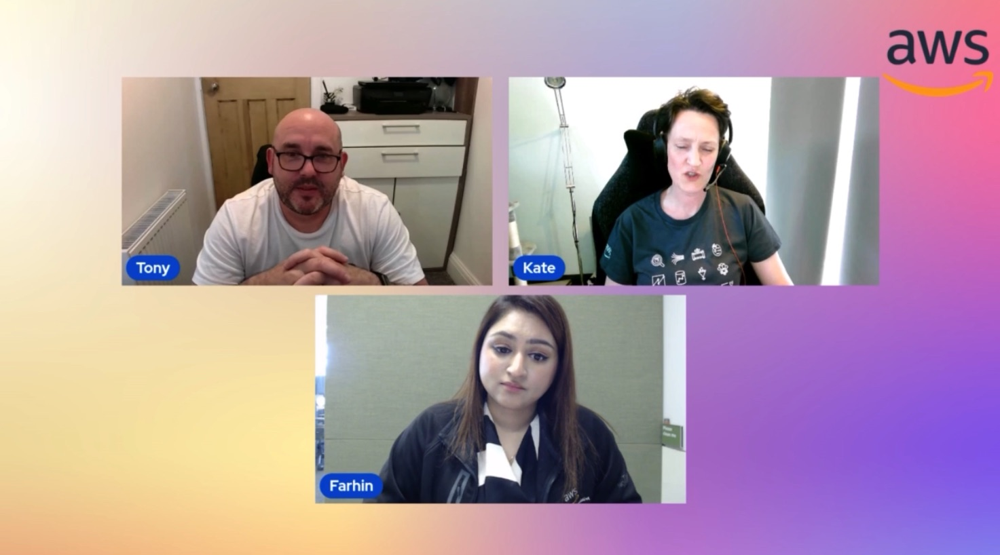

In this episode of Lets Talk About Data we discuss about the women in data initiative at AWS and discuss about the cloud journey of our guests. In the second half of the show we focus on reference architecture of manufacturing company and how they leverage various AWS services.

Check out the recording here:

https://www.twitch.tv/videos/1841658946

## Hosts of the show 🎤

[**Tony Mullen**](https://www.linkedin.com/in/tony-mullen-8b05927), Senior RDS Specialist Solutions Architect @ AWS

## Guests

[**Kate Gawron**](https://www.linkedin.com/in/katehollow/), Leader in Cloud Databases

[**Farhin Khan**](https://www.linkedin.com/in/farhin-khan-0a505536/), Head of AWS UKI Databases Sales, GTM and Business Development @ AWS

## Links from today's episode

* https://lnkd.in/grbpzw_D - AWS She Builds Mentorship
* https://ladiesthatlaunch.splashthat.com/ - Ladies that Launch Lunch on Summit
* https://aws.amazon.com/events/summits/london/ London Summit

* AWS Certified Database - Specialty (DBS-C01) Certification Guide - https://www.packtpub.com/product/aws-certified-database-specialty-dbs-c01-certification-guide/9781803243108

## Reach out to the hosts and guests:

- Tony: (https://www.linkedin.com/in/tony-mullen-8b05927d)
- Kate Gawron: (https://www.linkedin.com/in/katehollow/)
- Farhin Khan: (https://www.linkedin.com/in/farhin-khan-0a505536/)
