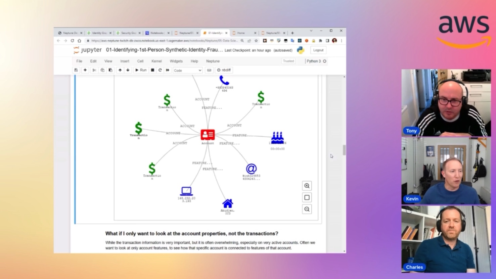

In this episode of Lets Talk About Data we dive deep in Graph databases and Amazon Neptune. We discuss about the usecases where customer benefit from using a graph database. In the second half of the show we have a detailed demo to setup and use graph databases.

Check out the recording here:

https://www.twitch.tv/videos/1851873056

## Hosts of the show 🎤

[**Tony Mullen**](https://www.linkedin.com/in/tony-mullen-8b05927), Senior RDS Specialist Solutions Architect @ AWS

## Guests

[**Kevin Phillips**](https://www.linkedin.com/in/kevinphillips81/), Graph Database Specialist Solutions Architect @AWS
[**Chrales Ivie**](https://www.linkedin.com/in/charlesivie//), Sr Graph Architect @ AWS

## Links from today's episode

* Demos Hub - https://www.demos.neptune.aws.dev/
* Identity Graph blog - https://aws.amazon.com/blogs/database/building-a-customer-identity-graph-with-amazon-neptune/
* Getting Started - https://docs.aws.amazon.com/neptune/latest/userguide/graph-get-started.html

## Reach out to the hosts and guests:

- Tony: (https://www.linkedin.com/in/tony-mullen-8b05927d)
- Kevin Phillip (https://www.linkedin.com/in/kevinphillips81/)
- Chrales Ivie (https://www.linkedin.com/in/charlesivie//)
