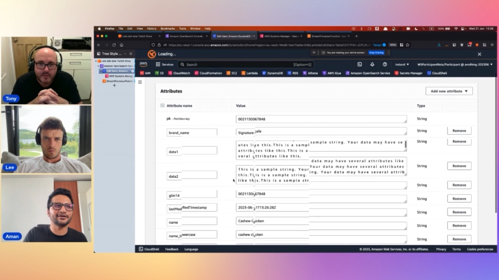

In this episode of Lets Talk About Data we discuss about what is Dynamodb, the best practises while using Dynamodb and focus on how customers use DynamoDB. In the second part of the show we focus on the Demo , creating tables and discussing about indexes and modelling considerations while working with DynamoDB.

Check out the recording here:

https://www.twitch.tv/videos/1851873056

## Hosts of the show 🎤

[**Tony Mullen**](https://www.linkedin.com/in/tony-mullen-8b05927), Senior RDS Specialist Solutions Architect @ AWS

## Guests

[**Aman Dhingra**](https://www.linkedin.com/in/amdhing/), Specialist Solutions Architect @AWS
[**Lee Hannigan**](https://www.linkedin.com/in/lee-hannigan/), Sr. Specialist Solutions Architect @ AWS

## Links from today's episode

* Self-service workshop of DynamoDB + OpenSearch for learning - https://catalog.us-east-1.prod.workshops.aws/workshops/de2b0dd7-8b88-4aeb-b355-ce076b0d9c6e/en-US
* Other DynamoDB Workshops (with Self-service option) - https://amazon-dynamodb-labs.com/index.html

## Reach out to the hosts and guests:

- Tony: (https://www.linkedin.com/in/tony-mullen-8b05927d)
- Aman Dhingra: (https://www.linkedin.com/in/amdhing/)
- Lee Hannigan: (https://www.linkedin.com/in/lee-hannigan/)
