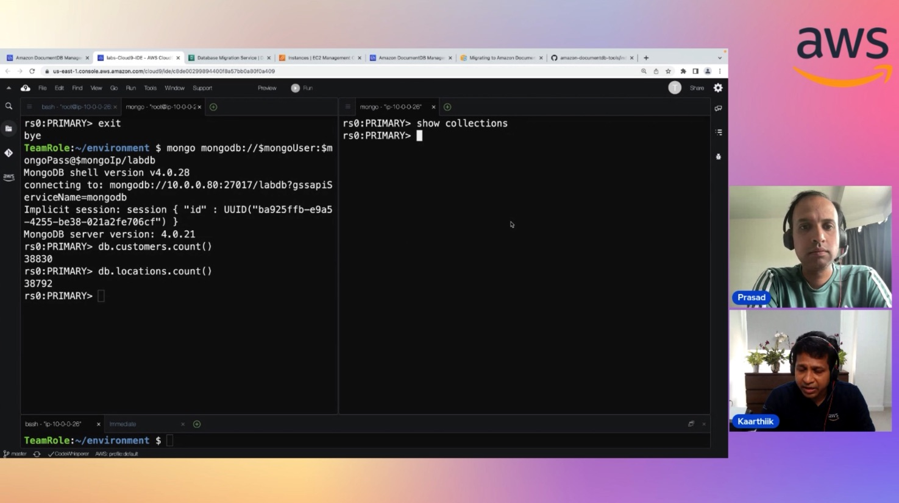

In this episode of Lets Talk About Data we discuss about what is Amazon DocumentDB and how it is different when compared to MongoDB. We also have a detailed demo of how customers can move from their existing MongoDB to Amazon DocumentDB using Database Migration Service.creating the Data Domain.

Check out the recording here:

https://www.twitch.tv/videos/1953157024

## Hosts of the show 🎤

[**Prasad Matkar**](https://www.linkedin.com/in/prasad-matkar-37063715/), RDS Specialist Solutions Architect @ AWS

## Guests

[**Kaarthiik Thota**](https://www.linkedin.com/in/kaarthiik-thota/), Senior NoSQL Solutions Architect @ AWS

## Links from today's episode

* Can DMS support migration from non relational sources ? 
    * Link: https://aws.amazon.com/blogs/database/migrating-relational-databases-to-amazon-documentdb-with-mongodb-compatibility/

* What methods are available for migration, like can customers migrate online with low downtime or zero downtime
    * Link: https://docs.aws.amazon.com/documentdb/latest/developerguide/docdb-migration.html#docdb-migration-approaches

## Reach out to the hosts and guests:

- Prasad: (https://www.linkedin.com/in/prasad-matkar-37063715/)
- Kaarthiik Thota: (https://www.linkedin.com/in/kaarthiik-thota/)
