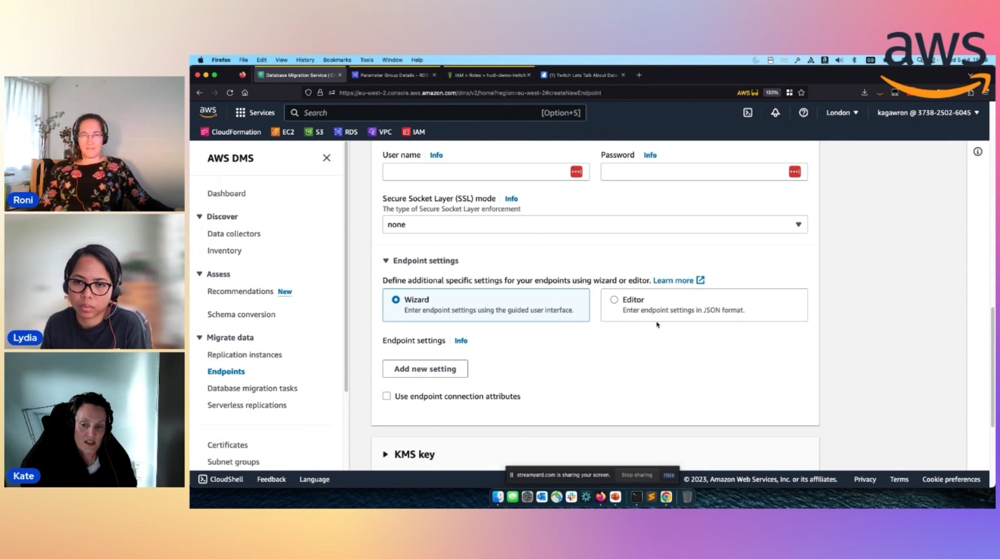

In this episode of Lets Talk About Data we focus on the AWS Analytics services like Glue , Hudi and how it can be used to build data lake. We focus on the ingestion sources and staging the data in the data lake. We have a detailed demo in the second half of the show focusing on building data lake and using these services.

Check out the recording here:

https://www.twitch.tv/videos/1953225374

[**Roni Vered *](https://www.linkedin.com/in/ronivered/), Senior Database Solutions Architect @ AWS

## Guests

[**Kate Gawron**](https://www.linkedin.com/in/katehollow/), Leader in Cloud Databases

[**Lydia Ray**](https://www.linkedin.com/in/lydia-ray/), Data, Analytics, AIML @AWS

## Links from today's episode

* How get started with Apache Hudi? More info about Hudi. https://hudi.apache.org/docs/overview
* How to get started with AWS Glue with Hudi?
* AWS Doc - Hudi Script - https://docs.aws.amazon.com/glue/latest/dg/aws-glue-programming-etl-format-hudi.html
* AWS Doc - Hudi in Glue Studio (low code) - https://docs.aws.amazon.com/glue/latest/ug/gs-data-lake-formats-hudi.html
* Latest AWS blog about Glue with Hudi:
   * https://aws.amazon.com/blogs/big-data/automate-schema-evolution-at-scale-with-apache-hudi-in-aws-glue/
   * https://aws.amazon.com/blogs/big-data/how-infomedia-built-a-serverless-data-pipeline-with-change-data-capture-using-aws-glue-and-apache-hudi/
* OTF Comparison (Hudi, Iceberg, Delta Lake) - https://aws.amazon.com/blogs/big-data/choosing-an-open-table-format-for-your-transactional-data-lake-on-aws/

## Reach out to the hosts and guests:

- Roni Vered: (https://www.linkedin.com/in/ronivered/)
- Kate Gawron: (https://www.linkedin.com/in/katehollow/)
- Lydia Ray: (https://www.linkedin.com/in/lydia-ray/)

