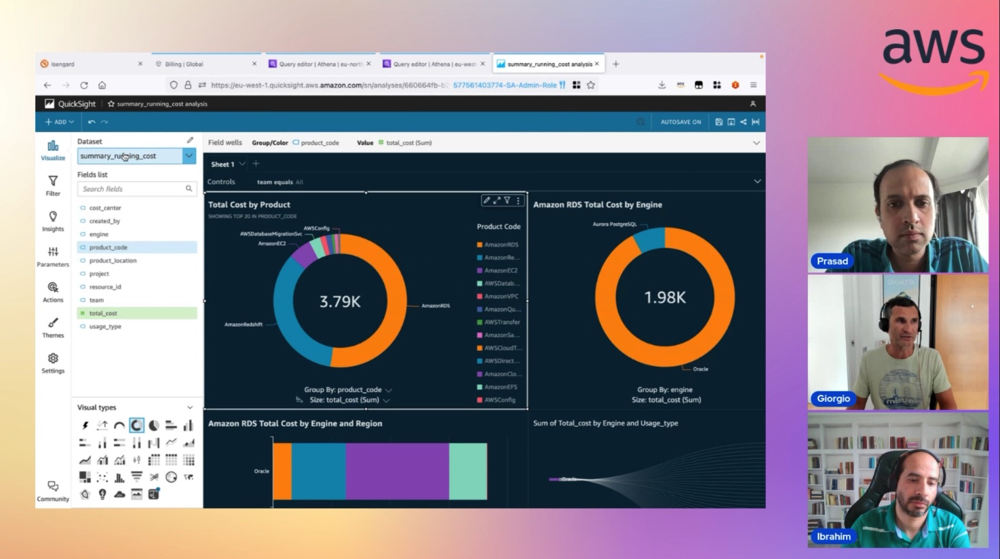

In this episode of Lets Talk About Data we discuss about cost optmisation when using Amazon RDS and Amazon Aurora in detail. In the second half of the show we focus on the demo using services like Amazon Cost & Usage report, Lambda and create dashboard to visualise the cost.

Check out the recording here:

https://www.twitch.tv/videos/1841017419

## Hosts of the show 🎤

[**Prasad Matkar**](https://www.linkedin.com/in/prasad-matkar-37063715/), RDS Specialist Solutions Architect @ AWS

## Guests

[**Ibrahim Emara**](https://www.linkedin.com/in/ibrahim-emara-b295a675), RDS Specialist Solutions Architect @ AWS

[**Giorgio Bonzi**](https://www.linkedin.com/in/giorgio-bonzi-680a8a4b/), Senior RDS Specialist Solutions Architect @ AWS

## Links from today's episode

* What is Relational Database Service - https://aws.amazon.com/rds/
* What is Aurora - 	https://docs.aws.amazon.com/AmazonRDS/latest/AuroraUserGuide/CHAP_AuroraOverview.html
* Can you please share guidelines to optimise cost in RDS - https://aws.amazon.com/blogs/database/optimizing-costs-in-amazon-rds/
* Storage spends in RDS	- https://aws.amazon.com/blogs/database/optimizing-costs-in-amazon-rds/
* What is efficient way to store long term backups for compliance to keep the cost minimal	https://aws.amazon.com/blogs/database/demystifying-amazon-rds-backup-storage-costs/

## Reach out to the hosts and guests:

- Tony: (https://www.linkedin.com/in/tony-mullen-8b05927d)
- Prasad: (https://www.linkedin.com/in/prasad-matkar-37063715/)
- Giorgio: (https://www.linkedin.com/in/giorgio-bonzi-680a8a4b/)
- Ibrahim: (https://www.linkedin.com/in/ibrahim-emara-b295a675/)
