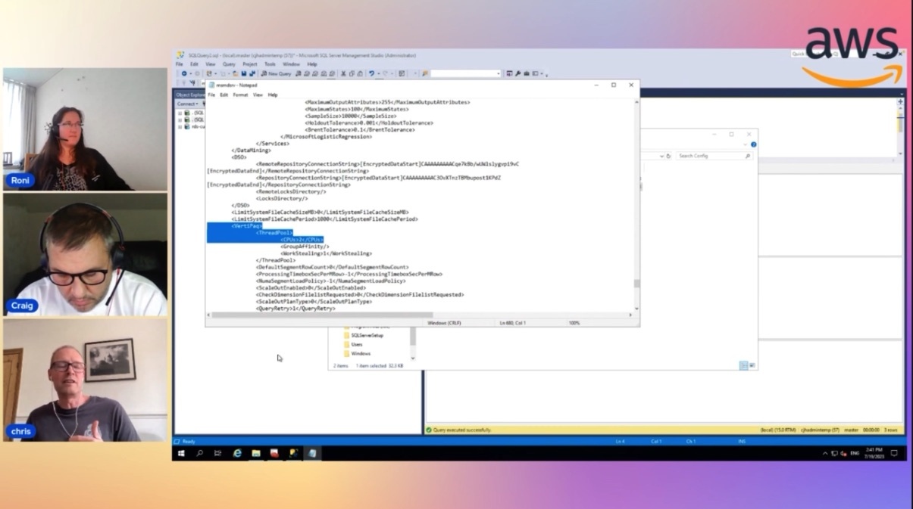

In this episode of Lets Talk About Data we discuss about RDS options available in SQL Server deployment and usecases where customer can consider chosing amongst those options. In the show we dive deep in details about RDS and RDS Custom for SQL Server followed by demo in the second part of the show.

Check out the recording here:

https://www.twitch.tv/videos/1876777687

## Hosts of the show 🎤

[**Roni Vered *](https://www.linkedin.com/in/ronivered/), Senior RDS Specialist Solutions Architect @ AWS

## Guests

[**Christopher Hutchings**](https://www.linkedin.com/in/chris-hutchings-957214/), Senior RDS Specialist Solutions Architect @ AWS

[**Craig Clayton**](https://www.linkedin.com/in/craig-clayton-32480714/), Senior Database Specialist Solutions Architect @ AWS

## Links from today's episode

* What is Relational Database Service - https://aws.amazon.com/rds/
* What is RDS for SQL Server	Amazon RDS for Microsoft SQL Server - https://docs.aws.amazon.com/AmazonRDS/latest/UserGuide/CHAP_SQLServer.html
* What is RDS Custom for SQL Server	https://aws.amazon.com/blogs/aws/new-amazon-rds-custom-for-sql-server-is-generally-available/
* List key diffrences between RDS / RDS Custom	https://docs.aws.amazon.com/AmazonRDS/latest/UserGuide/rds-custom.html
--> Comparison matrix	https://docs.aws.amazon.com/prescriptive-guidance/latest/migration-sql-server/comparison.html
* What about Self-Managed SQL on EC2 ? 	Amazon EC2 for SQL Server - AWS Prescriptive Guidance
* What EC2/RDS instance types are recommended for SQL Server workloads?	Amazon RDS for Microsoft SQL Server - Amazon Relational Database Service
* How to choose the right service for my SQL Server workload? 	https://docs.aws.amazon.com/prescriptive-guidance/latest/migration-sql-server/comparison.html
* How do we migrate SQL Server workloads to AWS ? 	https://docs.aws.amazon.com/prescriptive-guidance/latest/patterns/migrate-an-on-premises-microsoft-sql-server-database-to-amazon-rds-for-sql-server.html
* Latest new features of RDS and RDS Custom ? 	Working with Self Managed Active Directory with an Amazon RDS for SQL Server DB instance - Amazon Relational Database Service
* What's the fuz about BYOM of RDS Custom  ?	https://aws.amazon.com/blogs/database/optimize-your-sql-server-costs-by-using-bring-your-own-media-byom-on-amazon-rds-custom-for-sql-server/
* What's different between the MAZ in RDS and in RDS Custom for SQL Server?	https://aws.amazon.com/blogs/database/configure-multi-az-with-amazon-rds-custom-for-sql-server/

## Reach out to the hosts and guests:

- Roni : (https://www.linkedin.com/in/ronivered/))
- Chris : (https://www.linkedin.com/in/chris-hutchings-957214/)
- Craig : (https://www.linkedin.com/in/craig-clayton-32480714/)
