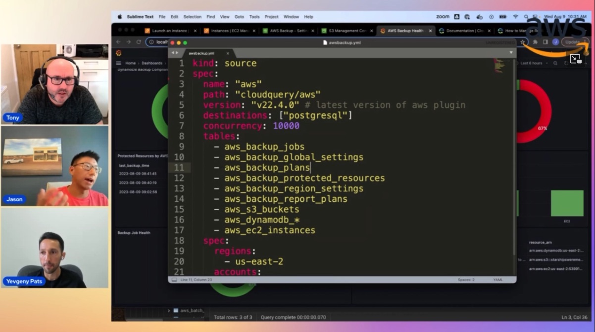

In this episode of Lets Talk About Data we discuss about managing the infrastructure data using Cloudquery and how customers can benefit of having these detailed easily accessible via queries. In the second half of the show we have a detailed demo of how cloud query is able to query infrastructre related data and help provide useful insights to the end customers.

Check out the recording here:

https://www.twitch.tv/videos/1907162122

## Hosts of the show 🎤

[**Tony Mullen**](https://www.linkedin.com/in/tony-mullen-8b05927), Senior RDS Specialist Solutions Architect @ AWS

## Guests

[**Jason Kao**](https://www.linkedin.com/in/kaojason/), Head of Security Research and Solutions @ CloudQuery

[**Yevgeny Pats**](https://www.linkedin.com/in/yevgeny-pats-5973328b/), Co-Founder & CEO at CloudQuery

## Links from today's episode

* AWS Backup Blog -  https://www.cloudquery.io/how-to-guides/manage-resilience-with-aws-backup
* Other Links -
  https://www.cloudquery.io/how-to-guides/manage-resilience-with-aws-backup
  https://www.cloudquery.io/integrations
  https://www.cloudquery.io/docs

## Reach out to the hosts and guests:

- Tony: (https://www.linkedin.com/in/tony-mullen-8b05927d)
- Jason: (https://www.linkedin.com/in/kaojason/)
- Yevgeny: (https://www.linkedin.com/in/yevgeny-pats-5973328b/)