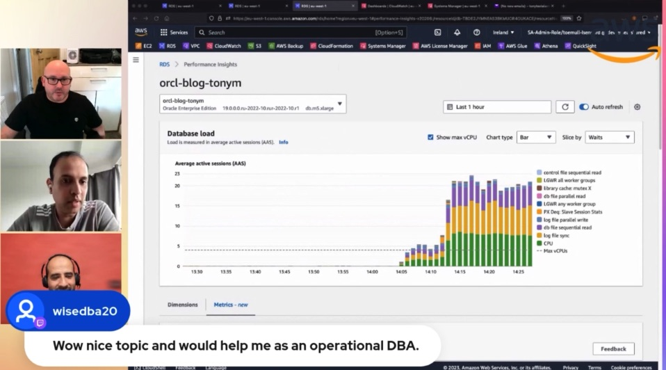

In this episode of Lets Talk About Data this first host builder show we focus on monitoring options available in the Amazon RDS for Oracle and detailed demo covers enhanced monitoring and performance insights, cloudwatch metrics to monitor the database.

Check out the recording here:

https://www.twitch.tv/videos/1907161452

## Hosts Builder show 🎤

[**Tony Mullen**](https://www.linkedin.com/in/tony-mullen-8b05927d), Senior RDS Specialist Solutions Architect @ AWS

[**Prasad Matkar**](https://www.linkedin.com/in/prasad-matkar-37063715/), RDS Specialist Solutions Architect @ AWS

[**Ibrahim Emara**](https://www.linkedin.com/in/ibrahim-emara-b295a675), RDS Specialist Solutions Architect @ AWS

## Links from today's episode

* Swingbench - https://www.dominicgiles.com/swingbench/
* Cloudwatch metrics - https://docs.aws.amazon.com/AmazonCloudWatch/latest/logs/WhatIsCloudWatchLogs.html
* Enhanced monitoring - https://docs.aws.amazon.com/AmazonRDS/latest/UserGuide/USER_Monitoring.OS.html
* Performance insights - https://docs.aws.amazon.com/AmazonRDS/latest/UserGuide/USER_PerfInsights.html
* Cloudwatch logs - https://docs.aws.amazon.com/AmazonRDS/latest/UserGuide/USER_LogAccess.html
* Create alarm - https://aws.amazon.com/premiumsupport/knowledge-center/storage-full-rds-cloudwatch-alarm/
* Alert log notification - https://aws.amazon.com/blogs/database/enable-notifications-for-block-corruption-on-amazon-rds-for-oracle/
* Bespoke metrics - https://docs.aws.amazon.com/AmazonCloudWatch/latest/monitoring/publishingMetrics.html
* Event subscription - https://docs.aws.amazon.com/AmazonRDS/latest/UserGuide/USER_Events.overview.html

## Reach out to the hosts and guests:

- Tony: (https://www.linkedin.com/in/tony-mullen-8b05927d)
- Prasad: (https://www.linkedin.com/in/prasad-matkar-37063715/)
- Ibrahim: (https://www.linkedin.com/in/ibrahim-emara-b295a675/)
