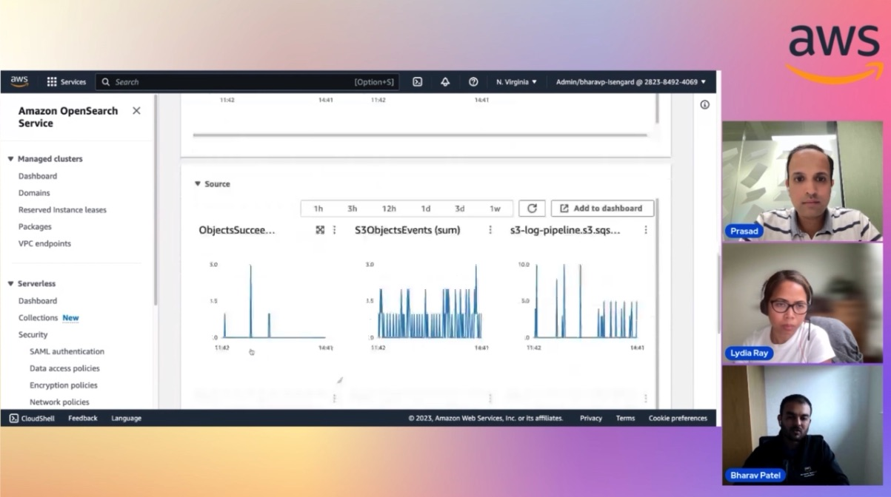

In this episode of Lets Talk About Data we discuss about Opensearch and customer usecases of how the Amazon Openseach Ingestion (OSI) and consumption fits together. In the second half we cover demo which provides end users details of how end to end tasks can be configured.

Check out the recording here:

https://www.twitch.tv/videos/1907119575

## Hosts of the show 🎤

[**Prasad Matkar**](https://www.linkedin.com/in/prasad-matkar-37063715/), RDS Specialist Solutions Architect @ AWS

## Guests

[**Lydia Ray**](https://www.linkedin.com/in/lydia-ray/), Data, Analytics, AIML @AWS

[**Bharav Patel**](https://www.linkedin.com/in/bharav-patel-2a3a2127/), Specialist Solutions Architect @ AWS

## Links from today's episode

* What is Log Analytics- https://aws.amazon.com/what-is/log-analytics/#:~:text=Log%20analytics%20involves%20searching%2C%20analyzing,of%20rapidly%20proliferating%20machine%20data.
* What is OpenSearch-	https://opensearch.org/
* What is Amazon OpenSearch- 	https://aws.amazon.com/opensearch-service/
* OpenSource Project examples:
  https://aws.amazon.com/solutions/case-studies/cms-case-study/?did=cr_card&trk=cr_card
  https://aws.amazon.com/solutions/case-studies/pinterest-case-study/
  https://aws.amazon.com/solutions/case-studies/anghami/?did=cr_card&trk=cr_card
* Amazon OpenSearch Ingestion (OSI) - https://docs.aws.amazon.com/opensearch-service/latest/developerguide/ingestion.html
* Monitor Ingestion pipeline?	https://docs.aws.amazon.com/opensearch-service/latest/developerguide/monitoring-pipeline-metrics.html

## Reach out to the hosts and guests:

- Prasad: (https://www.linkedin.com/in/prasad-matkar-37063715/)
- Bharav: (https://www.linkedin.com/in/bharav-patel-2a3a2127/)
- Lydia: (https://www.linkedin.com/in/lydia-ray/)
