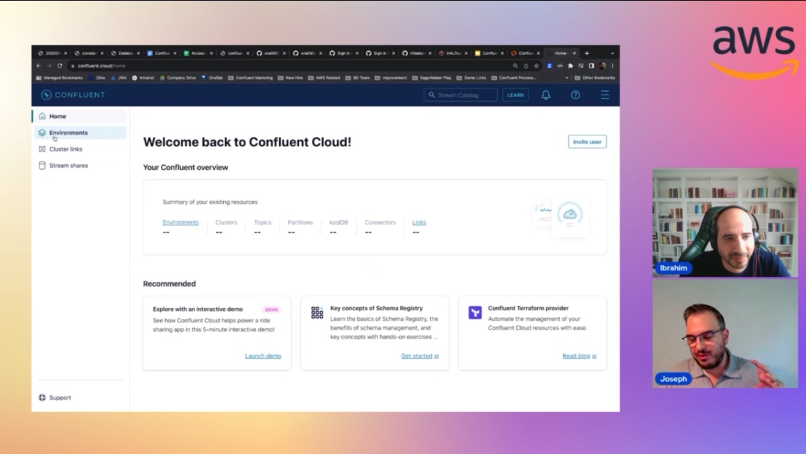

In this episode of Lets Talk About Data we discuss about how Confluent powers realtime outcomes in AWS .

Check out the recording here:

https://www.twitch.tv/videos/1918470045

## Hosts of the show 🎤

[**Ibrahim Emara**](https://www.linkedin.com/in/ibrahim-emara-b295a675), RDS Specialist Solutions Architect @ AWS

## Guests

[**Joseph Morais**](https://www.linkedin.com/in/theejosephmorais/), Principal Cloud Partner Solutions Architect and AWS Evangelist @ Confluent

## Links from today's episode

* Useful Confluent links:
  https://www.confluent.io/partner/amazon-web-services/
  https://www.confluent.io/hub/
  https://www.confluent.io/blog/connect-with-confluent-partner-program/
  https://www.confluent.io/blog/cloud-kafka-meets-cloud-flink-with-confluent-and-immerok/
  https://developer.confluent.io/podcast/flink-vs-kafka-streams-ksqldb-comparing-stream-processing-tools/
  https://www.confluent.io/blog/chatgpt-and-streaming-data-for-real-time-generative-ai/
  https://www.confluent.io/blog/streaming-data-quality-integration-and-sharing/
  https://www.confluent.io/blog/two-ways-to-build-event-driven-serverless-applications/
  https://www.confluent.io/learn/batch-vs-real-time-data-processing/

## Reach out to the hosts and guests:

- Ibrahim: (https://www.linkedin.com/in/ibrahim-emara-b295a675/)
- Joseph: (https://www.linkedin.com/in/theejosephmorais/)