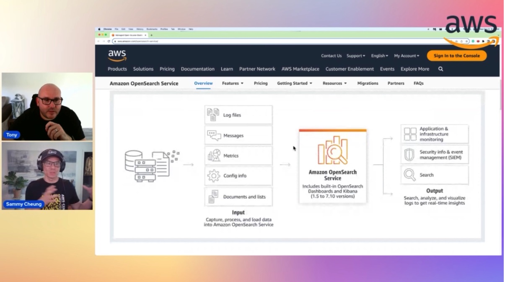

In this episode of Lets Talk About Data we discuss about the data management challenges which Sammy has faced and solved in his data career of 30 years . We also discuss about solutions to these complex data management challenges.

Check out the recording here:

https://www.twitch.tv/videos/1941628995

## Hosts of the show 🎤

[**Tony Mullen**](https://www.linkedin.com/in/tony-mullen-8b05927d), Senior RDS Specialist Solutions Architect @ AWS

## Guests

[**Sammy Cheung**](https://www.linkedin.com/in/sammy-cheung/), AWS Ambassador | Champion AWS Authorized Instructor | AWS Community Builder

## Links from today's episode

* Well architected framework - https://aws.amazon.com/architecture/well-architected
* Backup to S3 - https://aws.amazon.com/getting-started/hands-on/backup-to-s3-cli/
* DMS and DMS Serverless : 
  https://aws.amazon.com/dms/
  https://docs.aws.amazon.com/dms/latest/userguide/CHAP_Serverless.html
* AWS Workspaces - https://aws.amazon.com/workspaces/
* OpenSearch - 
  https://aws.amazon.com/opensearch-service/
  https://docs.aws.amazon.com/opensearch-service/latest/developerguide/serverless.html
* Kinesis Fanout - https://aws.amazon.com/blogs/aws/kds-enhanced-fanout/
* AWS training and certification - https://www.aws.training/
* AWS skill builders' - https://skillbuilder.aws/
* Unnested Cleanup script (watch out for owner ID)- https://n2ws.com/blog/how-to-guides/how-to-delete-unutilized-ebs-based-amis-and-corresponding-snapshots

## Reach out to the hosts and guests:

- Tony: (https://www.linkedin.com/in/tony-mullen-8b05927d)
- Sammy: (https://www.linkedin.com/in/sammy-cheung/)
