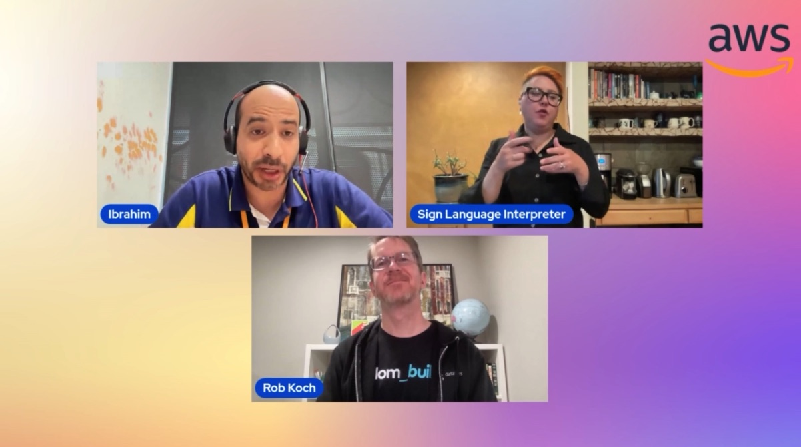

In this episode of Lets Talk About Data we discuss with Rob about ETL, ELT and Zero ETL and its evolution. In the second half Rob demonstrates Zero ETL via Demo and we focus on Rob's career and experience.

Check out the recording here:

https://www.twitch.tv/videos/1925129457

## Hosts of the show 🎤

[**Ibrahim Emara**](https://www.linkedin.com/in/ibrahim-emara-b295a675), RDS Specialist Solutions Architect @ AWS

## Guests

[**Rob Koch**](https://www.linkedin.com/in/robkoch/), AWS Data Hero; Principal at Slalom Build;

## Reach out to the hosts and guests:

- Ibrahim: (https://www.linkedin.com/in/ibrahim-emara-b295a675/)
- Rob: (https://www.linkedin.com/in/robkoch/)
