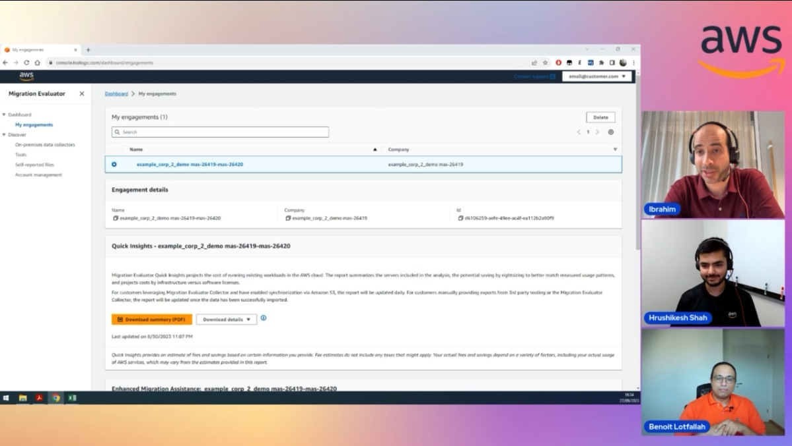

In this episode of Lets Talk About Data we discuss the Migration Evaluator service that provides the insights needed to build a data-driven business case for migration to AWS, helping define next steps in the migration journey.

Check out the recording here:

https://www.twitch.tv/videos/1937198717

## Hosts of the show 🎤

[**Ibrahim Emara**](https://www.linkedin.com/in/ibrahim-emara-b295a675), RDS Specialist Solutions Architect @ AWS

## Guests

[**Benoit Lotfallah**](https://www.linkedin.com/in/benoitlotfallah/), Senior Solutions Architect @ AWS
[**Hrushikesh Shah**](https://www.linkedin.com/in/hrushikesh-shah/), Solutions Architect @ AWS

## Links from today's episode

* Migration Evaluator -  https://0s62bmu3aj.execute-api.us-east-1.amazonaws.com/PROD/tracker/link/1f21fc7b-cc94-4fa5-91d0-4be89ec88afa
* Migration Evaluator - FAQs - https://0s62bmu3aj.execute-api.us-east-1.amazonaws.com/PROD/tracker/link/5477a93d-1027-7b42-a82a-45544220c1ad
* Migration Evaluator Sample Business Case - https://0s62bmu3aj.execute-api.us-east-1.amazonaws.com/PROD/tracker/link/1d1327b1-fe77-b659-c2b2-ef79cee7a52b

## Reach out to the hosts and guests:

- Ibrahim: (https://www.linkedin.com/in/ibrahim-emara-b295a675/)
- Benoit: (https://www.linkedin.com/in/benoitlotfallah/)
- Hrushikesh: (https://www.linkedin.com/in/hrushikesh-shah/)
