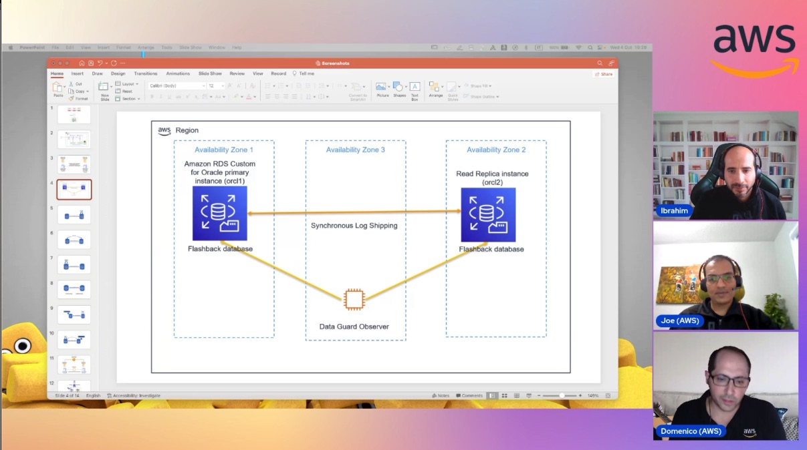

In this episode of Lets Talk About Data we discuss the different approaches to host Oracle database workloads in AWS without using RAC, while meeting the scalability, availability, performance and throughput requirements.  

Check out the recording here:

https://www.twitch.tv/videos/1952451035

## Hosts of the show 🎤

[**Ibrahim Emara**](https://www.linkedin.com/in/ibrahim-emara-b295a675), RDS Specialist Solutions Architect @ AWS

## Guests

[**Jobin Joseph**](https://www.linkedin.com/in/jobin-joseph-db/), Senior Database Specialist Solution Architect @ AWS

[**Domenico di Salvia**](https://www.linkedin.com/in/domenicodisalvia/), Sr. RDS PostgreSQL Solutions Architect @ AWS

## Links from today's episode

* Read Replicas - https://aws.amazon.com/blogs/database/build-high-availability-for-amazon-rds-custom-for-oracle-using-read-replicas/
* High Availability- https://aws.amazon.com/blogs/database/automate-high-availability-setup-in-amazon-rds-custom-for-oracle/

## Reach out to the hosts and guests:

- Ibrahim: (https://www.linkedin.com/in/ibrahim-emara-b295a675/)
- Jobin: (https://www.linkedin.com/in/jobin-joseph-db/)
- Domenico: (https://www.linkedin.com/in/domenicodisalvia/)