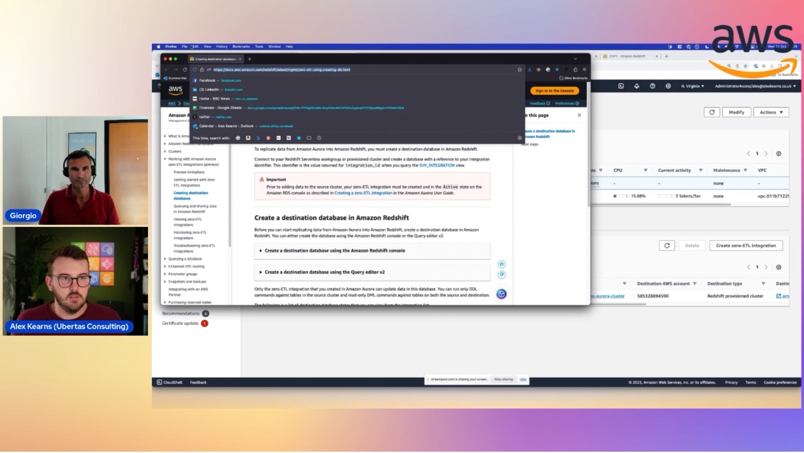

In this episode of Lets Talk About Data we discuss AWS have made significant and continuous investment into growing the list of zero-ETL features and services in the ecosystem. Let’s talk about what zero-ETL is, how it differs from the “traditional” ETL pipeline as well as take a look at some of the most exciting zero-ETL features available in AWS.

Check out the recording here:

https://www.twitch.tv/videos/1952451659

## Hosts of the show 🎤

[**Giorgio Bonzi**](https://www.linkedin.com/in/giorgio-bonzi-680a8a4b/), Senior RDS Specialist Solutions Architect @ AWS

## Guests

[**Alex Kearns**](https://www.linkedin.com/in/alexjameskearns/), Principal SA at Ubertas Consulting 

## Links from today's episode

* S3 Copy Jobs https://docs.aws.amazon.com/redshift/latest/dg/r_COPY-JOB.html
* Aurora zero-ETL to Redshift https://docs.aws.amazon.com/AmazonRDS/latest/AuroraUserGuide/zero-etl.html
* Zero ETL settings https://docs.aws.amazon.com/redshift/latest/mgmt/zero-etl-using.setting-up.html 
                    https://docs.aws.amazon.com/AmazonRDS/latest/AuroraUserGuide/zero-etl.setting-up.html
* GitHub Link https://github.com/alexkearns/aws-twitch-lets-talk-about-data

## Reach out to the hosts and guests:

- Giorgio: (https://www.linkedin.com/in/giorgio-bonzi-680a8a4b/)
- Alex: (https://www.linkedin.com/in/alexjameskearns/)
