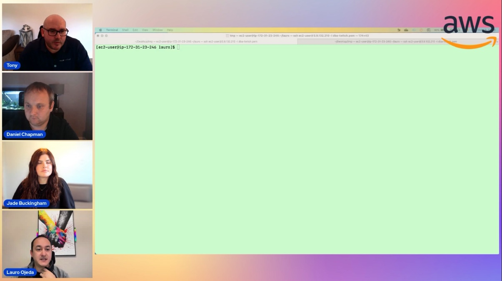

In this episode of Lets Talk About Data we discuss with 3 Guests from CDL softward sharing with us the tools and features they use in PostgeSQL RDS with a view from moving from Oracle with a DBA perspective.

Check out the recording here:

https://www.twitch.tv/videos/1954115395

## Hosts of the show 🎤

[**Tony Mullen**](https://www.linkedin.com/in/tony-mullen-8b05927d), Senior RDS Specialist Solutions Architect @ AWS

## Guests

[**Daniel Chapman**](https://www.linkedin.com/in/daniel-chapman-a753b56b/), Lead Cloud Database Engineer at CDL Software
[**Lauro Ojeda**](https://www.linkedin.com/in/lauro-fabiano-ojeda-00b5b54/), Sr. Cloud Database Engineer at CDL Software
**Jade Buckingham**(https://www.linkedin.com/in/jade-buckingham/), Technical Delivery Lead at CDL Software

## Links from today's episode

* psql download - https://www.postgresql.org/download/
* pgadmin- https://www.pgadmin.org/
* pgdump example - https://www.postgresql.org/docs/current/app-pgdump.html
* pg_transport - https://docs.aws.amazon.com/prescriptive-guidance/latest/patterns/transport-postgresql-databases-between-two-amazon-rds-db-instances-using-pg_transport.html
* pgbench - swingbench example - https://www.postgresql.org/docs/current/pgbench.html
* pg_stat_statements - https://www.postgresql.org/docs/current/pgstatstatements.html
* pgbadger - https://github.com/darold/pgbadger
* partitioning - https://www.postgresql.org/docs/current/ddl-partitioning.html
* auditing - https://www.pgaudit.org/

## Reach out to the hosts and guests:

- Tony: (https://www.linkedin.com/in/tony-mullen-8b05927d/)
- Daniel: (https://www.linkedin.com/in/daniel-chapman-a753b56b/)
- Lauro: (https://www.linkedin.com/in/lauro-fabiano-ojeda-00b5b54/)
- Jade: (https://www.linkedin.com/in/jade-buckingham/)
