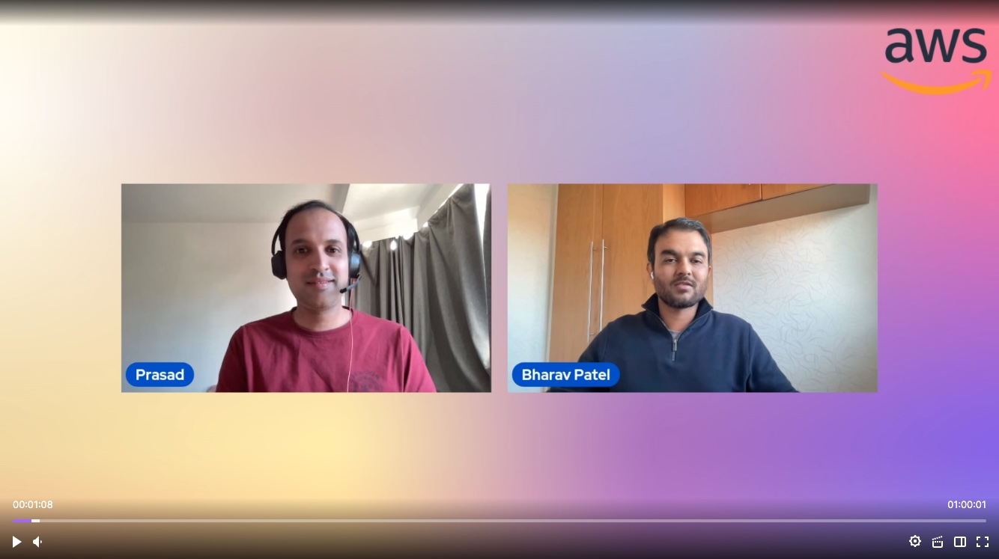

In this episode of Lets Talk About Data we discuss about Amazon Security Lake and how it is integrated with Amazon OpenSearch. We also cover demo about how to generate real time security insights from various AWS services and how we can query and dashboard the same in Amazon OpenSearch.

Check out the recording here:

https://www.twitch.tv/videos/1959956395

## Hosts of the show 🎤

[**Prasad Matkar**](https://www.linkedin.com/in/prasad-matkar-37063715/), RDS Specialist Solutions Architect @ AWS

## Guests

[**Bharav Patel**](https://www.linkedin.com/in/bharav-patel-2a3a2127/), Specialist Solutions Architect @ AWS

## Links from today's episode

* Security Lake - https://aws.amazon.com/security-lake/
* OpenSearch - https://opensearch.org/docs/latest/
* OpenSearch Usecases - https://opensearch.org/docs/latest/data-prepper/common-use-cases/common-use-cases/
* OpenSearch capabilities - https://opensearch.org/docs/latest/version-history/
* Pricing - https://aws.amazon.com/opensearch-service/pricing/

## Reach out to the hosts and guests:

- Prasad: (https://www.linkedin.com/in/tony-mullen-8b05927d/)
- Bharav: (https://www.linkedin.com/in/bharav-patel-2a3a2127/)
