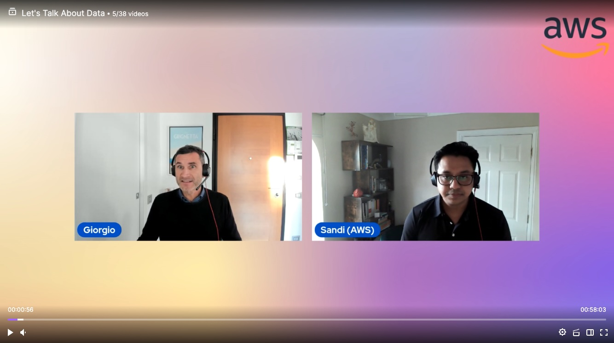

In this show we discuss about Data monetisation strategies and how organisations can benefit from it.

Check out the recording here:

https://www.twitch.tv/videos/1983392065?collection=BEUpZw5lUxeLJA&filter=collections&sort=time

## Hosts of the show 🎤

[**Giorgio Bonzi**](https://www.linkedin.com/in/giorgio-bonzi-680a8a4b/), Sr. Database Specialist SA EMEA @ AWS

## Guests

[**Sandipan Bhaumik**](https://www.linkedin.com/in/sandipanbhaumik/), Specialist Solutions Architect @ AWS

## Links from today's episode

* Data Monetization Whitepaper: https://docs.aws.amazon.com/whitepapers/latest/aws-caf-business-perspective/data-monetization.html
* AWS Lake Formation:: https://aws.amazon.com/lake-formation/
* Redshift Data Sharing: https://aws.amazon.com/redshift/features/data-sharing/?nc=sn&loc=2&dn=4
* AWS Data Exchange: https://aws.amazon.com/blogs/awsmarketplace/monetize-your-custom-http-apis-via-aws-data-exchange/
* QuickSight Embedded Analytics: https://aws.amazon.com/quicksight/embedded-analytics/
* Customer Story - EasySend: https://aws.amazon.com/blogs/business-intelligence/easysend-brings-analytics-to-customers-and-unlocks-the-secret-of-monetizing-data/
* Embed multi-tenant analytics in applications with Amazon QuickSight:  https://aws.amazon.com/blogs/big-data/embed-multi-tenant-analytics-in-applications-with-amazon-quicksight/

## Reach out to the hosts and guests:

- Giorgio: (https://www.linkedin.com/in/giorgio-bonzi-680a8a4b/)
- Sandipan: (https://www.linkedin.com/in/sandipanbhaumik/)
