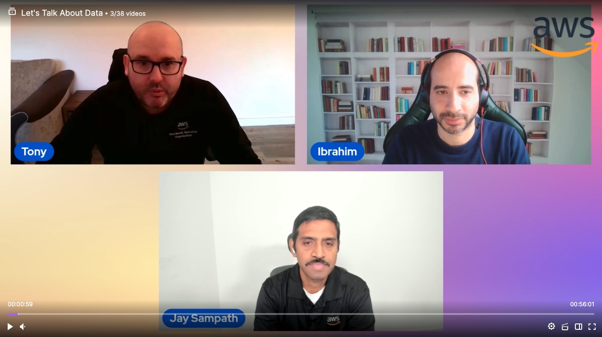

In this episode of Lets Talk About Data we discuss about latest announcement from ReInvent 2023 for AWS Data and how customer can benefit using it.

Check out the recording here:

https://www.twitch.tv/videos/1996783596?collection=BEUpZw5lUxeLJA&filter=collections&sort=time

## Hosts of the show 🎤

[**Tony Mullen**](https://www.linkedin.com/in/tony-mullen-8b05927d), Senior RDS Specialist Solutions Architect @ AWS
[**Ibrahim Emara**](https://www.linkedin.com/in/ibrahim-emara-b295a675), RDS Specialist Solutions Architect @ AWS

## Guests

[**Jay Sampath**](https://www.linkedin.com/in/jaysampath/), Principal Specialist Solutions Architect @ AWS

## Links from today's episode

* Aurora Limitless - https://aws.amazon.com/about-aws/whats-new/2023/11/amazon-aurora-limitless-database/
* Amazon RDS DB2 GA - https://aws.amazon.com/about-aws/whats-new/2023/11/amazon-rds-db2/
* Amazon DocumentDB I/O-Optimized - https://aws.amazon.com/about-aws/whats-new/2023/11/amazon-documentdb-i-o-optimized/
* Amazon DynamoDB zero-ETL integration with Amazon OpenSearch Service - https://aws.amazon.com/about-aws/whats-new/2023/11/amazon-dynamodb-zero-etl-integration-amazon-opensearch-service/
* Vector search for Amazon DocumentDB - https://aws.amazon.com/about-aws/whats-new/2023/11/vector-search-amazon-documentdb/
* Amazon Neptune Analytics is now generally available - https://aws.amazon.com/about-aws/whats-new/2023/11/amazon-neptune-analytics/

## Reach out to the hosts and guests:

- Tony: (https://www.linkedin.com/in/tony-mullen-8b05927d)
- Ibrahim: (https://www.linkedin.com/in/ibrahim-emara-b295a675/)
- Jay : (https://www.linkedin.com/in/jaysampath/)