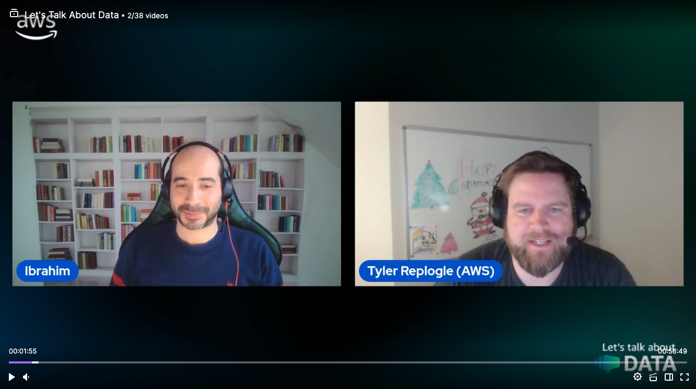

In this episode of Lets Talk About Data we discuss about Vector databases and embeddings with pgvector.

Check out the recording here:

https://www.twitch.tv/videos/2010811840?collection=BEUpZw5lUxeLJA&filter=collections&sort=time

## Hosts of the show 🎤

[**Ibrahim Emara**](https://www.linkedin.com/in/ibrahim-emara-b295a675), RDS Specialist Solutions Architect @ AWS

## Guests

[**Tyler Replogle**](https://www.linkedin.com/in/tyler-replogle-32741b22/), Senior Partner Solution Architect @ AWS

## Links from today's episode

* RDS for PostgreSQL integration - https://aws.amazon.com/about-aws/whats-new/2023/05/amazon-rds-postgresql-pgvector-ml-model-integration/ 
                                 - https://aws.amazon.com/blogs/database/leverage-pgvector-and-amazon-aurora-postgresql-for-natural-language-processing-chatbots-and-sentiment-analysis/ 
* Amazon MemoryDB for Redis - https://docs.aws.amazon.com/memorydb/latest/devguide/vector-search-overview.html
* Amazon Kendra - https://aws.amazon.com/blogs/machine-learning/get-insights-on-your-users-search-behavior-from-amazon-kendra-using-an-ml-powered-serverless-stack/ 
* Demo   - https://github.com/aws-samples/aws-genai-llm-chatbot 
* workshop: https://catalog.workshops.aws/pgvector/en-US/1-introduction/a-what-is-genai
* Knowledge Bases for Amazon Bedrock - https://aws.amazon.com/bedrock/knowledge-bases/ 

## Reach out to the hosts and guests:

- Ibrahim: (https://www.linkedin.com/in/ibrahim-emara-b295a675)
- Tyler: (https://www.linkedin.com/in/tyler-replogle-32741b22/)
