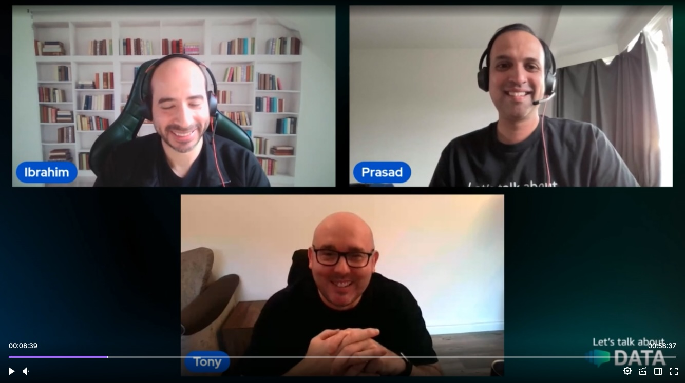

In this episode of Lets Talk About Data we discuss about Infrastructure as code and automating tasks for RDS.

Check out the recording here:

https://www.twitch.tv/videos/2021548860

## Hosts of the show 🎤

[**Ibrahim Emara**](https://www.linkedin.com/in/ibrahim-emara-b295a675), RDS Specialist Solutions Architect @ AWS
[**Prasad Matkar**](https://www.linkedin.com/in/prasad-matkar-37063715/), RDS Specialist Solutions Architect @ AWS
[**Tony Mullen**](https://www.linkedin.com/in/tony-mullen-8b05927d), Senior RDS Specialist Solutions Architect @ AWS

## Links from today's episode

* [Getting started with Terraform](https://developer.hashicorp.com/terraform/tutorials/aws-get-started)
* [Terraform](https://registry.terraform.io/providers/hashicorp/aws/latest/docs/resources/db_instance)
* [Instance Scheduler on AWS](https://aws.amazon.com/solutions/implementations/instance-scheduler-on-aws/)
* [Implementation guide:](https://docs.aws.amazon.com/solutions/latest/instance-scheduler-on-aws/solution-overview.html)

## Reach out to the hosts and guests:

- Ibrahim: (https://www.linkedin.com/in/ibrahim-emara-b295a675)
- Prasad: (https://www.linkedin.com/in/prasad-matkar-37063715/)
- Tony: (https://www.linkedin.com/in/tony-mullen-8b05927d)