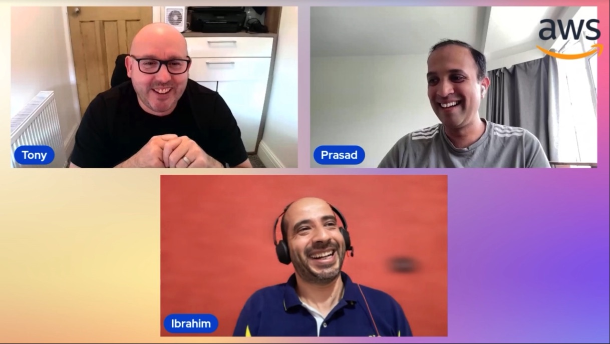

The “Lets Talk About Data” twitch show is a weekly update for data professionals looking for the latest news and information on AWS data services across the cloud! The show covers regular service updates, technical deep dives, new service launches, and interviews in the data space. We have AWS colleagues, community builders, AWS data Hero's and customers as guests on the show.  Show Location  https://www.twitch.tv/aws every Wednesday at 4pm CET.

## Hosts of the show 🎤

- **Tony Mullen** is a Senior Database Specialist Solution Architect based in Manchester. With a focus on relational database engines, he assists customers in migrating and modernizing their database workloads to AWS but has a keen interest in all things data.  Talk with him on [LinkedIn](https://www.linkedin.com/in/tony-mullen-8b05927/).

- **Prasad Maktar** is a Database Specialist Solutions Architect at AWS based in the EMEA region. With a focus on relational database engines, he provides guidance and technical assistance on database projects, helping them improve the value of their solutions when using or migrating to AWS, designing scalable, secure, performant, sustainable, cost-effective, and robust database architectures in the AWS Cloud. Talk with him on [LinkedIn](https://www.linkedin.com/in/prasad-matkar-37063715/).

- **Ibrahim Emara** is a Database Specialist Solution Architect based in London. With main focus on Oracle and Postgres databases, he works closely with AWS customers providing them with technical guidance throughout their journey to the cloud. Talk with him on [LinkedIn](https://www.linkedin.com/in/ibrahim-emara-b295a675/).

## Contact 📬

If you have any questions, comments, or ideas, **reach out** to us. Feel free to send us an email at: mailto:lets-talk-about-data-show-hosts@amazon.com

## Schedule 📆

Come learn live with us! We stream every Wednesday at 4pm CET.

### SEASON 01

| Episode | Name| Date | Link to Watch | Link to Show Notes |
|--|--|--|--|--|
| **S1E01** | GP3 storage and Oracle Gateway| April 5, 2023 | [Watch here](https://www.twitch.tv/videos/1841659475) |[Show Notes](/livestreams/lets-talk-about-data/2023-04-05) |
| **S1E02** | Database Migration Service| April 12, 2023 | [Watch here](https://www.twitch.tv/videos/1841014442) |[Show Notes](/livestreams/lets-talk-about-data/2023-04-12) |
| **S1E03** | Certifications| April 19, 2023 | [Watch here](https://www.twitch.tv/videos/1841017419) |[Show Notes](/livestreams/lets-talk-about-data/2023-04-19) |
| **S1E04** | Migrating 600 DB's from Oracle to RDS PostgreSQL| April 26, 2023 | [Watch here](https://www.twitch.tv/videos/1841658373) |[Show Notes](/livestreams/lets-talk-about-data/2023-04-26) |
| **S1E05** | Babelfish for Aurora PostgreSQL| May 3, 2023 | [Watch here](https://www.twitch.tv/videos/1841658652) |[Show Notes](/livestreams/lets-talk-about-data/2023-05-03) |
| **S1E06** | Data Mesh on AWS and Amazon Datazone| May 17, 2023 | [Watch here](https://www.twitch.tv/videos/1841659193) |[Show Notes](/livestreams/lets-talk-about-data/2023-05-17) |
| **S1E07** | Women in data initiative in AWS & Building a data lake using DMS, Glue & Hudi| May 24, 2023 | [Watch here](https://www.twitch.tv/videos/1841658946) |[Show Notes](/livestreams/lets-talk-about-data/2023-05-24) |
| **S1E08** | Graph Database and Neptune| June 14, 2023 | [Watch here](https://www.twitch.tv/videos/1851873056) |[Show Notes](/livestreams/lets-talk-about-data/2023-06-14) |
| **S1E09** | DynamoDB | June 21, 2023 | [Watch here](https://www.twitch.tv/videos/1851873056) |[Show Notes](/livestreams/lets-talk-about-data/2023-06-21) |
| **S1E10** | DocumentDB (Migration from Mongo to DocumentDB)| June 28, 2023 | [Watch here](https://www.twitch.tv/videos/1953157024) |[Show Notes](/livestreams/lets-talk-about-data/2023-06-28) |
| **S1E11** | Building a Data lake with DMS, Glue & Hudi| Jul 5, 2023 | [Watch here](https://www.twitch.tv/videos/1953225374) |[Show Notes](/livestreams/lets-talk-about-data/2023-07-05) |
| **S1E12** | Database Cost Optimization - Amazon RDS and Amazon Aurora | Jul 12, 2023 | [Watch here](https://www.twitch.tv/videos/1953967848) |[Show Notes](/livestreams/lets-talk-about-data/2023-07-12) |
| **S1E13** | RDS/RDS Custom sql server what is right for me? | Jul 19, 2023 | [Watch here](https://www.twitch.tv/videos/1876777687) |[Show Notes](/livestreams/lets-talk-about-data/2023-07-19) |
| **S1E14** | XTTS new feature for RDS? | Jul 26, 2023 | [Watch here](https://www.twitch.tv/videos/1882902977) |[Show Notes](/livestreams/lets-talk-about-data/2023-07-26) |
| **S1E15** | Amazon DocumentDB - Encryption, Integration and Indexing? | Aug 2, 2023 | [Watch here](https://www.twitch.tv/videos/1888909812) |[Show Notes](/livestreams/lets-talk-about-data/2023-08-02) |
| **S1E16** | Managing Infrastructure Data with CloudQuery | Aug 9, 2023 | [Watch here](https://www.twitch.tv/videos/1907162122) |[Show Notes](/livestreams/lets-talk-about-data/2023-08-09) |
| **S1E17** | Monitoring on RDS Deep Dive | Aug 16, 2023 | [Watch here](https://www.twitch.tv/videos/1907161452) |[Show Notes](/livestreams/lets-talk-about-data/2023-08-16) |
| **S1E18** | Effortless ingestion with Amazon OpenSearch Ingestion| Aug 23, 2023 | [Watch here](https://www.twitch.tv/videos/1907119575) |[Show Notes](/livestreams/lets-talk-about-data/2023-08-23) |
| **S1E19** | Confluent powers realtime outcomes in AWS | Aug 30, 2023 | [Watch here](https://www.twitch.tv/videos/1918470045) |[Show Notes](/livestreams/lets-talk-about-data/2023-08-30) |
| **S1E20** | Make complex data management cost-effective and easy | Sep 6, 2023 | [Watch here](https://www.twitch.tv/videos/1918470045) |[Show Notes](/livestreams/lets-talk-about-data/2023-09-06) |
| **S1E21** | ZeroETL, here to stay? | Sep 13, 2023 | [Watch here](https://www.twitch.tv/videos/1925129457) |[Show Notes](/livestreams/lets-talk-about-data/2023-09-13) |
| **S1E22** | Migration from oracle to postgres in 1hr live demo | Sep 20, 2023 | [Watch here](https://www.twitch.tv/videos/1931178867) |[Show Notes](/livestreams/lets-talk-about-data/2023-09-20) |
| **S1E23** | Migration acclerator  | Sep 27, 2023 | [Watch here](https://www.twitch.tv/videos/1937198717) |[Show Notes](/livestreams/lets-talk-about-data/2023-09-27) |
| **S1E24** | Meet workloads requirements without RAC in AWS | Oct 4, 2023 | [Watch here](https://www.twitch.tv/videos/1952451035) |[Show Notes](/livestreams/lets-talk-about-data/2023-10-04) |
| **S1E25** | Can zero be a hero in the world of ETL | Oct 11, 2023 | [Watch here](https://www.twitch.tv/videos/1952451659) |[Show Notes](/livestreams/lets-talk-about-data/2023-10-11) |
| **S1E26** | Postgres Tools and Features in RDS from the perspective of an Oracle DBA | Oct 18, 2023 | [Watch here](https://www.twitch.tv/videos/1954115395) |[Show Notes](/livestreams/lets-talk-about-data/2023-10-18) |
| **S1E27** | Amazon Opensearch integration with Security Lake | Oct 25, 2023 | [Watch here](https://www.twitch.tv/videos/1971030897) |[Show Notes](/livestreams/lets-talk-about-data/2023-10-25) |
| **S1E28** | Aurora, Redshift & Quicksight | Nov 1, 2023 | [Watch here](https://www.twitch.tv/videos/1971031389) |[Show Notes](/livestreams/lets-talk-about-data/2023-11-01) |
| **S1E29** | Data monetisation | Nov 15, 2023 | [Watch here](https://www.twitch.tv/videos/1983392065) |[Show Notes](/livestreams/lets-talk-about-data/2023-11-15) |
| **S1E30** | How to consolidate your RDS Oracle instances using  Multitenant | Nov 22, 2023 | [Watch here](https://www.twitch.tv/videos/1985940707) |[Show Notes](/livestreams/lets-talk-about-data/2023-11-22) |
