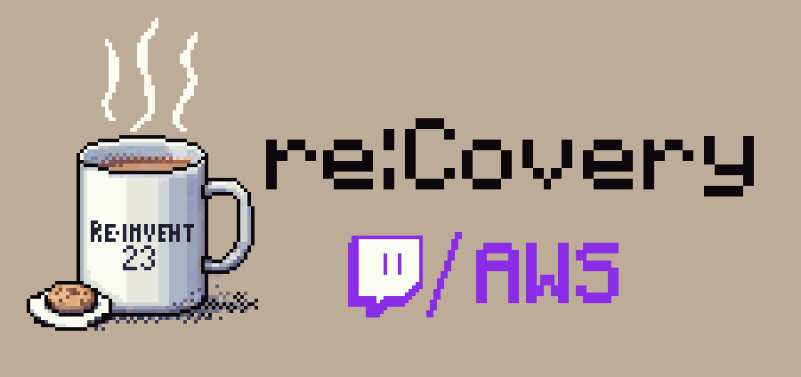
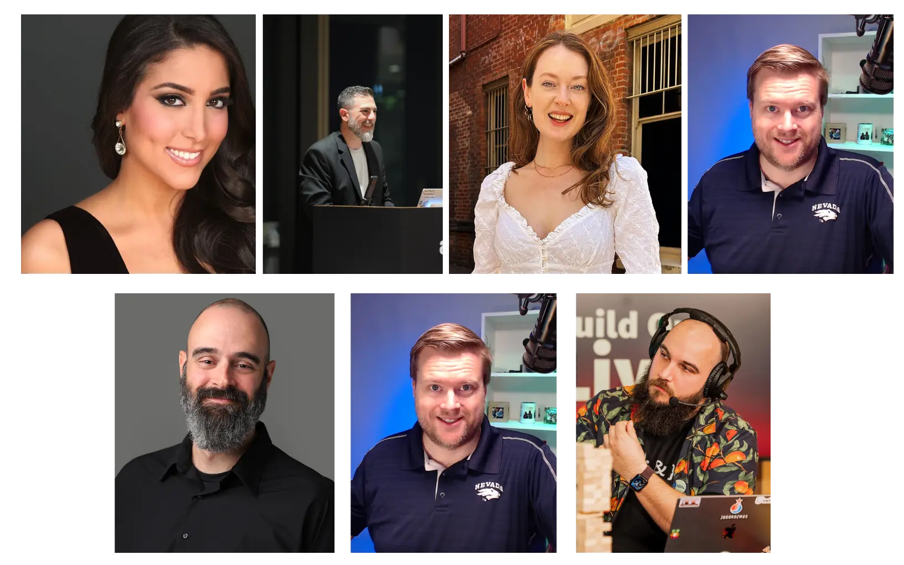

## What is this? 🤔

Join us for a comprehensive 3-day live stream designed to re:Cap and re:Cover from last week's AWS re:Invent 2023. The purpose of this live stream event is to demonstrate to you how to use and implement the latest launches and features in a practical manner. Each day will consist of a 4-5 hour long live stream, dedicated to achieving a specific goal by utilizing the new features. 

This series is hosted by none other than these amazing people: Four fantastic Developer Advocates - [Linda Haviv](https://twitter.com/lindavivah), [Todd Sharp](https://www.linkedin.com/in/toddrsharp/), [Brooke Jamieson](https://twitter.com/brooke_jamieson), [Erik Hanschett](https://www.linkedin.com/in/erikhanchett/); The most amazing [Chris Williams](https://twitter.com/mistwire) from Hashicorp; Our Data Specialist SA [Tony Mullen](https://www.linkedin.com/in/tony-mullen-8b05927/), and some guy named [Darko](https://www.linkedin.com/in/darko-mesaros/)

We will be sipping on a coffee ☕️ in a comfortable sweater with some relaxing lo-fi music playing the background, as we are joined by Amazonians and Community members to help us build stuff in the cloud. Remmeber, we are ALL re:Covering (pun intended) from the event last week.

Coming to you LIVE 🟣 on these days:
- **Tuesday 12th of December - 7AM PST to Noon PST**
- **Wednesday 13th of December - 7AM PST to Noon PST**
- **Thusday 14th of December - 8AM PST to Noon PST**

## Agenda ⌛

Okay, you may be asking yourself: "What am I going to learn during these three days?". Well here is the plan of what we will be building with each day. (**Please note, this is just an idea what we will be working with, and we will definitely explore far and wide, and welcome you - chat, yes you - to come and suggest things we can use 💜**):

| Tuesday | Wednesday | Thursday |
|---|---|---|
| Building **Serverless Applications** | All about **Data**  | Diving deeper into **Generative AI**  |
| Using new StepFunction features | Checking out the Zero ETL features | All the new bells and whistles with Amazon Bedrock |
| Adding some Amazon Bedrock magic to it | Deploy an Application to Graviton4 | What is the new SageMaker studio |
| Checking out new Amplify stuff | Flashback to DB2 Databases 😍 | To wrap it up - PartyRock 🥳 |
| | Streaming, not data, but actual video! 📹 | |

## Calendar Invites 📅

If you would like get notified about this, download these fancy *Calendar blockers*: 
- December 12 - [Google Cal](https://www.google.com/calendar/render?action=TEMPLATE&text=AWS%20re%3AInvent%20re%3ACovery%202023&location=twitch.tv%2Faws&details=Sit%20back%2C%20relax%2C%20grab%20a%20warm%20beverage%20%E2%98%95%EF%B8%8F%2C%20and%20join%20us%20as%20we%20take%20some%20to%20recover%2C%20recap%20and%20build%20things%20with%20the%20latest%20and%20greatest%20launches%20from%20AWS%20re%3AInvent%202023.&dates=20231212T150000Z%2F20231212T200000Z) | [iCal](https://pages.awscloud.com/rs/112-TZM-766/images/EV_AWS-re-Invent-re-Covery-2023_Dec-2023.ics?version=0)
- December 13 - [Google Cal](https://www.google.com/calendar/render?action=TEMPLATE&text=AWS%20re%3AInvent%20re%3ACovery%202023&location=twitch.tv%2Faws&details=Sit%20back%2C%20relax%2C%20grab%20a%20warm%20beverage%20%E2%98%95%EF%B8%8F%2C%20and%20join%20us%20as%20we%20take%20some%20to%20recover%2C%20recap%20and%20build%20things%20with%20the%20latest%20and%20greatest%20launches%20from%20AWS%20re%3AInvent%202023.&dates=20231213T150000Z%2F20231213T200000Z) | [iCal](https://pages.awscloud.com/rs/112-TZM-766/images/EV_AWS-re-Invent-re-Covery-2023_Dec-2023_13Dec.ics?version=0)
- December 14 - [Google Cal](https://www.google.com/calendar/render?action=TEMPLATE&text=AWS%20re%3AInvent%20re%3ACovery%202023&location=twitch.tv%2Faws&details=Sit%20back%2C%20relax%2C%20grab%20a%20warm%20beverage%20%E2%98%95%EF%B8%8F%2C%20and%20join%20us%20as%20we%20take%20some%20to%20recover%2C%20recap%20and%20build%20things%20with%20the%20latest%20and%20greatest%20launches%20from%20AWS%20re%3AInvent%202023.&dates=20231214T160000Z%2F20231214T200000Z) | [iCal](https://pages.awscloud.com/rs/112-TZM-766/images/EV_AWS-re-Invent-re-Covery-2023_Dec-202314Dec.ics?version=0)

---

## Show notes

If you've missed the live show, fear not, here are the show notes, links and videos from each of the days for your viewing pleasure! 💜

### Day 1 - Serverless Bonanza

On the first day we leaned our focus to serverless applications. Namely we built a bunch of Lambda functions, and deployed some React applications. Here are some of the highlights:

We kicked off the show with **Chris** and **Brandon**, as we discussed the finer points on *Do people still build stuff with Visual Basic or not* 🤔 But then we looked at how do you write **.NET Lambda functions**. Easy, you use [Microsoft Visual Studio](https://visualstudio.microsoft.com/) with the [AWS Toolkit for Visual Studio](https://aws.amazon.com/visualstudio/?sc_channel=el&sc_campaign=livestreams&sc_content=build-on-live&sc_geo=mult&sc_country=mult&sc_outcome=acq). What Brandon showcased here is how easy it is to author a Lambda function, deploy it to the cloud, and run AND test it all from the comfort of your IDE ☕️ .  Check out that portion of the stream in the video below 👇

https://www.twitch.tv/videos/2002678011

In the second part, we bid farewell to Brandon and Chris, and we have **Erik** enter the stage. Yes, it's time for some [AWS Amplify](https://aws.amazon.com/amplify/) 🎉 Specifically in this segment we are looking at a *Preview* feature of AWS Amplify - [Gen 2](https://docs.amplify.aws/gen2/?sc_channel=el&sc_campaign=livestreams&sc_content=build-on-live&sc_geo=mult&sc_country=mult&sc_outcome=acq). This gives You a chance to use Amplify to build front-end AND back-end applications with the power of TypeScript and CDK! In this segment, Erik and Darko deploy a simple *NextJS* application to AWS, and implement an Authentication feature to it with [AWS CDK](https://aws.amazon.com/cdk/?sc_channel=el&sc_campaign=livestreams&sc_content=build-on-live&sc_geo=mult&sc_country=mult&sc_outcome=acq) and [Amazon Cognito](https://aws.amazon.com/cognito/?sc_channel=el&sc_campaign=livestreams&sc_content=build-on-live&sc_geo=mult&sc_country=mult&sc_outcome=acq). Check out how it went, and our amazing Holiday spirit in the video below 👇

https://www.twitch.tv/videos/2002678012

Let's got back to Lambda functions, as we are joined by **Julian** and the most amazing **Linda**, and we take a peek at some of the features and improvements to Lambda Functions that came from this year's re:Invent. In the following segment Julian demonstrates us the new [scaling capabilities of Lambda](https://aws.amazon.com/blogs/aws/aws-lambda-functions-now-scale-12-times-faster-when-handling-high-volume-requests/?sc_channel=el&sc_campaign=livestreams&sc_content=build-on-live&sc_geo=mult&sc_country=mult&sc_outcome=acq) and it's new [advanced logging controls](https://aws.amazon.com/blogs/compute/introducing-advanced-logging-controls-for-aws-lambda-functions/?sc_channel=el&sc_campaign=livestreams&sc_content=build-on-live&sc_geo=mult&sc_country=mult&sc_outcome=acq).

What stood out for me in this segment is how fast we can get Lambda functions to spin up. If you want to see how fast it takes to have 10 000 (TEN THOUSAND) concurrent executions of Lambda functions, and how long it takes Lambda to process 200K SQS messages, check out the video below 👇

https://www.twitch.tv/videos/2002678010

Lastly, it's time for me (Darko) to attempt a thing. And *attempt* is the key word - I wanted to use my new found knowledge of .NET Lambda functions, and deploy a **PoweShell** Lambda function... yes! It's almost the same thing! 😅 This is all possible by using a custom [AWS Lambda PowerShell runtime](https://github.com/awslabs/aws-lambda-powershell-runtime) and [AWS SAM](https://github.com/awslabs/aws-lambda-powershell-runtime). 

This time we, almost got to the solution on time, but we ran out of time. So here is a challenge for you, dear reader:

- Create a Lambda Function that uses [this](https://github.com/awslabs/aws-lambda-powershell-runtime) PowerShell runtime
- Modify one of the existing example lambda functions to include the `AWS.Tools.S3` PowerShell module
- Make it upload a file with a random name to an S3 Bucket
- Now, make a new S3 bucket that uses the [Amazon S3 Express One Zone high performance](https://aws.amazon.com/blogs/aws/new-amazon-s3-express-one-zone-high-performance-storage-class/?sc_channel=el&sc_campaign=livestreams&sc_content=build-on-live&sc_geo=mult&sc_country=mult&sc_outcome=acq) storage class
- See how fast those Lambda functions can create file in that bucket.
- ????
- Profit 🥳

And, enjoy the video 👇

https://www.twitch.tv/videos/2002678009

### Day 2 - Data & Streaming fun

Would you look at that, day 2 has come and gone, and has left some *amazing* content in its wake! Today, I was joined by three *amazing* Amazonians, as we look at all things Data and Video Streaming. And we also got a chance to play around with some hardware. Today I wanted to focus on Data, and Data related launches so that is exactly what we did, but we also used the opportunity to put our *old-man-in-tech* hats on and talk about the "good" old times!

Speaking of Good Old times, the first thing we did this morning (and by "we" I am talking about **Tony** and **Ibrahim**) is look at the latest feature of [Amazon RDS](https://aws.amazon.com/rds/?sc_channel=el&sc_campaign=livestreams&sc_content=build-on-live&sc_geo=mult&sc_country=mult&sc_outcome=acq) - A "new" Database engine! Yes, now you can launch [IBM Db2 Databases](https://aws.amazon.com/blogs/aws/getting-started-with-new-amazon-rds-for-db2/?sc_channel=el&sc_campaign=livestreams&sc_content=build-on-live&sc_geo=mult&sc_country=mult&sc_outcome=acq) on RDS 💾 What a time to be alive.

What really stood out for me here, is that you actually need a licence key from IBM to be able to launch it. I've never seen things work such a way in the cloud, but I guess this is a very special type of Database. And for all the jokes we made, this is a very important launch for all those customers who are looking to migrate legacy workloads to the cloud, who are looking to gain from all the benefits of a fully-managed database, while still running their most critical workloads. Go give IBM Db2 on RDS a look. 👏

Oh two more things that can be a snag when launching this database (as of the time of writing this):

1. Create a *Parameter Group* that contains your IBM Site code and the Licence key
2. When creating a Db2 RDS instance, by default there is no database created, so make sure to check that option when launching

Enjoy the video of us doing exactly this 👇

https://www.twitch.tv/videos/2003625229

With the advent of AI/ML, we are in need of more and more data to be processed. Lot's of times that data sits in some sort of a Data Warehouse like [Amazon Redshift](https://aws.amazon.com/redshift/?sc_channel=el&sc_campaign=livestreams&sc_content=build-on-live&sc_geo=mult&sc_country=mult&sc_outcome=acq) but to get that data from production databases to there, you need to run some ETL - Extract, Transform, and Load - Operations on it. Historically this would require specific services and tooling to sit in-between these databases and perform all this. Well, this is no more! Now you can get your data *straight* from an Amazon RDS database into something like Amazon Redshift with [zero-ETL](https://aws.amazon.com/blogs/big-data/announcing-zero-etl-integrations-with-aws-databases-and-amazon-redshift/?sc_channel=el&sc_campaign=livestreams&sc_content=build-on-live&sc_geo=mult&sc_country=mult&sc_outcome=acq) 🔥

In the following segment, Tony and Ibrahim showcase just that. We also share this wonderful [lab](https://catalog.us-east-1.prod.workshops.aws/workshops/428641a0-1414-4fb7-8de6-a38c053ee19e/en-US) you can follow yourself if you want to check out how this works. More in the video below 👇

https://www.twitch.tv/videos/2003625227

Lastly, here was the fun part of the Data focused segment of the stream -  watching Darko fail! Yes, we've looked at the latest feature coming out of Amazon ElastiCache - [ElastiCache Serverless](https://aws.amazon.com/blogs/aws/amazon-elasticache-serverless-for-redis-and-memcached-now-generally-available/?sc_channel=el&sc_campaign=livestreams&sc_content=build-on-live&sc_geo=mult&sc_country=mult&sc_outcome=acq). This gives you the ability to launch an Redis or Memcached cluster that is able to launch in under a minute and can instantly scale based on usage! 😎 

We started out great, and we managed to launch it without issues. However we ran into issues in connecting to the cache using `redis6-cli`. After a lot of trial and tribulations we figured it out. A single cli parameter of `--tls` was the culprit! 😧 Yes, since we are encrypting the data in transit, we needed to tell the redis tool to use TLS! Oh well!

If you want to see the tool in action, as well as us scratching our heads, check out the video below 👇

https://www.twitch.tv/videos/2003625228

Alright, it's time for **Todd**. 🥳 And straight off the bat Todd brings his a-game! Yes, he made fun things with microcontrollers! 😍 In this segment, Todd showcases how he used an [ESP32](https://www.espressif.com/en/products/socs/esp32) microcontroller, the Twitch API and [Amazon Bedrock](https://aws.amazon.com/bedrock/?sc_channel=el&sc_campaign=livestreams&sc_content=build-on-live&sc_geo=mult&sc_country=mult&sc_outcome=acq) to play music notes that Twitch chat shares with us, from a speaker attached to the ESP32 and attempt the song that was played! 🎵 

Oh, and he built an ugly Christmas sweater that lights up whenever we get a new Twitch channel follower! 😍 Check out these shenanigans below 👇

https://www.twitch.tv/videos/2003625236

Last, but definitely not least, Todd showcases some of the latest features of [Amazon IVS](https://aws.amazon.com/ivs/?sc_channel=el&sc_campaign=livestreams&sc_content=build-on-live&sc_geo=mult&sc_country=mult&sc_outcome=acq). A service that enables you to create your own live streaming platforms and tools. In this segment we looked at a way you can run your own **real-time** live streams with **server side compositing** with Amazon IVS. If you want to do it yourself, Todd has given us this [fancy document](https://gist.github.com/recursivecodes/3c95b560895ca8588e1770a249adbf65) that outlines all the steps we did. But if you want just to watch us do this, and more, check out the video below 👇

https://www.twitch.tv/videos/2003625230
