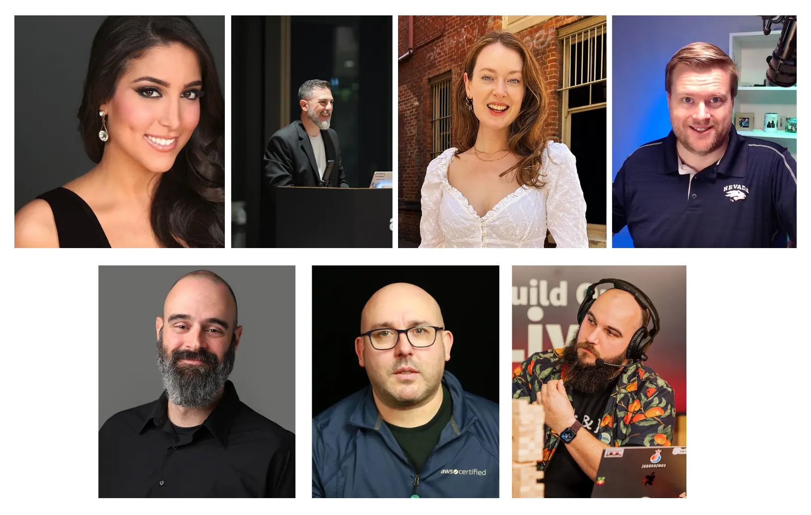

## What is this? 🤔

Join us for a comprehensive 3-day live stream designed to re:Cap and re:Cover from last week's AWS re:Invent 2023. The purpose of this live stream event is to demonstrate to you how to use and implement the latest launches and features in a practical manner. Each day will consist of a 4-5 hour long live stream, dedicated to achieving a specific goal by utilizing the new features. 

This series is hosted by none other than these amazing people: Four fantastic Developer Advocates - [Linda Haviv](https://twitter.com/lindavivah), [Todd Sharp](https://www.linkedin.com/in/toddrsharp/), [Brooke Jamieson](https://twitter.com/brooke_jamieson), [Erik Hanschett](https://www.linkedin.com/in/erikhanchett/); The most amazing [Chris Williams](https://twitter.com/mistwire) from Hashicorp; Our Data Specialist SA [Tony Mullen](https://www.linkedin.com/in/tony-mullen-8b05927/), and some guy named [Darko](https://www.linkedin.com/in/darko-mesaros/)

We will be sipping on a coffee ☕️ in a comfortable sweater with some relaxing lo-fi music playing the background, as we are joined by Amazonians and Community members to help us build stuff in the cloud. Remmeber, we are ALL re:Covering (pun intended) from the event last week.

Coming to you LIVE 🟣 on these days:
- **Tuesday 12th of December - 7AM PST to Noon PST**
- **Wednesday 13th of December - 7AM PST to Noon PST**
- **Thusday 14th of December - 8AM PST to Noon PST**

## Agenda ⌛

Okay, you may be asking yourself: "What am I going to learn during these three days?". Well here is the plan of what we will be building with each day. (**Please note, this is just an idea what we will be working with, and we will definitely explore far and wide, and welcome you - chat, yes you - to come and suggest things we can use 💜**):

| Tuesday | Wednesday | Thursday |
|---|---|---|
| Building **Serverless Applications** | All about **Data**  | Diving deeper into **Generative AI**  |
| Using new StepFunction features | Checking out the Zero ETL features | All the new bells and whistles with Amazon Bedrock |
| Adding some Amazon Bedrock magic to it | Deploy an Application to Graviton4 | What is the new SageMaker studio |
| Checking out new Amplify stuff | Flashback to DB2 Databases 😍 | To wrap it up - PartyRock 🥳 |
| | Streaming, not data, but actual video! 📹 | |

## Calendar Invites 📅

If you would like get notified about this, download these fancy *Calendar blockers*: 
- December 12 - [Google Cal](https://www.google.com/calendar/render?action=TEMPLATE&text=AWS%20re%3AInvent%20re%3ACovery%202023&location=twitch.tv%2Faws&details=Sit%20back%2C%20relax%2C%20grab%20a%20warm%20beverage%20%E2%98%95%EF%B8%8F%2C%20and%20join%20us%20as%20we%20take%20some%20to%20recover%2C%20recap%20and%20build%20things%20with%20the%20latest%20and%20greatest%20launches%20from%20AWS%20re%3AInvent%202023.&dates=20231212T150000Z%2F20231212T200000Z) | [iCal](https://pages.awscloud.com/rs/112-TZM-766/images/EV_AWS-re-Invent-re-Covery-2023_Dec-2023.ics?version=0)
- December 13 - [Google Cal](https://www.google.com/calendar/render?action=TEMPLATE&text=AWS%20re%3AInvent%20re%3ACovery%202023&location=twitch.tv%2Faws&details=Sit%20back%2C%20relax%2C%20grab%20a%20warm%20beverage%20%E2%98%95%EF%B8%8F%2C%20and%20join%20us%20as%20we%20take%20some%20to%20recover%2C%20recap%20and%20build%20things%20with%20the%20latest%20and%20greatest%20launches%20from%20AWS%20re%3AInvent%202023.&dates=20231213T150000Z%2F20231213T200000Z) | [iCal](https://pages.awscloud.com/rs/112-TZM-766/images/EV_AWS-re-Invent-re-Covery-2023_Dec-2023_13Dec.ics?version=0)
- December 14 - [Google Cal](https://www.google.com/calendar/render?action=TEMPLATE&text=AWS%20re%3AInvent%20re%3ACovery%202023&location=twitch.tv%2Faws&details=Sit%20back%2C%20relax%2C%20grab%20a%20warm%20beverage%20%E2%98%95%EF%B8%8F%2C%20and%20join%20us%20as%20we%20take%20some%20to%20recover%2C%20recap%20and%20build%20things%20with%20the%20latest%20and%20greatest%20launches%20from%20AWS%20re%3AInvent%202023.&dates=20231214T160000Z%2F20231214T200000Z) | [iCal](https://pages.awscloud.com/rs/112-TZM-766/images/EV_AWS-re-Invent-re-Covery-2023_Dec-202314Dec.ics?version=0)

---

## Show notes

If you've missed the live show, fear not, here are the show notes, links and videos from each of the days for your viewing pleasure! 💜

### Day 1 - Serverless Bonanza

On the first day we leaned our focus to serverless applications. Namely we built a bunch of Lambda functions, and deployed some React applications. Here are some of the highlights:

We kicked off the show with **Chris** and **Brandon**, as we discussed the finer points on *Do people still build stuff with Visual Basic or not* 🤔 But then we looked at how do you write **.NET Lambda functions**. Easy, you use [Microsoft Visual Studio](https://visualstudio.microsoft.com/) with the [AWS Toolkit for Visual Studio](https://aws.amazon.com/visualstudio/?sc_channel=el&sc_campaign=livestreams&sc_content=build-on-live&sc_geo=mult&sc_country=mult&sc_outcome=acq). What Brandon showcased here is how easy it is to author a Lambda function, deploy it to the cloud, and run AND test it all from the comfort of your IDE ☕️ .  Check out that portion of the stream in the video below 👇

https://www.twitch.tv/videos/2002678011

In the second part, we bid farewell to Brandon and Chris, and we have **Erik** enter the stage. Yes, it's time for some [AWS Amplify](https://aws.amazon.com/amplify/) 🎉 Specifically in this segment we are looking at a *Preview* feature of AWS Amplify - [Gen 2](https://docs.amplify.aws/gen2/?sc_channel=el&sc_campaign=livestreams&sc_content=build-on-live&sc_geo=mult&sc_country=mult&sc_outcome=acq). This gives You a chance to use Amplify to build front-end AND back-end applications with the power of TypeScript and CDK! In this segment, Erik and Darko deploy a simple *NextJS* application to AWS, and implement an Authentication feature to it with [AWS CDK](https://aws.amazon.com/cdk/?sc_channel=el&sc_campaign=livestreams&sc_content=build-on-live&sc_geo=mult&sc_country=mult&sc_outcome=acq) and [Amazon Cognito](https://aws.amazon.com/cognito/?sc_channel=el&sc_campaign=livestreams&sc_content=build-on-live&sc_geo=mult&sc_country=mult&sc_outcome=acq). Check out how it went, and our amazing Holiday spirit in the video below 👇

https://www.twitch.tv/videos/2002678012

Let's got back to Lambda functions, as we are joined by **Julian** and the most amazing **Linda**, and we take a peek at some of the features and improvements to Lambda Functions that came from this year's re:Invent. In the following segment Julian demonstrates us the new [scaling capabilities of Lambda](https://aws.amazon.com/blogs/aws/aws-lambda-functions-now-scale-12-times-faster-when-handling-high-volume-requests/?sc_channel=el&sc_campaign=livestreams&sc_content=build-on-live&sc_geo=mult&sc_country=mult&sc_outcome=acq) and it's new [advanced logging controls](https://aws.amazon.com/blogs/compute/introducing-advanced-logging-controls-for-aws-lambda-functions/?sc_channel=el&sc_campaign=livestreams&sc_content=build-on-live&sc_geo=mult&sc_country=mult&sc_outcome=acq).

What stood out for me in this segment is how fast we can get Lambda functions to spin up. If you want to see how fast it takes to have 10 000 (TEN THOUSAND) concurrent executions of Lambda functions, and how long it takes Lambda to process 200K SQS messages, check out the video below 👇

https://www.twitch.tv/videos/2002678010

Lastly, it's time for me (Darko) to attempt a thing. And *attempt* is the key word - I wanted to use my new found knowledge of .NET Lambda functions, and deploy a **PoweShell** Lambda function... yes! It's almost the same thing! 😅 This is all possible by using a custom [AWS Lambda PowerShell runtime](https://github.com/awslabs/aws-lambda-powershell-runtime) and [AWS SAM](https://github.com/awslabs/aws-lambda-powershell-runtime). 

This time we, almost got to the solution on time, but we ran out of time. So here is a challenge for you, dear reader:

- Create a Lambda Function that uses [this](https://github.com/awslabs/aws-lambda-powershell-runtime) PowerShell runtime
- Modify one of the existing example lambda functions to include the `AWS.Tools.S3` PowerShell module
- Make it upload a file with a random name to an S3 Bucket
- Now, make a new S3 bucket that uses the [Amazon S3 Express One Zone high performance](https://aws.amazon.com/blogs/aws/new-amazon-s3-express-one-zone-high-performance-storage-class/?sc_channel=el&sc_campaign=livestreams&sc_content=build-on-live&sc_geo=mult&sc_country=mult&sc_outcome=acq) storage class
- See how fast those Lambda functions can create file in that bucket.
- ????
- Profit 🥳

And, enjoy the video 👇

https://www.twitch.tv/videos/2002678009
