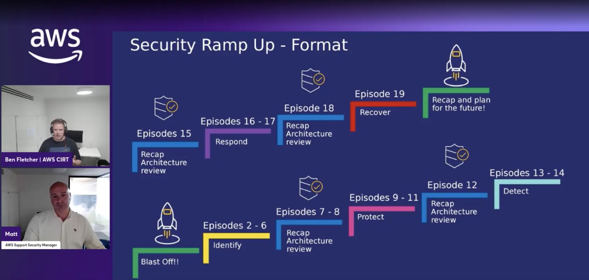

### Check out the recording here:

https://www.twitch.tv/videos/2036378972

### Links from the episode:

- [Understanding Zero Trust principles](https://docs.aws.amazon.com/prescriptive-guidance/latest/strategy-zero-trust-architecture/zero-trust-principles.html)
- [What is Amazon VPC?](https://docs.aws.amazon.com/vpc/latest/userguide/what-is-amazon-vpc.html)

### Reach out to the team:

If you have any questions, comments, or ideas, **reach out** to us. Feel free to send us an email at: [awstwitch-saferoom@amazon.com](mailto:awstwitch-saferoom@amazon.com)

