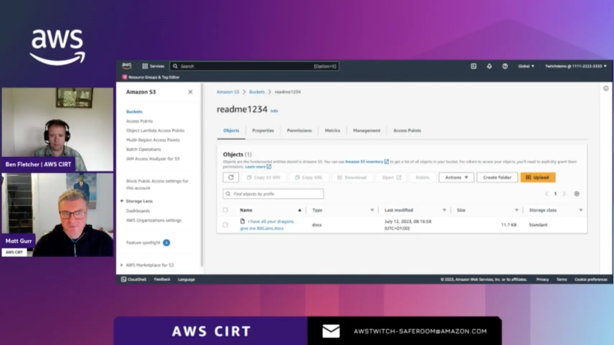

### Check out the recording here:

https://www.twitch.tv/videos/2036379174

### Links from the episode:

- [Getting started with Amazon S3](https://docs.aws.amazon.com/AmazonS3/latest/userguide/GetStartedWithS3.html)
- [What is CloudTrail](https://docs.aws.amazon.com/awscloudtrail/latest/userguide/cloudtrail-user-guide.html)
- [Enabling CloudTrail event logging for S3 buckets and objects](https://docs.aws.amazon.com/AmazonS3/latest/userguide/enable-cloudtrail-logging-for-s3.html)

### Reach out to the team:

If you have any questions, comments, or ideas, **reach out** to us. Feel free to send us an email at: [awstwitch-saferoom@amazon.com](mailto:awstwitch-saferoom@amazon.com)

